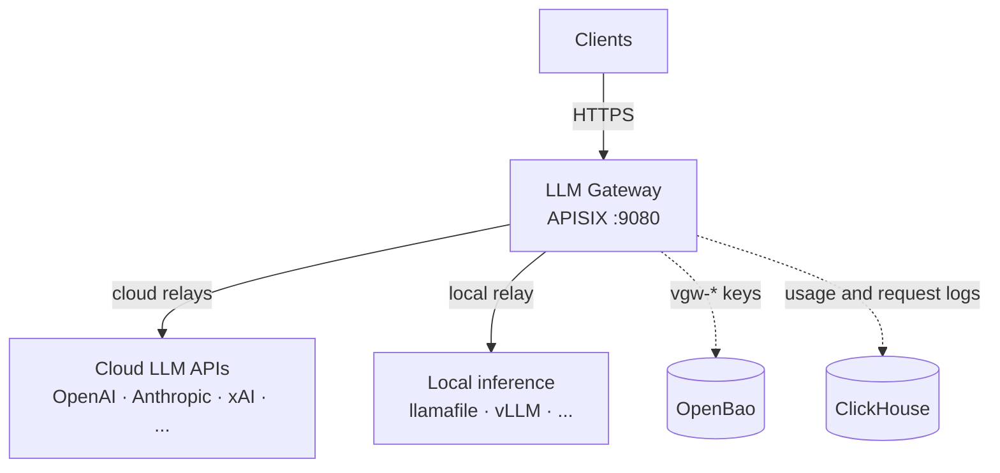
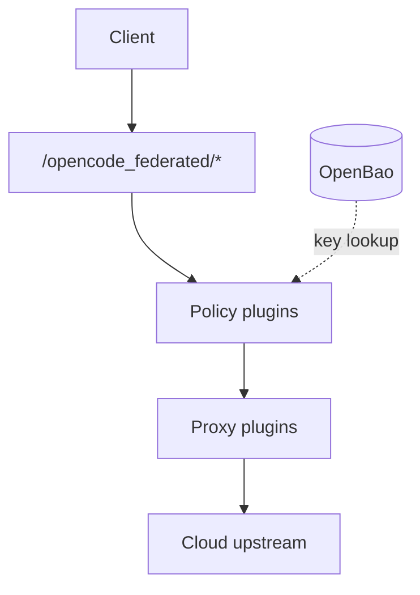
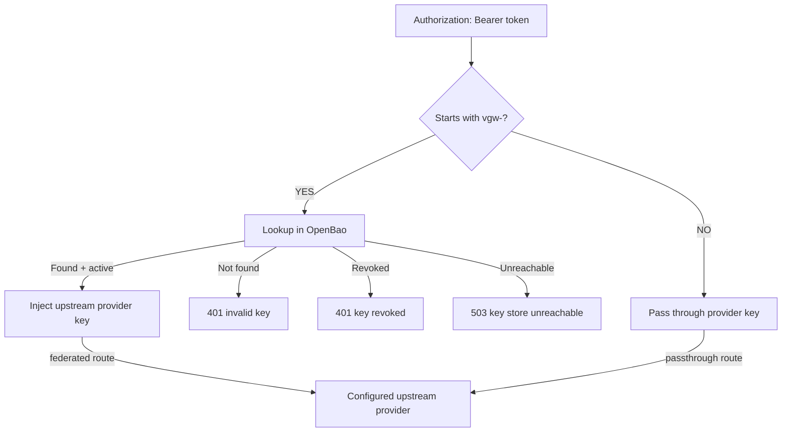
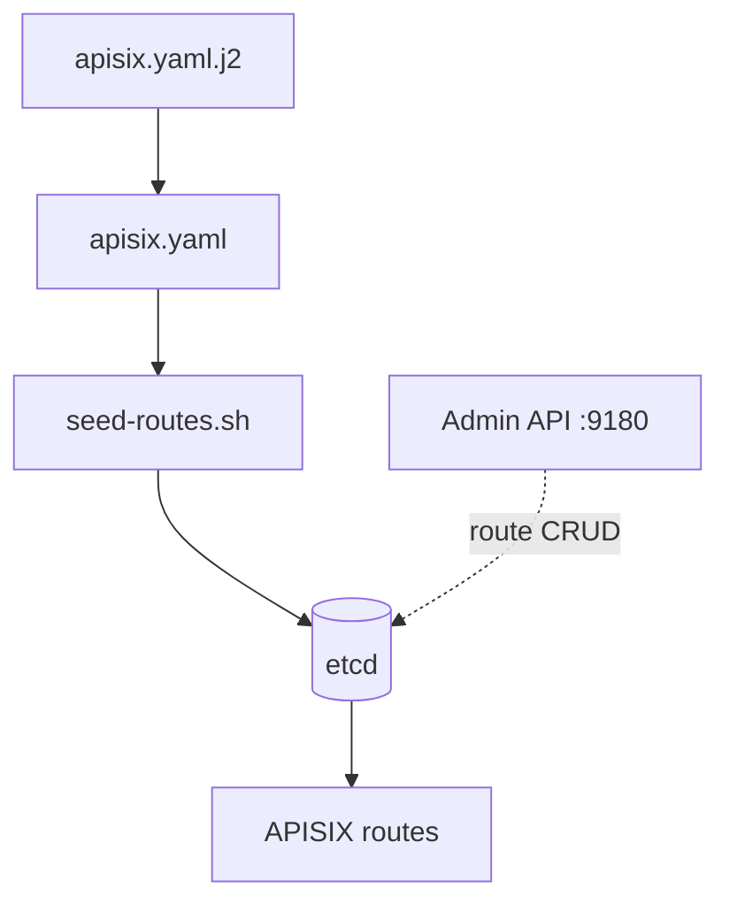
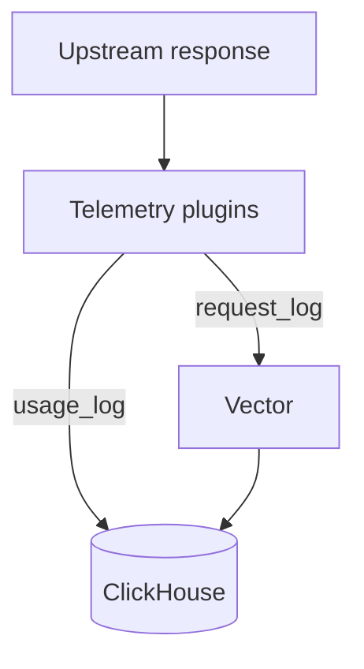
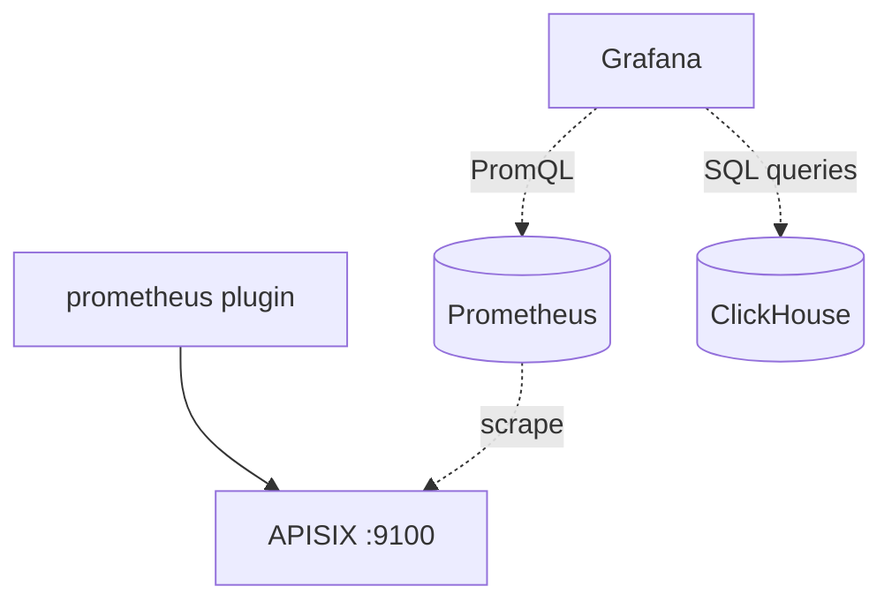

# Multi-tenant LLM Gateway on APISIX

Apache APISIX gateway for shared LLM traffic with per-tenant keys, spend
limits, and PII redaction. Cloud backends run through ai-proxy or relay
configuration, including OpenAI, Anthropic, Gemini, Bedrock, and others,
with usage, cost, and health tracked in ClickHouse and Grafana; this repo
ships sample routes to OpenCode and llamafile.

**Default deployment** routes cloud traffic to OpenCode Go (`opencode.ai`).
The gateway itself is provider-agnostic: add relay routes or swap to
`ai-proxy` / `ai-proxy-multi` for any OpenAI-compatible backend (see
[Supported Providers](#supported-providers)).

> Full technical reference: [`docs/architecture/README.md`](docs/architecture/README.md)

---

## Table of Contents

- [Quick Start](#quick-start)
- [Architecture](#architecture)
- [Supported Providers](#supported-providers)
- [Features](#features)
- [Plugins](#plugins)
- [Key Management](#key-management)
- [Configuration](#configuration)
- [opencode Integration](#opencode-integration)
- [Testing](#testing)
- [Make Targets](#make-targets)
- [Documentation](#documentation)
- [License](#license)

---

## Quick Start

```bash
# 1. Install podman-compose and build images
make install

# 2. Start the gateway stack (APISIX + etcd + ClickHouse + Vector + OpenBao + Prometheus + Grafana)
make dev-start

# 3. Send a request through the gateway
KEY="$GATEWAY_API_KEY"  # vgw-gateway-key from .env (provisioned in OpenBao on start)
curl -s http://localhost:9080/opencode_federated/v1/chat/completions \
  -H "Authorization: Bearer $KEY" \
  -H "Content-Type: application/json" \
  -d '{"model":"minimax-m3","messages":[{"role":"user","content":"Say hello"}]}'
```

Ports: 9080 (gateway), 9180 (APISIX Admin API + `/ui/`), 8123 (ClickHouse), 9100 (APISIX Prometheus metrics), 8201 (OpenBao), 3030 (Grafana), 9092 (Prometheus).

### Prerequisites

- [Podman](https://podman.io/) 5.x
- [Ansible](https://docs.ansible.com/) 2.21+
- `curl`, `jq`, `openssl`, `xxd` (used by tests and key scripts)
- `uv` (for `.venv` setup)
- A `.env` file with `ADMIN_KEY`, `OPENCODE_API_KEY`, `GATEWAY_API_KEY`,
  `OPENBAO_TOKEN` (see [`.env.example`](.env.example), gitignored)

Run `make init` to check all system dependencies and print install
instructions for any that are missing.

---

## Architecture

**Legend (all diagrams in this doc):** solid arrows = request/response data
path; dashed arrows = config, key lookup, or read-only observability.

### System context



The gateway is provider-agnostic: clients hit APISIX, which relays to cloud
or local LLM APIs, resolves virtual keys via OpenBao, and persists usage data.
Deeper flows are diagrammed in the section that owns each concern:
[Plugins](#plugins) (request path), [Configuration](#configuration)
(telemetry, metrics, route config), [Key Management](#key-management) (auth).

Each new provider is a relay route + upstream node (or `ai-proxy` /
`ai-proxy-multi`; see [`docs/BUILTIN-PLUGINS.md`](docs/BUILTIN-PLUGINS.md)
and [Supported Providers](#supported-providers)). Diagram authoring rules:
[`workflows/WORKFLOW-CREATING-DIAGRAMS.md`](workflows/WORKFLOW-CREATING-DIAGRAMS.md).

### Sample deployments in this repo

| Route | Prefix | Auth | Sample upstream |
|-------|--------|------|-----------------|
| `relay-opencode` | `/opencode/*` | Direct key passthrough | OpenCode Go (`opencode.ai`) → `/zen/go/*` |
| `relay-opencode-federated` | `/opencode_federated/*` | Virtual keys (`vgw-*`) via OpenBao | OpenCode Go (`opencode.ai`) → `/zen/go/*` |
| `relay-llamafile` | `/llamafile/*` | None (local dev) | VM-hosted llamafile (`host.docker.internal:8765`) |

In this sample, OpenCode Go exposes 20+ models (MiniMax, Kimi, GLM,
DeepSeek, Qwen, MiMo, HY3). Swap the upstream node in `apisix.yaml.j2`
to point at any other compatible API. Additional providers = new relay
route + upstream node; see [`docs/PROVIDER-XAI-GROK.md`](docs/PROVIDER-XAI-GROK.md)
for the xAI Grok draft spec.

---

## Supported Providers

APISIX's built-in `ai-proxy` and `ai-proxy-multi` plugins support the
following LLM provider backends. Swap the plain upstream proxy in
`conf/apisix.yaml` for `ai-proxy` (single provider) or `ai-proxy-multi`
(load balancing, retries, health checks across multiple providers).

| Provider | Value | Default Endpoint | Since |
|----------|-------|------------------|-------|
| OpenAI | `openai` | `api.openai.com/chat/completions` | 3.0 |
| DeepSeek | `deepseek` | `api.deepseek.com/chat/completions` | 3.0 |
| Azure OpenAI | `azure-openai` | custom (via `override.endpoint`) | 3.0 |
| AIMLAPI | `aimlapi` | `api.aimlapi.com/v1/chat/completions` | 3.14 |
| Anthropic | `anthropic` | `api.anthropic.com/v1/chat/completions` | 3.15 |
| OpenRouter | `openrouter` | `openrouter.ai/api/v1/chat/completions` | 3.15 |
| Google Gemini | `gemini` | `generativelanguage.googleapis.com/v1beta/openai` | 3.15 |
| Google Vertex AI | `vertex-ai` | `aiplatform.googleapis.com` (needs `project_id` + `region`) | 3.15 |
| AWS Bedrock | `bedrock` | `bedrock-runtime.{region}.amazonaws.com` (SigV4 signed) | 3.17 |
| Any OpenAI-compatible | `openai-compatible` | custom (via `override.endpoint`) | 3.0 |

**`ai-proxy-multi`** adds: load balancing across instances, automatic
retries on failure, health checks, and provider-level routing rules.

---

## Features

| Feature | Plugin / Mechanism | Type |
|---------|-------------------|------|
| PII redaction (on-the-fly sensitive data anonymisation) + re-hydration | `redact`: regex + dictionary + Luhn, pure Lua | Custom |
| Virtual key management | `key-resolver`: OpenBao KVv2 (persistent file-storage), shared dict cache | Custom |
| Direct key pass-through | `key-resolver`: non-`vgw-` keys forwarded as-is | Custom |
| SSE token extraction | `sse-usage`: buffers SSE, extracts usage, writes ClickHouse | Custom |
| Per-key rate limiting (RPM) | `limit-count` + `key-meta` | Built-in + custom Lua |
| Per-key token/cost budget | `key-resolver` + `sse-usage` + `ngx.shared` | Custom Lua |
| Request/response logging | `http-logger` to Vector to ClickHouse | Built-in |
| Prometheus metrics | `prometheus` at `:9100` | Built-in |
| SSE streaming support | `proxy-buffering` disabled per-route | Config |
| Grafana dashboards (3) | Cost & Usage, Ops & Health, Cost Leaderboard: 7d lookback, 5s refresh | Config |
| Billing-grade schema | ClickHouse `Decimal64(6)`, 13-month TTL, `LowCardinality` keys | SQL |

---

## Plugins

### Request path (one federated cloud request)



Policy = `key-resolver`, `key-meta`, `redact`, `limit-count` (access phase).
Proxy = `proxy-rewrite`, upstream proxy, `proxy-buffering`. Telemetry plugins
run after the upstream responds; see [ClickHouse Tables](#clickhouse-tables).

`/opencode/*` skips `key-resolver`; `/llamafile/*` skips auth and targets a
local upstream (see [sample deployments](#sample-deployments-in-this-repo)).

Eight plugins on the passthrough and llamafile routes, nine on the federated
route (federated adds `key-resolver`), ordered by Nginx phase priority:

- **`proxy-rewrite`** (N/A, Built-in, `rewrite`) : Strips route prefix; opencode relays → `/zen/go/*`, llamafile → upstream root
- **`key-resolver`** (2555, Custom Lua, `access`, federated only) : Resolve `vgw-*` keys via OpenBao; pass through others
- **`key-meta`** (2530, Custom Lua, `access`) : Compute key hash for per-key scoping (`X-Key-Hash`)
- **`redact`** (2500, Custom Lua, `access`/`header_filter`/`body_filter`/`log`) : PII anonymization + re-hydration
- **`sse-usage`** (2400, Custom Lua, `header_filter`/`body_filter`/`log`) : Extract token usage; increment budget counter
- **`limit-count`** (2002, Built-in, `access`) : Per-key RPM; federated route uses variable limits from OpenBao headers
- **`http-logger`** (410, Built-in, `log`) : Send req/resp metadata to Vector
- **`proxy-buffering`** (300, Built-in, `filter`) : Disable buffering for SSE
- **`prometheus`** (N/A, Built-in, `log`) : Export metrics at `:9100`

### Extract-Testable-Core Pattern

Each custom plugin is split into two files:

- **`*_lib.lua`** : Pure logic module, requireable, unit-testable (deps: `cjson`, `ngx.re` only)
- **`*.lua`** : APISIX adapter: lifecycle phases, ctx, shared dict (deps: Full APISIX API)

---

## Key Management



Applies to `/opencode/*` and `/opencode_federated/*` only; `/llamafile/*`
has no `Authorization` flow.

### Two Key Modes

1. **Virtual keys** (`vgw-*`): Used on the `/opencode_federated/*`
   route. Stored in OpenBao (production file-storage mode with
   persistent volumes). Resolved to an upstream provider API key. Can be
   revoked, rate-limited per tenant, audited. Cached in `key_cache`
   shared dict (5s TTL in dev, 300s in prod).

2. **Direct keys** (any non-`vgw-` prefix, e.g. `sk-*`): Used on the
   `/opencode/*` route. Passed through to upstream as-is. No OpenBao
   lookup. Users bring their own upstream provider API keys.

### Commands

```bash
make issue-key                              # Create vgw-<random hex> key
make issue-key KEY_ID=my-key TENANT_ID=acme USER_ID=alice
make list-keys                              # List all keys with metadata
make revoke-key KEY_ID=vgw-abc123           # Revoke (record preserved)
```

---

## Configuration

### Routes and config (control plane)



Traditional/etcd mode: routes live in etcd, seeded from the rendered
`conf/apisix.yaml` on stack start. Admin API and built-in dashboard:
`http://localhost:9180/ui/`.

### Key Files

- `conf/config.yaml`: APISIX traditional/etcd mode: plugin list, shared dicts, env vars, Admin API, Prometheus port
- `conf/apisix.yaml`: Committed route render (3 routes); drift-checked against `conf/apisix.yaml.j2`
- `conf/apisix.yaml.j2`: Jinja2 route template rendered at deploy from `.env`
- `res/scripts/seed-routes.sh`: Seeds etcd from rendered `apisix.yaml` on stack start
- `conf/openbao.hcl`: OpenBao production config (file-storage backend)
- `conf/prometheus.yml`: Prometheus scrape config (APISIX `:9100`)
- `conf/grafana/`: Grafana datasources + 3 provisioned dashboards
- `conf/redact-patterns.json`: PII detection: 6 regex patterns + 2 dictionary categories
- `conf/clickhouse-init.sql`: Base schema; incremental changes via `conf/migrations/`
- `conf/vector.toml`: Vector pipeline: HTTP source, VRL remap (parse_json for model extraction), ClickHouse sink
- `res/docker/docker-compose.yml`: 8 services: apisix, etcd, clickhouse, migrate, vector, openbao, prometheus, grafana
- `res/docker/Dockerfile.apisix`: Custom APISIX image: Lua plugins + config copied in
- `res/docker/Dockerfile.openbao`: Custom OpenBao image (production file-storage)
- `res/docker/openbao-entrypoint.sh`: OpenBao auto-init, auto-unseal, gateway key provisioning (data persists via `openbao-data` named volume)
- `.env`: Secrets: `ADMIN_KEY`, `OPENCODE_API_KEY`, `GATEWAY_API_KEY`, `OPENBAO_TOKEN`

### Environment Variables

| Variable | Purpose | Example |
|----------|---------|---------|
| `ADMIN_KEY` | APISIX Admin API key (not stored in tracked files) | `your-apisix-admin-key` |
| `OPENCODE_API_KEY` | Upstream Go key (injected into proxied requests) | `sk-HiEr...` |
| `OPENCODE_BASE_URL` | Upstream Go base URL | `https://opencode.ai/zen/go/v1` |
| `GATEWAY_API_KEY` | Default virtual key for opencode integration | `vgw-gateway-key` |
| `OPENBAO_TOKEN` | Root token for OpenBao KVv2 API | `2e22c6e...` |
| `CONTEXT_LIMIT_PCT` | Context limit scaling percentage | `80` |
| `CONTEXT_LIMIT_CEILING` | Absolute max context tokens after scaling | `128000` |

### ClickHouse Tables

Telemetry runs in response/log phases after the upstream returns:



`sse-usage` writes `usage_log` directly; `http-logger` ships full
request/response metadata to Vector, which inserts `request_log`.

| Table | Written By | Key Columns |
|-------|-----------|-------------|
| `request_log` | Vector (from http-logger) | `request_id`, model, status, req_body, resp_body, identity columns |
| `usage_log` | sse-usage plugin (via timer) | `request_id`, model, token breakdown, `cost`, `cost_source` |
| `billing_ledger` | MV on `usage_log` INSERT | cost `Decimal64(6)`, rate_input/output, cache_status |
| `billing_discrepancies` | v2 reconciler (deferred) | gateway_tokens, provider_tokens, divergence |

### Grafana Dashboards



The `prometheus` plugin exports request metrics at `:9100`. Prometheus
scrapes every 15s (`conf/prometheus.yml`). Grafana uses **Prometheus** for
ops panels (latency, error rate) and **ClickHouse** for cost and usage.
Grafana only queries data; it does not write.

Three provisioned dashboards (default: `now-7d` lookback, `5s` refresh):

| Dashboard | URL |
|-----------|-----|
| Gateway Cost & Usage | `http://localhost:3030/d/gateway-cost-usage?from=now-7d&to=now&refresh=5s` |
| Gateway Operations & Health | `http://localhost:3030/d/gateway-ops-health?from=now-7d&to=now&refresh=5s` |
| Gateway Cost Leaderboard | `http://localhost:3030/d/gateway-cost-leaderboard?from=now-7d&to=now&refresh=5s` |

The leaderboard shows top clients (p20) and top models (p21) by cost and
tokens. After editing dashboard JSON, run `make dev-restart-grafana` to
reload provisioning. See [`docs/DASHBOARD-REQUIREMENTS.md`](docs/DASHBOARD-REQUIREMENTS.md).

---

## opencode Integration

The gateway registers as `workspace-gw-private` (virtual key),
`workspace-gw-own` (own key), and `workspace-gw-llamafile` (local LLM)
custom providers in opencode.

```bash
# Sync all models from gateway into opencode config
make sync-models
```

This fetches `/opencode_federated/v1/models` from the gateway using the
virtual gateway key, enriches each model with canonical metadata (name,
context limit, capabilities, cost, modalities) from [models.dev](https://models.dev),
and also fetches `/llamafile/v1/models` for the local llamafile upstream.
It writes THREE provider entries into `~/.config/opencode/opencode.jsonc`:

- `workspace-gw-private`: virtual-key mode (apiKey = `vgw-gateway-key`)
- `workspace-gw-own`: own-key passthrough (no apiKey, client provides key)
- `workspace-gw-llamafile`: no-auth local LLM (VM-hosted llamafile, no apiKey)

The first two providers receive the full enriched model catalog so opencode
does not drop them (opencode deletes providers with zero models). The
llamafile provider receives the model list from `/llamafile/v1/models`
(or a default model id if the llamafile server is not running). MiniCPM5
uses context `131072` (scaled to `104857` at 80%) with `tool_call: true`.
The script runs automatically on `make dev-start` and `make dev-restart`
via the Ansible playbook.

Context limits are scaled by `CONTEXT_LIMIT_PCT` (default 80) from `.env`,
so e.g. `CONTEXT_LIMIT_PCT=80` reduces a 200000-token context to 160000.
An absolute ceiling `CONTEXT_LIMIT_CEILING` (default 128000) is then
applied: any scaled value exceeding the ceiling is clamped to it. Set to
0 to disable.

Result in opencode config:

```json
{
  "provider": {
    "workspace-gw-private": {
      "api": "http://localhost:9080/opencode_federated/v1",
      "npm": "@ai-sdk/openai-compatible",
      "options": {
        "baseURL": "http://localhost:9080/opencode_federated/v1",
        "apiKey": "vgw-gateway-key",
        "headers": { "X-Tenant-ID": "default", "X-User-ID": "agent" }
      },
      "models": {
        "minimax-m3": {
          "name": "MiniMax M3",
          "family": "minimax",
          "release_date": "2026-06-01",
          "attachment": true,
          "reasoning": true,
          "temperature": true,
          "tool_call": true,
          "cost": { "input": 15, "output": 75, "cache_read": 1.5, "cache_write": 18.75 },
          "limit": { "context": 160000, "output": 24000 },
          "modalities": { "input": ["text", "image", "pdf"], "output": ["text"] },
          "status": "active"
        }
      }
    },
    "workspace-gw-own": {
      "api": "http://localhost:9080/opencode/v1",
      "npm": "@ai-sdk/openai-compatible",
      "options": {
        "baseURL": "http://localhost:9080/opencode/v1",
        "headers": { "X-Tenant-ID": "default", "X-User-ID": "agent" }
      },
      "models": { "...": "same enriched models as workspace-gw-private" }
    }
  }
}
```

---

## Testing

```bash
make test          # Run all stages (excludes live upstream API tests)
make test-live     # Run all stages including live upstream API tests
make dev-test      # Same as test, via Ansible
```

1. Lua unit tests via `resty` CLI inside the APISIX container
2. Config validation: 14 scripts (YAML, SQL, TOML, JSON, dashboard structure, migrations)
3. Reconciler static analysis: syntax, strict mode, error handling
4. Integration: black-box HTTP against the running stack (llamafile e2e,
   event_id alignment, data flow, cost e2e, Grafana panel checks)
5. CI hook verification: pre-commit and pre-push hooks present and wired
6. E2E: real Go API calls (gated behind `RUN_LIVE_API_TESTS=1`)

See [`docs/TEST-PLAN.md`](docs/TEST-PLAN.md) for the full strategy.

---

## Make Targets

### Dev Lifecycle (Ansible-managed)

| Target | Description |
|--------|-------------|
| `make dev-start` | Build images, start stack, provision keys, health checks |
| `make dev-stop` | Stop stack (keep volumes) |
| `make dev-restart` | Stop + start |
| `make dev-rebuild` | Stop + start (rebuilds images) |
| `make dev-status` | Show containers + health |
| `make dev-logs` | Tail container logs |
| `make dev-clean` | Stop + destroy volumes (data loss) |
| `make dev-shell` | Exec into APISIX container |
| `make dev-sanity` | Single curl request through gateway |
| `make dev-test` | Run full test suite via Ansible |
| `make dev-restart-service SVC=name` | Recreate one service (apisix, vector, grafana, etc.) |
| `make dev-restart-grafana` | Recreate Grafana, reload provisioning, sync dashboard defaults |
| `make ch-migrate` | Apply pending ClickHouse schema migrations |
| `make ch-migrate-status` | Show ClickHouse migration version |

### Key Management

| Target | Description |
|--------|-------------|
| `make issue-key` | Create new `vgw-*` key in OpenBao |
| `make list-keys` | List all keys with metadata |
| `make revoke-key KEY_ID=vgw-xxx` | Revoke a key |
| `make sync-models` | Sync models from gateway to opencode config |

### Quality Gates

| Target | Description |
|--------|-------------|
| `make lint` | Shell syntax + YAML validation |
| `make type-check` | Lua syntax check via `resty` in Podman |
| `make test` | Run all test stages (excludes live upstream API) |
| `make test-live` | Run all stages including live upstream API tests |
| `make check` | lint + type-check + test |
| `make check-push` | check + E2E tests (if Go key set) |

---

## Documentation

- **[`workflows/WORKFLOW-CREATING-DIAGRAMS.md`](workflows/WORKFLOW-CREATING-DIAGRAMS.md)** : How we author and review architecture diagrams
- **[`docs/architecture/README.md`](docs/architecture/README.md)** : Architecture hub: components, plugins, data flows, schema
- **[`docs/TEST-PLAN.md`](docs/TEST-PLAN.md)** : Testing strategy with extract-testable-core pattern
- **[`docs/DASHBOARD-REQUIREMENTS.md`](docs/DASHBOARD-REQUIREMENTS.md)** : Authoritative Grafana dashboard spec (16 panels across 3 dashboards)
- **[`docs/COST-CALC-LUA.md`](docs/COST-CALC-LUA.md)** : Cost calculation module and token pricing paths
- **[`docs/PROPOSAL-LLM-GATEWAY-v3.md`](docs/PROPOSAL-LLM-GATEWAY-v3.md)** : Architecture rationale, Kong-to-APISIX pivot, billing contract
- **[`docs/PLUGIN-FOUNDATION.md`](docs/PLUGIN-FOUNDATION.md)** : APISIX custom Lua plugin development foundation
- **[`docs/PLUGIN-REDACT-LUA.md`](docs/PLUGIN-REDACT-LUA.md)** : Redact plugin specification
- **[`docs/BUILTIN-PLUGINS.md`](docs/BUILTIN-PLUGINS.md)** : Built-in plugin configuration guide
- **[`docs/DEPLOYMENT.md`](docs/DEPLOYMENT.md)** : Deployment and operations guide
- **[`docs/OPENCODE-INTEGRATION.md`](docs/OPENCODE-INTEGRATION.md)** : OpenCode Go integration specifics
- **[`docs/PROVIDER-XAI-GROK.md`](docs/PROVIDER-XAI-GROK.md)** : xAI Grok provider integration spec (draft)

### v2 Specs (Deferred)

- **[`docs/PLUGIN-SEMANTIC-CACHE.md`](docs/PLUGIN-SEMANTIC-CACHE.md)** : Redis VSS semantic cache
- **[`docs/PLUGIN-REDACT-ENGINE.md`](docs/PLUGIN-REDACT-ENGINE.md)** : Rust NER sidecar (ONNX BERT-tiny)

---

## License

- **Apache APISIX 3.17.0**: Apache 2.0
- **OpenBao 2.4.4**: MPL 2.0
- **ClickHouse 24.8**: Apache 2.0
- **Vector 0.40**: MPL 2.0
- **Prometheus v3.13.1**: Apache 2.0
- **Grafana 13.0.2**: AGPLv3

