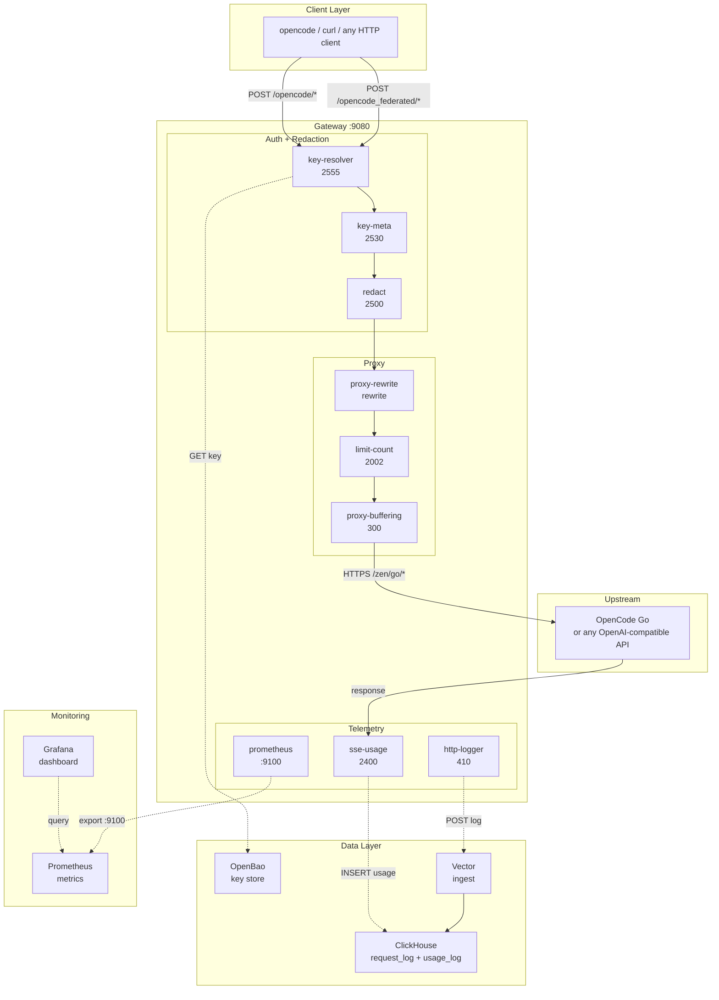
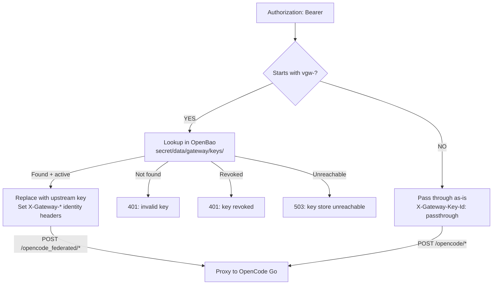

# Multi-tenant LLM Gateway on APISIX

Routes traffic to any OpenAI-compatible LLM provider through Apache APISIX
3.17.0, with PII redaction, virtual key management, billing-grade token
accounting, per-key rate limiting, and a Grafana dashboard. Four custom Lua
plugins, five built-in plugins, zero sidecars on the hot path. Per-tenant isolation runs entirely
inside APISIX: virtual keys are minted in OpenBao, every request is scoped
to a tenant route, and token usage is streamed to ClickHouse via Vector for
second-granularity audit and cost attribution. No proxy process to babysit,
no external rate-limiter, no separate auth tier; the gateway is the policy.

Currently configured with **OpenCode Go** as the upstream. APISIX's
built-in `ai-proxy` / `ai-proxy-multi` plugins support 10 provider
backends out of the box (see [Supported Providers](#supported-providers)).

> Full technical reference: [`docs/ARCHITECTURE.md`](docs/ARCHITECTURE.md)

---

## Table of Contents

- [Quick Start](#quick-start)
- [Architecture](#architecture)
- [Supported Providers](#supported-providers)
- [Features](#features)
- [Plugins](#plugins)
- [Key Management](#key-management)
- [Configuration](#configuration)
- [opencode Integration](#opencode-integration)
- [Testing](#testing)
- [Make Targets](#make-targets)
- [Documentation](#documentation)
- [License](#license)

---

## Quick Start

```bash
# 1. Install podman-compose and build images
make install

# 2. Start the gateway stack (APISIX + ClickHouse + Vector + OpenBao + Prometheus + Grafana)
make dev-start

# 3. Send a request through the gateway
KEY="$GATEWAY_API_KEY"  # vgw-gateway-key from .env (provisioned in OpenBao on start)
curl -s http://localhost:9080/opencode_federated/v1/chat/completions \
  -H "Authorization: Bearer $KEY" \
  -H "Content-Type: application/json" \
  -d '{"model":"minimax-m3","messages":[{"role":"user","content":"Say hello"}]}'
```

Ports: 9080 (gateway), 8123 (ClickHouse), 9100 (Prometheus metrics), 8201 (OpenBao), 3030 (Grafana), 9092 (Prometheus).

### Prerequisites

- [Podman](https://podman.io/) 5.x
- [Ansible](https://docs.ansible.com/) 2.21+
- `curl`, `jq`, `openssl`, `xxd` (used by tests and key scripts)
- `uv` (for `.venv` setup)
- A `.env` file with `OPENCODE_API_KEY`, `GATEWAY_API_KEY`,
  `OPENBAO_TOKEN` (see `.env` example in repo, gitignored)

Run `make init` to check all system dependencies and print install
instructions for any that are missing.

---

## Architecture



Standalone YAML mode: file-driven configuration, hot reload.

**Current upstream**: OpenCode Go (`opencode.ai:443`), reached via the
`/zen/go/` path rewrite applied by `proxy-rewrite`. The gateway exposes
two routes: `/opencode/*` (passthrough) and `/opencode_federated/*`
(virtual-key), both rewritten to `/zen/go/*`. The Go endpoint serves
20+ models across Chinese model families: MiniMax, Kimi, GLM, DeepSeek,
Qwen, MiMo, HY3. The gateway can be reconfigured to point at any
OpenAI-compatible API by editing `conf/apisix.yaml`.

---

## Supported Providers

APISIX's built-in `ai-proxy` and `ai-proxy-multi` plugins support the
following LLM provider backends. Swap the plain upstream proxy in
`conf/apisix.yaml` for `ai-proxy` (single provider) or `ai-proxy-multi`
(load balancing, retries, health checks across multiple providers).

| Provider | Value | Default Endpoint | Since |
|----------|-------|------------------|-------|
| OpenAI | `openai` | `api.openai.com/chat/completions` | 3.0 |
| DeepSeek | `deepseek` | `api.deepseek.com/chat/completions` | 3.0 |
| Azure OpenAI | `azure-openai` | custom (via `override.endpoint`) | 3.0 |
| AIMLAPI | `aimlapi` | `api.aimlapi.com/v1/chat/completions` | 3.14 |
| Anthropic | `anthropic` | `api.anthropic.com/v1/chat/completions` | 3.15 |
| OpenRouter | `openrouter` | `openrouter.ai/api/v1/chat/completions` | 3.15 |
| Google Gemini | `gemini` | `generativelanguage.googleapis.com/v1beta/openai` | 3.15 |
| Google Vertex AI | `vertex-ai` | `aiplatform.googleapis.com` (needs `project_id` + `region`) | 3.15 |
| AWS Bedrock | `bedrock` | `bedrock-runtime.{region}.amazonaws.com` (SigV4 signed) | 3.17 |
| Any OpenAI-compatible | `openai-compatible` | custom (via `override.endpoint`) | 3.0 |

**`ai-proxy-multi`** adds: load balancing across instances, automatic
retries on failure, health checks, and provider-level routing rules.

---

## Features

| Feature | Plugin / Mechanism | Type |
|---------|-------------------|------|
| PII redaction (on-the-fly sensitive data anonymisation) + re-hydration | `redact`: regex + dictionary + Luhn, pure Lua | Custom |
| Virtual key management | `key-resolver`: OpenBao KVv2 (persistent file-storage), shared dict cache | Custom |
| Direct key pass-through | `key-resolver`: non-`vgw-` keys forwarded as-is | Custom |
| SSE token extraction | `sse-usage`: buffers SSE, extracts usage, writes ClickHouse | Custom |
| Per-key rate limiting (RPM) | `limit-count` + `key-meta` | Built-in + custom Lua |
| Per-key token/cost budget | `key-resolver` + `sse-usage` + `ngx.shared` | Custom Lua |
| Request/response logging | `http-logger` to Vector to ClickHouse | Built-in |
| Prometheus metrics | `prometheus` at `:9100` | Built-in |
| SSE streaming support | `proxy-buffering` disabled per-route | Config |
| Grafana dashboard | Pre-provisioned datasources + dashboards for gateway observability | Config |
| Billing-grade schema | ClickHouse `Decimal64(6)`, 13-month TTL, `LowCardinality` keys | SQL |

---

## Plugins

Eight plugins on the passthrough route, nine on the federated route
(federated adds `key-resolver`), ordered by Nginx phase priority:

- **`proxy-rewrite`** (N/A, Built-in, `rewrite`) : Rewrites both route prefixes → `/zen/go/*`
- **`key-resolver`** (2555, Custom Lua, `access`, federated only) : Resolve `vgw-*` keys via OpenBao; pass through others
- **`key-meta`** (2530, Custom Lua, `access`) : Compute key hash for per-key scoping (`X-Key-Hash`)
- **`redact`** (2500, Custom Lua, `access`/`header_filter`/`body_filter`/`log`) : PII anonymization + re-hydration
- **`sse-usage`** (2400, Custom Lua, `header_filter`/`body_filter`/`log`) : Extract token usage; increment budget counter
- **`limit-count`** (2002, Built-in, `access`) : Per-key RPM; federated route uses variable limits from OpenBao headers
- **`http-logger`** (410, Built-in, `log`) : Send req/resp metadata to Vector
- **`proxy-buffering`** (300, Built-in, `filter`) : Disable buffering for SSE
- **`prometheus`** (N/A, Built-in, `log`) : Export metrics at `:9100`

### Extract-Testable-Core Pattern

Each custom plugin is split into two files:

- **`*_lib.lua`** : Pure logic module, requireable, unit-testable (deps: `cjson`, `ngx.re` only)
- **`*.lua`** : APISIX adapter: lifecycle phases, ctx, shared dict (deps: Full APISIX API)

---

## Key Management



### Two Key Modes

1. **Virtual keys** (`vgw-*`): Used on the `/opencode_federated/*`
   route. Stored in OpenBao (production file-storage mode with
   persistent volumes). Resolved to an upstream Go key. Can be
   revoked, rate-limited per tenant, audited. Cached in `key_cache`
   shared dict (5s TTL in dev, 300s in prod).

2. **Direct keys** (any non-`vgw-` prefix, e.g. `sk-*`): Used on the
   `/opencode/*` route. Passed through to upstream as-is. No OpenBao
   lookup. Users bring their own Go API keys.

### Commands

```bash
make issue-key                              # Create vgw-<random hex> key
make issue-key KEY_ID=my-key TENANT_ID=acme USER_ID=alice
make list-keys                              # List all keys with metadata
make revoke-key KEY_ID=vgw-abc123           # Revoke (record preserved)
```

---

## Configuration

### Key Files

- `conf/config.yaml`: APISIX standalone mode: plugin list, shared dicts, env vars, Prometheus port
- `conf/apisix.yaml`: Two routes: `/opencode/*` (8 plugins) + `/opencode_federated/*` (9 plugins)
- `conf/openbao.hcl`: OpenBao production config (file-storage backend)
- `conf/prometheus.yml`: Prometheus scrape config (APISIX `:9100`)
- `conf/grafana/`: Grafana datasources + dashboards (provisioned on start)
- `conf/redact-patterns.json`: PII detection: 6 regex patterns + 2 dictionary categories
- `conf/clickhouse-init.sql`: 4 tables: `request_log`, `usage_log`, `billing_ledger`, `billing_discrepancies`
- `conf/vector.toml`: Vector pipeline: HTTP source, VRL remap (parse_json for model extraction), ClickHouse sink
- `res/docker/docker-compose.yml`: 6 services: apisix, clickhouse, vector, openbao, prometheus, grafana
- `res/docker/Dockerfile.apisix`: Custom APISIX image: 5 Lua files + config copied in
- `res/docker/Dockerfile.openbao`: Custom OpenBao image (production file-storage)
- `res/docker/openbao-entrypoint.sh`: OpenBao auto-init, auto-unseal, gateway key provisioning (data persists via `openbao-data` named volume)
- `.env`: Secrets: `OPENCODE_API_KEY`, `GATEWAY_API_KEY`, `OPENBAO_TOKEN`

### Environment Variables

| Variable | Purpose | Example |
|----------|---------|---------|
| `OPENCODE_API_KEY` | Upstream Go key (injected into proxied requests) | `sk-HiEr...` |
| `OPENCODE_BASE_URL` | Upstream Go base URL | `https://opencode.ai/zen/go/v1` |
| `GATEWAY_API_KEY` | Default virtual key for opencode integration | `vgw-gateway-key` |
| `OPENBAO_TOKEN` | Root token for OpenBao KVv2 API | `2e22c6e...` |
| `CONTEXT_LIMIT_PCT` | Context limit scaling percentage | `80` |
| `CONTEXT_LIMIT_CEILING` | Absolute max context tokens after scaling | `128000` |

### ClickHouse Tables

| Table | Written By | Key Columns |
|-------|-----------|-------------|
| `request_log` | Vector (from http-logger) | model, tokens, req_body, resp_body, 11 identity columns |
| `usage_log` | sse-usage plugin (via timer) | model, prompt_tokens, completion_tokens, total_tokens |
| `billing_ledger` | v2 billing pipeline (deferred) | cost `Decimal64(6)`, rate_input/output, cache_status |
| `billing_discrepancies` | v2 reconciler (deferred) | gateway_tokens, provider_tokens, divergence |

---

## opencode Integration

The gateway registers as `workspace-gw-private` (virtual key) and
`workspace-gw-own` (own key) custom providers in opencode.

```bash
# Sync all models from gateway into opencode config
make sync-models
```

This fetches `/opencode_federated/v1/models` from the gateway using the
virtual gateway key, enriches each model with canonical metadata (name,
context limit, capabilities, cost, modalities) from [models.dev](https://models.dev),
and writes TWO provider entries into `~/.config/opencode/opencode.jsonc`:

- `workspace-gw-private`: virtual-key mode (apiKey = `vgw-gateway-key`)
- `workspace-gw-own`: own-key passthrough (no apiKey, client provides key)

Both providers receive the full enriched model catalog so opencode does not
drop them (opencode deletes providers with zero models). The script runs
automatically on `make dev-start` and `make dev-restart` via the Ansible
playbook.

Context limits are scaled by `CONTEXT_LIMIT_PCT` (default 80) from `.env`,
so e.g. `CONTEXT_LIMIT_PCT=80` reduces a 200000-token context to 160000.
An absolute ceiling `CONTEXT_LIMIT_CEILING` (default 128000) is then
applied: any scaled value exceeding the ceiling is clamped to it. Set to
0 to disable.

Result in opencode config:

```json
{
  "provider": {
    "workspace-gw-private": {
      "api": "http://localhost:9080/opencode_federated/v1",
      "npm": "@ai-sdk/openai-compatible",
      "options": {
        "baseURL": "http://localhost:9080/opencode_federated/v1",
        "apiKey": "vgw-gateway-key",
        "headers": { "X-Tenant-ID": "default", "X-User-ID": "agent" }
      },
      "models": {
        "minimax-m3": {
          "name": "MiniMax M3",
          "family": "minimax",
          "release_date": "2026-06-01",
          "attachment": true,
          "reasoning": true,
          "temperature": true,
          "tool_call": true,
          "cost": { "input": 15, "output": 75, "cache_read": 1.5, "cache_write": 18.75 },
          "limit": { "context": 160000, "output": 24000 },
          "modalities": { "input": ["text", "image", "pdf"], "output": ["text"] },
          "status": "active"
        }
      }
    },
    "workspace-gw-own": {
      "api": "http://localhost:9080/opencode/v1",
      "npm": "@ai-sdk/openai-compatible",
      "options": {
        "baseURL": "http://localhost:9080/opencode/v1",
        "headers": { "X-Tenant-ID": "default", "X-User-ID": "agent" }
      },
      "models": { "...": "same enriched models as workspace-gw-private" }
    }
  }
}
```

---

## Testing

```bash
make test          # Run all stages (excludes live upstream API tests)
make test-live     # Run all stages including live upstream API tests
make dev-test      # Same as test, via Ansible
```

1. Lua unit tests via `resty` CLI inside the APISIX container
2. Config validation: 7 scripts checking every YAML, SQL, TOML, JSON file
3. Reconciler static analysis: syntax, strict mode, error handling
4. Integration: black-box HTTP against the running stack
5. CI hook verification: pre-commit and pre-push hooks present and wired
6. E2E: real Go API calls (gated behind `RUN_LIVE_API_TESTS=1`)

See [`docs/TEST-PLAN.md`](docs/TEST-PLAN.md) for the full strategy.

---

## Make Targets

### Dev Lifecycle (Ansible-managed)

| Target | Description |
|--------|-------------|
| `make dev-start` | Build images, start stack, provision keys, health checks |
| `make dev-stop` | Stop stack (keep volumes) |
| `make dev-restart` | Stop + start |
| `make dev-rebuild` | Stop + start (rebuilds images) |
| `make dev-status` | Show containers + health |
| `make dev-logs` | Tail container logs |
| `make dev-clean` | Stop + destroy volumes (data loss) |
| `make dev-shell` | Exec into APISIX container |
| `make dev-reset-db` | Drop + recreate ClickHouse tables |
| `make dev-sanity` | Single curl request through gateway |
| `make dev-test` | Run full test suite via Ansible |

### Key Management

| Target | Description |
|--------|-------------|
| `make issue-key` | Create new `vgw-*` key in OpenBao |
| `make list-keys` | List all keys with metadata |
| `make revoke-key KEY_ID=vgw-xxx` | Revoke a key |
| `make sync-models` | Sync models from gateway to opencode config |

### Quality Gates

| Target | Description |
|--------|-------------|
| `make lint` | Shell syntax + YAML validation |
| `make type-check` | Lua syntax check via `resty` in Podman |
| `make test` | Run all test stages (excludes live upstream API) |
| `make test-live` | Run all stages including live upstream API tests |
| `make check` | lint + type-check + test |
| `make check-push` | check + E2E tests (if Go key set) |

---

## Documentation

- **[`docs/ARCHITECTURE.md`](docs/ARCHITECTURE.md)** : Complete technical reference: every component, plugin, data flow, schema, script, test
- **[`docs/TEST-PLAN.md`](docs/TEST-PLAN.md)** : Testing strategy with extract-testable-core pattern
- **[`docs/PROPOSAL-LLM-GATEWAY-v3.md`](docs/PROPOSAL-LLM-GATEWAY-v3.md)** : Architecture rationale, Kong-to-APISIX pivot, billing contract
- **[`docs/PLUGIN-FOUNDATION.md`](docs/PLUGIN-FOUNDATION.md)** : APISIX custom Lua plugin development foundation
- **[`docs/PLUGIN-REDACT-LUA.md`](docs/PLUGIN-REDACT-LUA.md)** : Redact plugin specification
- **[`docs/BUILTIN-PLUGINS.md`](docs/BUILTIN-PLUGINS.md)** : Built-in plugin configuration guide
- **[`docs/DEPLOYMENT.md`](docs/DEPLOYMENT.md)** : Deployment and operations guide
- **[`docs/OPENCODE-INTEGRATION.md`](docs/OPENCODE-INTEGRATION.md)** : OpenCode Go integration specifics

### v2 Specs (Deferred)

- **[`docs/PLUGIN-SEMANTIC-CACHE.md`](docs/PLUGIN-SEMANTIC-CACHE.md)** : Redis VSS semantic cache
- **[`docs/PLUGIN-REDACT-ENGINE.md`](docs/PLUGIN-REDACT-ENGINE.md)** : Rust NER sidecar (ONNX BERT-tiny)

---

## License

- **Apache APISIX 3.17.0**: Apache 2.0
- **OpenBao 2.4.4**: MPL 2.0
- **ClickHouse 24.8**: Apache 2.0
- **Vector 0.40**: MPL 2.0
- **Prometheus v3.11.3**: Apache 2.0
- **Grafana 13.0.2**: AGPLv3

