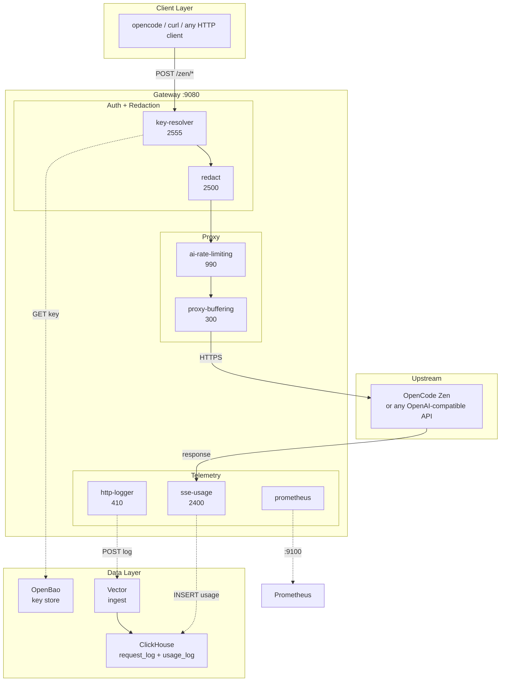
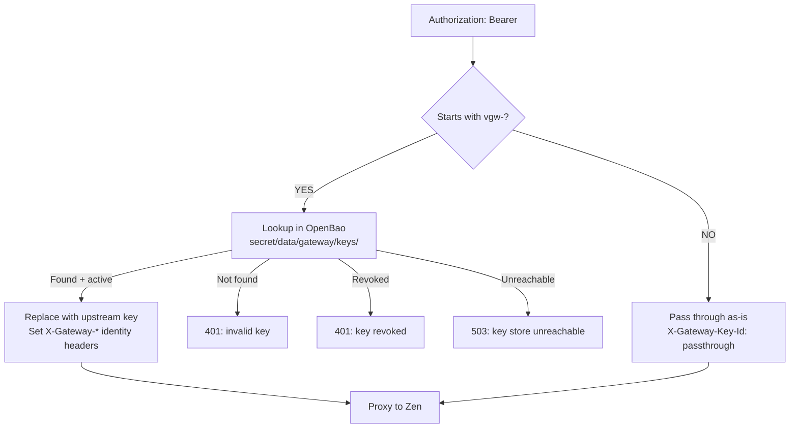

# WORKSPACE-GATEWAY

Multi-tenant LLM gateway on Apache APISIX 3.17.0. Routes traffic to any
OpenAI-compatible LLM provider, with PII redaction, virtual key
management, and billing-grade token accounting. Three custom Lua
plugins, four built-in plugins, zero sidecars on the hot path.

Currently configured with **OpenCode Zen** as the upstream. APISIX's
built-in `ai-proxy` / `ai-proxy-multi` plugins support 10 provider
backends out of the box (see [Supported Providers](#supported-providers)).

> Part of the `Independent-Ai-Labs/WORKSPACE-VM` monorepo.
> Full technical reference: [`docs/ARCHITECTURE.md`](docs/ARCHITECTURE.md)

---

## Table of Contents

- [Quick Start](#quick-start)
- [Architecture](#architecture)
- [Supported Providers](#supported-providers)
- [Features](#features)
- [Plugins](#plugins)
- [Key Management](#key-management)
- [Configuration](#configuration)
- [opencode Integration](#opencode-integration)
- [Testing](#testing)
- [Repository Layout](#repository-layout)
- [Make Targets](#make-targets)
- [Documentation](#documentation)
- [License](#license)

---

## Quick Start

```bash
# 1. Install podman-compose and build images
make install

# 2. Start the gateway stack (APISIX + ClickHouse + Vector + OpenBao)
make dev-start

# 3. Send a request through the gateway
KEY="$GATEWAY_API_KEY"  # from .env (provisioned in OpenBao on start)
curl -s http://localhost:9080/zen/v1/chat/completions \
  -H "Authorization: Bearer $KEY" \
  -H "Content-Type: application/json" \
  -d '{"model":"big-pickle","messages":[{"role":"user","content":"Say hello"}]}'
```

Ports: 9080 (gateway), 8123 (ClickHouse), 9100 (Prometheus), 8201 (OpenBao).

### Prerequisites

- [Podman](https://podman.io/) 5.x
- [Ansible](https://docs.ansible.com/) 2.21+
- `uv` (for `.venv` setup)
- A `.env` file with `OPENCODE_ZEN_API_KEY`, `GATEWAY_API_KEY`,
  `OPENBAO_TOKEN` (see `.env` example in repo, gitignored)

---

## Architecture



Standalone YAML mode: file-driven configuration, hot reload.

**Current upstream**: OpenCode Zen (`opencode.ai:443`), which itself
routes to 50+ models across OpenAI, Anthropic, Google, DeepSeek, and
others. The gateway can be reconfigured to point at any
OpenAI-compatible API by editing `conf/apisix.yaml`.

---

## Supported Providers

APISIX's built-in `ai-proxy` and `ai-proxy-multi` plugins support the
following LLM provider backends. Swap the plain upstream proxy in
`conf/apisix.yaml` for `ai-proxy` (single provider) or `ai-proxy-multi`
(load balancing, retries, health checks across multiple providers).

| Provider | `provider` value | Default Endpoint | Since |
|----------|------------------|------------------|-------|
| OpenAI | `openai` | `api.openai.com/chat/completions` | 3.0 |
| DeepSeek | `deepseek` | `api.deepseek.com/chat/completions` | 3.0 |
| Azure OpenAI | `azure-openai` | custom (via `override.endpoint`) | 3.0 |
| AIMLAPI | `aimlapi` | `api.aimlapi.com/v1/chat/completions` | 3.14 |
| Anthropic | `anthropic` | `api.anthropic.com/v1/chat/completions` | 3.15 |
| OpenRouter | `openrouter` | `openrouter.ai/api/v1/chat/completions` | 3.15 |
| Google Gemini | `gemini` | `generativelanguage.googleapis.com/v1beta/openai` | 3.15 |
| Google Vertex AI | `vertex-ai` | `aiplatform.googleapis.com` (needs `project_id` + `region`) | 3.15 |
| AWS Bedrock | `bedrock` | `bedrock-runtime.{region}.amazonaws.com` (SigV4 signed) | 3.17 |
| Any OpenAI-compatible | `openai-compatible` | custom (via `override.endpoint`) | 3.0 |

**`ai-proxy-multi`** adds: load balancing across instances, automatic
retries on failure, health checks, and provider-level routing rules.

---

## Features

| Feature | How | Custom Code |
|---------|-----|-------------|
| PII redaction + re-hydration | `redact` plugin: regex + dictionary + Luhn, pure Lua | Yes |
| Virtual key management | `key-resolver` plugin: OpenBao KVv2, shared dict cache | Yes |
| Direct key pass-through | `key-resolver`: non-`vgw-` keys forwarded as-is | Yes |
| SSE token extraction | `sse-usage` plugin: buffers SSE, extracts usage, writes ClickHouse | Yes |
| Per-model rate limiting | `ai-rate-limiting` built-in | No |
| Request/response logging | `http-logger` built-in, to Vector to ClickHouse | No |
| Prometheus metrics | `prometheus` built-in at `:9100` | No |
| SSE streaming support | `proxy-buffering` disabled per-route | No |
| Billing-grade schema | ClickHouse `Decimal64(6)`, 13-month TTL, `LowCardinality` keys | SQL only |

---

## Plugins

Seven plugins on a single route, ordered by Nginx phase priority:

| Plugin | Priority | Type | Phase(s) | Purpose |
|--------|----------|------|----------|---------|
| `key-resolver` | 2555 | Custom Lua | access | Resolve `vgw-*` keys via OpenBao; pass through others |
| `redact` | 2500 | Custom Lua | access, header_filter, body_filter, log | PII anonymization + re-hydration |
| `sse-usage` | 2400 | Custom Lua | header_filter, body_filter, log | Extract token usage from SSE/JSON responses |
| `ai-rate-limiting` | 990 | Built-in | access | Per-model rate limit (1000 req / 60s) |
| `http-logger` | 410 | Built-in | log | Send req/resp metadata to Vector |
| `proxy-buffering` | 300 | Built-in | filter | Disable buffering for SSE |
| `prometheus` | N/A | Built-in | log | Export metrics at `:9100` |

### Extract-Testable-Core Pattern

Each custom plugin is split into two files:

| File | Role | Nginx Dependency |
|------|------|------------------|
| `*_lib.lua` | Pure logic module, requireable, unit-testable | `cjson`, `ngx.re` only |
| `*.lua` | APISIX adapter: lifecycle phases, ctx, shared dict | Full APISIX API |

---

## Key Management



### Two Key Modes

1. **Virtual keys** (`vgw-*`): Stored in OpenBao. Resolved to an
   upstream Zen key. Can be revoked, rate-limited per tenant, audited.
   Cached in `key_cache` shared dict (5s TTL in dev, 300s in prod).

2. **Direct keys** (any non-`vgw-` prefix, e.g. `sk-*`): Passed through
   to upstream as-is. No OpenBao lookup. Users can bring their own
   Zen API keys.

### Commands

```bash
make issue-key                              # Create vgw-<random hex> key
make issue-key KEY_ID=my-key TENANT_ID=acme USER_ID=alice
make list-keys                              # List all keys with metadata
make revoke-key KEY_ID=vgw-abc123           # Revoke (record preserved)
```

---

## Configuration

### Key Files

| File | Purpose |
|------|---------|
| `conf/config.yaml` | APISIX standalone mode: plugin list, shared dicts, env vars, Prometheus port |
| `conf/apisix.yaml` | Route + plugin configs (single `/zen/*` route, 7 plugins) |
| `conf/redact-patterns.json` | PII detection: 6 regex patterns + 2 dictionary categories |
| `conf/clickhouse-init.sql` | 4 tables: `request_log`, `usage_log`, `billing_ledger`, `billing_discrepancies` |
| `conf/vector.toml` | Vector pipeline: HTTP source, VRL remap, ClickHouse sink |
| `res/docker/docker-compose.yml` | 4 services: apisix, clickhouse, vector, openbao |
| `res/docker/Dockerfile.apisix` | Custom APISIX image: 5 Lua files + config copied in |
| `.env` | Secrets: `OPENCODE_ZEN_API_KEY`, `GATEWAY_API_KEY`, `OPENBAO_TOKEN` |

### Environment Variables

| Variable | Purpose | Example |
|----------|---------|---------|
| `OPENCODE_ZEN_API_KEY` | Upstream Zen key (injected into proxied requests) | `sk-C0kL...` |
| `GATEWAY_API_KEY` | Default virtual key for opencode integration | `vgw-gateway-key` |
| `OPENBAO_TOKEN` | Root token for OpenBao KVv2 API | `2e22c6e...` |

### ClickHouse Tables

| Table | Written By | Key Columns |
|-------|-----------|-------------|
| `request_log` | Vector (from http-logger) | model, tokens, req_body, resp_body, 11 identity columns |
| `usage_log` | sse-usage plugin (via timer) | model, prompt_tokens, completion_tokens, total_tokens |
| `billing_ledger` | v2 billing pipeline (deferred) | cost `Decimal64(6)`, rate_input/output, cache_status |
| `billing_discrepancies` | v2 reconciler (deferred) | gateway_tokens, provider_tokens, divergence |

---

## opencode Integration

The gateway registers as a `workspace-gateway` custom provider in
opencode.

```bash
# Sync all models from gateway into opencode config
make sync-models
```

This fetches `/zen/v1/models` from the gateway and writes the
`workspace-gateway` provider entry into `~/.config/opencode/opencode.jsonc`
with all model IDs, the gateway URL, and the virtual key.

Result in opencode config:

```json
{
  "provider": {
    "workspace-gateway": {
      "api": "http://localhost:9080/zen/v1",
      "options": {
        "baseURL": "http://localhost:9080/zen/v1",
        "apiKey": "vgw-gateway-key",
        "headers": { "X-Tenant-ID": "default", "X-User-ID": "agent" }
      },
      "models": { "big-pickle": {}, "gpt-5": {}, "...": {} }
    }
  }
}
```

---

## Testing

```bash
make test          # Run all stages
make dev-test      # Same, via Ansible
```

| Stage | What |
|-------|------|
| 1 | Lua unit tests via `resty` CLI inside the APISIX container |
| 2 | Config validation: 7 scripts checking every YAML, SQL, TOML, JSON file |
| 3 | Reconciler static analysis: syntax, strict mode, error handling |
| 4 | Integration: black-box HTTP against the running stack |
| 5 | CI hook verification: pre-commit and pre-push hooks present and wired |
| 6 | E2E: real Zen API calls (streaming, non-streaming, redaction, errors) |

See [`docs/TEST-PLAN.md`](docs/TEST-PLAN.md) for the full strategy.

---

## Repository Layout

```
WORKSPACE-GATEWAY/
├── README.md
├── Makefile                        # Dev lifecycle + quality gates
├── pyproject.toml
├── .env                            # Secrets (gitignored)
├── docs/
│   ├── ARCHITECTURE.md             # Complete technical reference
│   ├── TEST-PLAN.md                # Test plan
│   ├── PROPOSAL-LLM-GATEWAY-v3.md  # Umbrella architecture
│   ├── PLUGIN-FOUNDATION.md        # APISIX Lua plugin dev guide
│   ├── BUILTIN-PLUGINS.md          # Built-in plugin config
│   ├── PLUGIN-REDACT-LUA.md        # Redact plugin spec
│   ├── PLUGIN-REDACT-ENGINE.md     # NER sidecar spec (v2)
│   ├── PLUGIN-SEMANTIC-CACHE.md    # Semantic cache spec (v2)
│   ├── DEPLOYMENT.md               # Deployment guide
│   └── OPENCODE-INTEGRATION.md     # Zen integration specifics
├── plugins/custom/
│   ├── key-resolver.lua            # priority 2555: virtual key + pass-through
│   ├── redact.lua                  # priority 2500: PII redaction adapter
│   ├── redact_lib.lua              # pure logic: luhn, load, redact, restore
│   ├── sse-usage.lua               # priority 2400: SSE usage extraction adapter
│   └── sse_usage_lib.lua           # pure logic: buffer, scan, parse, extract
├── conf/
│   ├── config.yaml                 # APISIX standalone config
│   ├── apisix.yaml                 # route + 7 plugin configs
│   ├── redact-patterns.json        # 6 regex + 2 dictionary PII patterns
│   ├── clickhouse-init.sql         # 4 tables with idempotent ALTERs
│   └── vector.toml                 # HTTP source + VRL remap + ClickHouse sink
├── res/
│   ├── docker/
│   │   ├── docker-compose.yml      # 4 services, 2 networks
│   │   └── Dockerfile.apisix       # APISIX 3.17 + 5 Lua files
│   ├── ansible/
│   │   └── dev.yml                 # Lifecycle playbook (start/stop/clean/test/smoke)
│   └── scripts/
│       ├── issue-key.sh            # Create virtual key in OpenBao
│       ├── list-keys.sh            # List all keys
│       ├── revoke-key.sh           # Revoke key (preserve record)
│       ├── reconciler.sh           # Daily billing reconciliation
│       └── sync-opencode-models.sh # Sync models to opencode config
├── tests/
│   ├── run_all.sh                  # Master runner
│   ├── lua/                        # Lua unit tests (resty CLI)
│   ├── config/                     # Config validation (7 scripts)
│   ├── reconciler/                 # Reconciler static analysis
│   ├── integration/                # Black-box HTTP tests
│   ├── ci/                         # CI hook verification
│   └── e2e/                        # End-to-end Zen API tests
└── config/
    └── coverage_thresholds.yaml
```

---

## Make Targets

### Dev Lifecycle (Ansible-managed)

| Target | Description |
|--------|-------------|
| `make dev-start` | Build images, start stack, provision keys, health checks |
| `make dev-stop` | Stop stack (keep volumes) |
| `make dev-restart` | Stop + start |
| `make dev-rebuild` | Stop + start (rebuilds images) |
| `make dev-status` | Show containers + health |
| `make dev-logs` | Tail container logs |
| `make dev-clean` | Stop + destroy volumes (data loss) |
| `make dev-shell` | Exec into APISIX container |
| `make dev-reset-db` | Drop + recreate ClickHouse tables |
| `make dev-smoke` | Single curl request through gateway |
| `make dev-test` | Run full test suite via Ansible |

### Key Management

| Target | Description |
|--------|-------------|
| `make issue-key` | Create new `vgw-*` key in OpenBao |
| `make list-keys` | List all keys with metadata |
| `make revoke-key KEY_ID=vgw-xxx` | Revoke a key |
| `make sync-models` | Sync models from gateway to opencode config |

### Quality Gates

| Target | Description |
|--------|-------------|
| `make lint` | Shell syntax + YAML validation |
| `make type-check` | Lua syntax check via `resty` in Podman |
| `make test` | Run all test stages |
| `make check` | lint + type-check + test |
| `make check-push` | check + E2E tests (if Zen key set) |

---

## Documentation

| Document | Content |
|----------|---------|
| [`docs/ARCHITECTURE.md`](docs/ARCHITECTURE.md) | Complete technical reference: every component, plugin, data flow, schema, script, test |
| [`docs/TEST-PLAN.md`](docs/TEST-PLAN.md) | Testing strategy with extract-testable-core pattern |
| [`docs/PROPOSAL-LLM-GATEWAY-v3.md`](docs/PROPOSAL-LLM-GATEWAY-v3.md) | Architecture rationale, Kong-to-APISIX pivot, billing contract |
| [`docs/PLUGIN-FOUNDATION.md`](docs/PLUGIN-FOUNDATION.md) | APISIX custom Lua plugin development foundation |
| [`docs/PLUGIN-REDACT-LUA.md`](docs/PLUGIN-REDACT-LUA.md) | Redact plugin specification |
| [`docs/BUILTIN-PLUGINS.md`](docs/BUILTIN-PLUGINS.md) | Built-in plugin configuration guide |
| [`docs/DEPLOYMENT.md`](docs/DEPLOYMENT.md) | Deployment and operations guide |
| [`docs/OPENCODE-INTEGRATION.md`](docs/OPENCODE-INTEGRATION.md) | OpenCode Zen integration specifics |

### v2 Specs (Deferred)

| Document | Feature |
|----------|---------|
| [`docs/PLUGIN-SEMANTIC-CACHE.md`](docs/PLUGIN-SEMANTIC-CACHE.md) | Redis VSS semantic cache |
| [`docs/PLUGIN-REDACT-ENGINE.md`](docs/PLUGIN-REDACT-ENGINE.md) | Rust NER sidecar (ONNX BERT-tiny) |

---

## License

- **Apache APISIX 3.17.0**: Apache 2.0
- **OpenBao 2.4.4**: MPL 2.0
- **ClickHouse 24.8**: Apache 2.0
- **Vector 0.40**: MPL 2.0
- **Custom Lua plugins**: bespoke, written for this project

---

**Maintained by:** AMI-Agents Engineering
