# Multi-tenant LLM Gateway on APISIX

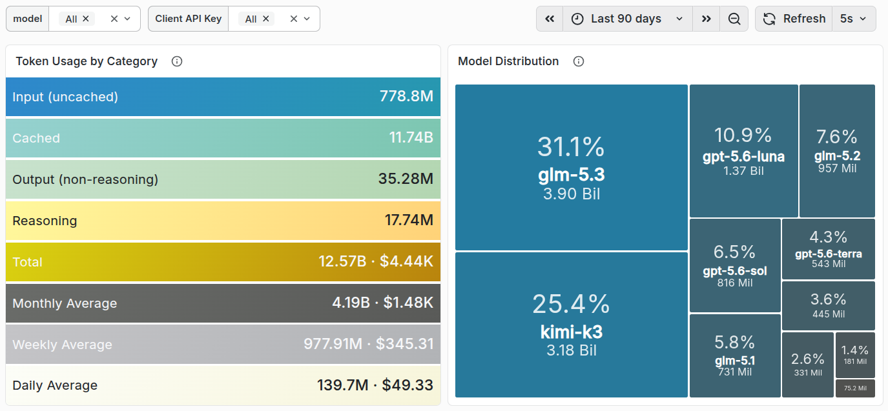

Apache APISIX gateway for shared LLM traffic with **virtual key sharding**,
**spend limits**, and **PII redaction**.

Cloud backends are reached through provider-passthrough relay routes
(`proxy-rewrite` plus the custom `sse-usage` telemetry layer), with usage, cost,
and health tracked in ClickHouse and Grafana. Passthrough is transparent: the
provider's own request and response shapes pass through unmodified, so
provider-native fields, streaming semantics, and error payloads survive the
gateway, and every route carries its own credential handling, path rewrite,
rate limit, and telemetry. The gateway is therefore provider-agnostic: a new
provider is a relay route plus an upstream node, whether the backend is
OpenAI-compatible or provider-native. This repo ships sample routes to OpenCode,
Moonshot Kimi, Z.ai, Alibaba Token Plan, and a local llamafile, and the default
deployment sends cloud traffic to OpenCode Go (`opencode.ai`).

---

## Table of Contents

- [Quick Start](#quick-start)
- [Architecture](#architecture)
- [Features](#features)
- [Work in progress](#work-in-progress)
- [Plugins](#plugins)
- [Key Management](#key-management)
- [Configuration](#configuration)
- [opencode Integration](#opencode-integration)
- [Testing](#testing)
- [Make Targets](#make-targets)
- [License](#license)

---

## Quick Start

```bash
# 1. Install podman-compose and build images
make install

# 2. Start the gateway stack (APISIX + etcd + ClickHouse + Vector + OpenBao + Prometheus + Grafana)
make gw-start

# 3. Send a request through the gateway
KEY="$GATEWAY_API_KEY"  # vgw-gateway-key from .env (provisioned in OpenBao on start)
curl -s http://localhost:9080/opencode_federated/v1/chat/completions \
  -H "Authorization: Bearer $KEY" \
  -H "Content-Type: application/json" \
  -d '{"model":"minimax-m3","messages":[{"role":"user","content":"Say hello"}]}'
```

Host port surface:

| Service | Dev | Prod | Exposure |
|---------|-----|------|----------|
| APISIX HTTP / HTTPS | 9080 / 9443 | 9081 / 9444 | public |
| ClickHouse HTTP | 8123 | 8124 | loopback, authenticated |
| Grafana | 3030 | 3030 | loopback, edge-proxy auth |

etcd, OpenBao, Vector, Prometheus, the APISIX Admin API and metrics, and the
ClickHouse native port publish no host ports; reach them with `podman exec`.

### Prerequisites

- [Podman](https://podman.io/) 5.x
- [Ansible](https://github.com/ansible/ansible) 2.21+
- `curl`, `jq`, `openssl`, `xxd` (used by tests and key scripts)
- `uv` (for `.venv` setup)
- A `.env` file with `ADMIN_KEY`, `OPENCODE_API_KEY`, `GATEWAY_API_KEY`,
  `OPENBAO_TOKEN`, `GRAFANA_ADMIN_PASSWORD`, the ClickHouse credential set,
  and the etcd credential set (see [`.env.example`](.env.example), gitignored)

Run `make init` to check all system dependencies and print install
instructions for any that are missing.

---

## Architecture

**Legend (all diagrams in this doc):** solid arrows = request/response data
path; dashed arrows = config, key lookup, or read-only observability.

### System context

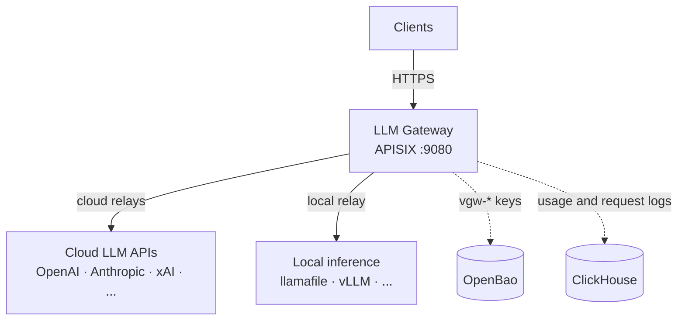
```mermaid
flowchart TB
    Clients[Clients]
    Gateway["LLM Gateway<br/>APISIX :9080"]
    Cloud["Cloud LLM APIs<br/>OpenAI · Anthropic · xAI · ..."]
    Local["Local inference<br/>llamafile · vLLM · ..."]
    OpenBao[(OpenBao)]
    Store[(ClickHouse)]

    Clients -->|HTTPS| Gateway
    Gateway -->|cloud relays| Cloud
    Gateway -->|local relay| Local
    Gateway -.->|vgw-* keys| OpenBao
    Gateway -.->|usage and request logs| Store
```

The gateway is provider-agnostic: clients hit APISIX, which relays to cloud
or local LLM APIs, resolves virtual keys via OpenBao, and persists usage data.
Deeper flows are diagrammed in the section that owns each concern:
[Plugins](#plugins) (request path), [Configuration](#configuration)
(telemetry, metrics, route config), [Key Management](#key-management) (auth).

Each new provider is a relay route plus an upstream node.

### Sample deployments in this repo

All 18 relay routes as registered in APISIX (definitions in
[`conf/apisix.yaml`](conf/apisix.yaml), provider config in
[`conf/providers/`](conf/providers/)):

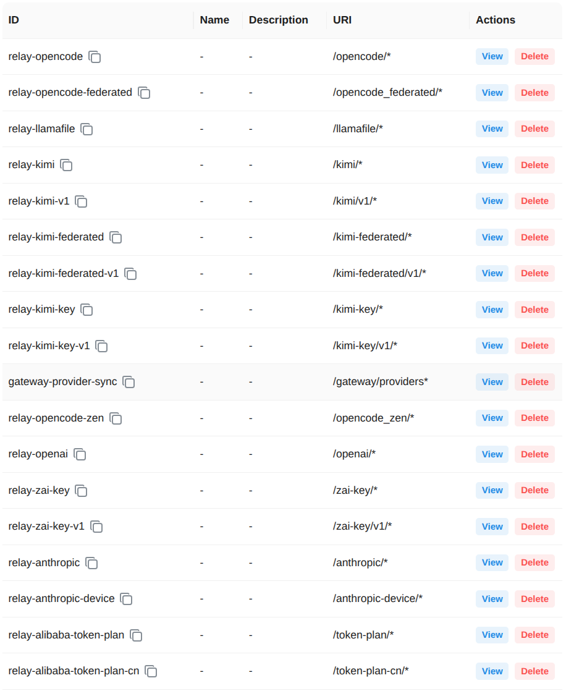

In this sample, OpenCode Go exposes 20+ models (MiniMax, Kimi, GLM,
DeepSeek, Qwen, MiMo, HY3) and OpenCode Zen serves the free/Zen model set
(`*-free` + pay-as-you-go) via the `/opencode_zen/*` relay. Swap the
upstream node in `apisix.yaml.j2` to point at any other compatible API.
Additional providers = new relay route + upstream node. Upstream API-key quota
exhaustion is handled by upstream key pools (see
[Key Management](#key-management)).

---

## Features

| Feature | Plugin / Mechanism | Type |
|---------|-------------------|------|
| PII redaction (on-the-fly sensitive data anonymisation) + re-hydration | `redact`: regex + dictionary + Luhn, pure Lua | Custom |
| Virtual key management | `key-resolver`: OpenBao KVv2 (persistent file-storage), shared dict cache | Custom |
| Direct key pass-through | `key-resolver`: non-`vgw-` keys forwarded as-is | Custom |
| Upstream key pool rotation | `key-resolver` + `upstream_pool_lib.lua`: sticky selection, auto-rotate on 429/402/403 | Custom |
| OAuth device/browser flows (any provider) | `provider-oauth` + `oauth_device`/`oauth_jwt`/`oauth_store`: protocol engines + per-route config, OpenBao session storage, transparent refresh | Custom |
| SSE token extraction | `sse-usage`: buffers SSE, extracts usage, writes ClickHouse | Custom |
| Per-key rate limiting (RPM) | `limit-count` + `key-meta` | Built-in + custom Lua |
| Per-key token/cost budget | `key-resolver` + `sse-usage` + `ngx.shared` | Custom Lua |
| Request/response logging | `http-logger` to Vector to ClickHouse | Built-in |
| Prometheus metrics | `prometheus` at `:9100` | Built-in |
| SSE streaming support | `proxy-buffering` disabled per-route | Config |
| Grafana dashboards (5) | Cost & Usage, Ops & Health, Cost Leaderboard, Model Experience, Model Performance: 90d lookback, 5s refresh | Config |
| Billing-grade schema | ClickHouse `Decimal64(6)`, tiered retention (archive volume, no deletion), `LowCardinality` keys | SQL |

---

## Work in progress

### Built-in safety and moderation (gateway plugins)

**Status:** WIP. Target: APISIX plugins on the federated request path that score
assistant behavior and enforce moderation policy before or after upstream relay,
alongside existing `redact` and `key-resolver` policy plugins.

### Semantic response cache

**Status:** WIP. A `semantic-cache` plugin (pgvector-backed response reuse) is
not attached to any route; it needs a pgvector store added to the stack.

---

## Plugins

### Request path (one federated cloud request)

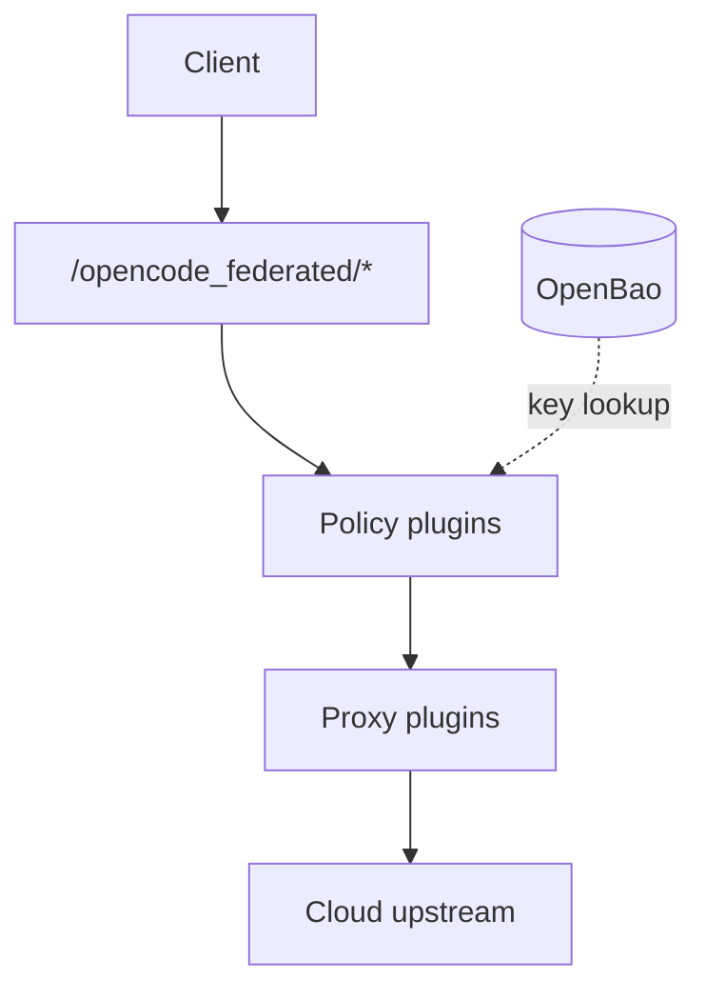
```mermaid
flowchart TB
    Client[Client]
    Route["/opencode_federated/*"]
    Policy[Policy plugins]
    Proxy[Proxy plugins]
    Upstream[Cloud upstream]
    OpenBao[(OpenBao)]

    Client --> Route --> Policy --> Proxy --> Upstream
    OpenBao -.->|key lookup| Policy
```

Policy = `key-resolver`, `key-meta`, `redact`, `limit-count` (access phase).
Proxy = `proxy-rewrite`, upstream proxy, `proxy-buffering`. Telemetry plugins
run after the upstream responds; see [ClickHouse Tables](#clickhouse-tables).

`/opencode/*` skips `key-resolver`; `/llamafile/*` skips auth and targets a
local upstream (see [sample deployments](#sample-deployments-in-this-repo)).

Plugins on the request path, in Nginx phase-priority order (`provider-oauth`
replaces `key-resolver` on the kimi routes):

- **`proxy-rewrite`** (N/A, Built-in, `rewrite`) : Strips route prefix; opencode relays → `/zen/go/*`, opencode zen relay → `/zen/*`, llamafile → upstream root
- **`provider-oauth`** (2560, Custom Lua, `access`, kimi routes) : Upstream device/browser OAuth with transparent token refresh
- **`key-resolver`** (2555, Custom Lua, `access`, federated only) : Resolve `vgw-*` keys via OpenBao; pass through others
- **`key-meta`** (2530, Custom Lua, `access`) : Compute key hash for per-key scoping (`X-Key-Hash`)
- **`redact`** (2500, Custom Lua, `access`/`header_filter`/`body_filter`/`log`) : PII anonymization + re-hydration
- **`sse-usage`** (2400, Custom Lua, `header_filter`/`body_filter`/`log`) : Extract token usage; increment budget counter
- **`limit-count`** (2002, Built-in, `access`) : Per-key RPM; federated route uses variable limits from OpenBao headers
- **`request-id`** (N/A, Built-in, `rewrite`/`log`) : Add `X-Request-Id` and echo it in the response
- **`http-logger`** (410, Built-in, `log`) : Send req/resp metadata to Vector
- **`proxy-buffering`** (300, Built-in, `filter`) : Disable buffering for SSE
- **`prometheus`** (N/A, Built-in, `log`) : Export metrics at `:9100`

### Extract-Testable-Core Pattern

Each custom plugin is split into two files:

- **`*_lib.lua`** : Pure logic module, requireable, unit-testable (deps: `cjson`, `ngx.re` only)
- **`*.lua`** : APISIX adapter: lifecycle phases, ctx, shared dict (deps: Full APISIX API)

---

## Key Management

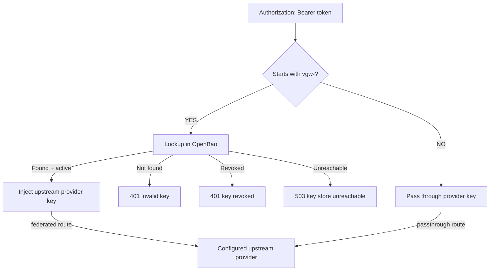
```mermaid
flowchart TB
    REQ["Authorization: Bearer token"] --> CHECK{"Starts with vgw-?"}
    CHECK -->|"YES"| OPENBAO["Lookup in OpenBao"]
    OPENBAO -->|"Found + active"| INJECT["Inject upstream provider key"]
    OPENBAO -->|"Not found"| R401["401 invalid key"]
    OPENBAO -->|"Revoked"| R401R["401 key revoked"]
    OPENBAO -->|"Unreachable"| R503["503 key store unreachable"]
    CHECK -->|"NO"| PASS["Pass through provider key"]
    INJECT -->|"federated route"| UPSTREAM["Configured upstream provider"]
    PASS -->|"passthrough route"| UPSTREAM
```

Applies to `/opencode/*` and `/opencode_federated/*` only; `/llamafile/*`
has no `Authorization` flow.

### Key Modes

1. **Virtual keys** (`vgw-*`): Used on the `/opencode_federated/*` and
   `/kimi-federated/*` routes. Stored in OpenBao (production file-storage
   mode with persistent volumes). Resolved to an upstream provider API key.
   Can be revoked, rate-limited per tenant, audited. Cached in `key_cache`
   shared dict (5s TTL in dev, 300s in prod).

2. **Direct keys** (any non-`vgw-` prefix, e.g. `sk-*`): Used on the
   `/opencode/*`, `/kimi-key/*`, and `/zai-key/*` routes. Passed through to
   upstream as-is. No OpenBao lookup. Users bring their own upstream provider
   API keys.

3. **Upstream key pools**: Named pools of upstream API keys shared by one or
   more virtual keys. The `key-resolver` plugin selects keys sticky-style and
   rotates on upstream quota/rate-limit responses (429 parks a key in cooldown,
   402/403 hard-disables it in OpenBao). Create and attach pools via
   `make pool-key` and `make issue-key POOL=...`.

### Commands

```bash
make issue-key                              # Create vgw-<random hex> key
make issue-key KEY_ID=my-key TENANT_ID=acme USER_ID=alice
make issue-key KEY_ID=my-key POOL=kimi      # Attach key to upstream pool
make list-keys                              # List all keys with metadata
make revoke-key KEY_ID=vgw-abc123           # Revoke (record preserved)
make pool-key ARGS='list'                   # List upstream key pools
make pool-key ARGS='create kimi'            # Create a new pool
make pool-key ARGS='add kimi k1 sk-...'     # Add a key to a pool
```

---

## Configuration

### Routes and config (control plane)

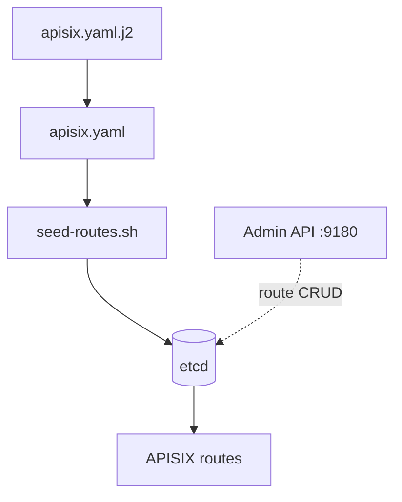
```mermaid
flowchart TB
    J2[apisix.yaml.j2]
    YAML[apisix.yaml]
    Seed[seed-routes.sh]
    Etcd[(etcd)]
    Routes[APISIX routes]
    Admin["Admin API :9180"]

    J2 --> YAML --> Seed --> Etcd --> Routes
    Admin -.->|route CRUD| Etcd
```

Traditional/etcd mode (RBAC-enabled; APISIX authenticates as a dedicated
etcd user): routes live in etcd, seeded from the rendered `conf/apisix.yaml`
on stack start. Admin API and built-in dashboard are reached via
`podman exec gw-apisix curl http://127.0.0.1:9180/ui/` (no host port).

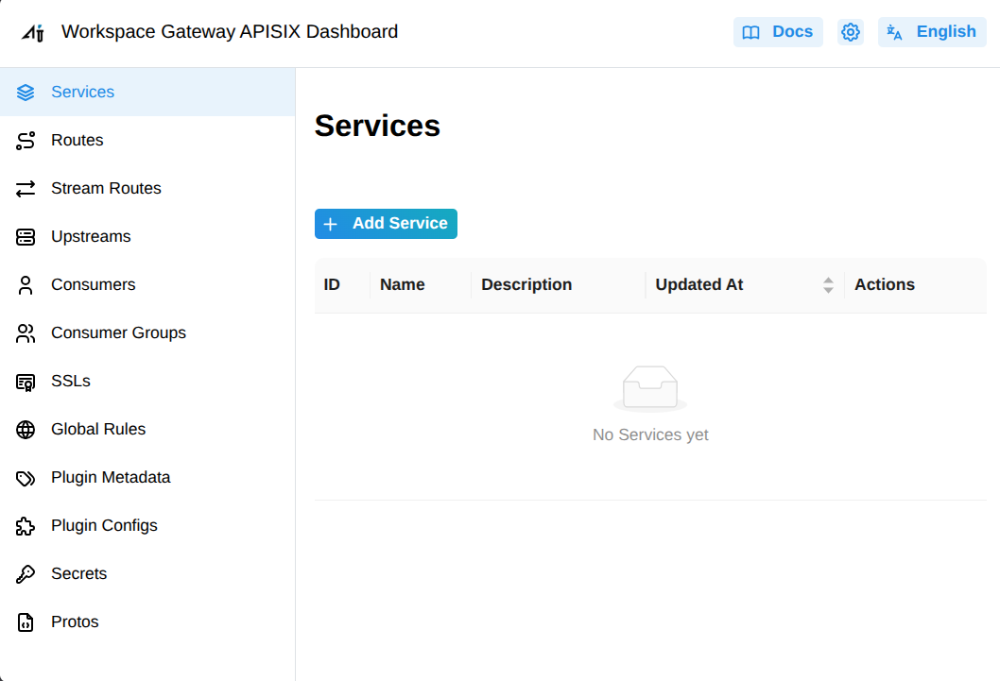

### Key Files

- `conf/config.yaml`: APISIX traditional/etcd mode: plugin list, shared dicts, env vars, Admin API, Prometheus port
- `conf/apisix.yaml`: Committed route render (18 routes); drift-checked against `conf/apisix.yaml.j2`
- `conf/apisix.yaml.j2`: Jinja2 route template rendered at deploy from `.env`
- `res/scripts/seed-routes.sh`: Seeds etcd from rendered `apisix.yaml` on stack start
- `conf/openbao.hcl`: OpenBao production config (file-storage backend)
- `conf/prometheus.yml`: Prometheus scrape config (APISIX `:9100`)
- `conf/profanity/`: vendored rejection-language dictionaries (refresh: `make gw-update-dictionaries`)
- `conf/grafana/`: Grafana datasources + 5 provisioned dashboards
- `conf/redact-patterns.json`: PII detection: 6 regex patterns + 2 dictionary categories
- `conf/sql/`: All SQL (no inline SQL anywhere). `clickhouse-init.sql` base schema, `migrations/` incremental changes, plus `ops/`, `ingest/`, `grafana/queries/`, `sqlite/`, `tests/`. Templates rendered by `res/scripts/lib-sql.sh` and linted by sqlfluff via `.sqlfluff`
- `conf/vector.toml`: Vector pipeline: HTTP source, VRL remap (parse_json for model extraction), ClickHouse sink
- `res/docker/docker-compose.yml`: 8 services: apisix, etcd, clickhouse, migrate, vector, openbao, prometheus, grafana
- `res/docker/Dockerfile.apisix`: Custom APISIX image: Lua plugins + config copied in
- `res/docker/Dockerfile.openbao`: Custom OpenBao image (production file-storage)
- `res/docker/openbao-entrypoint.sh`: OpenBao auto-init, auto-unseal, gateway key provisioning (data persists via `openbao-data` named volume)
- `.env`: Secrets: `ADMIN_KEY`, `OPENCODE_API_KEY`, `GATEWAY_API_KEY`, `OPENBAO_TOKEN`

### Environment Variables

| Variable | Purpose | Example |
|----------|---------|---------|
| `ADMIN_KEY` | APISIX Admin API key (not stored in tracked files) | `your-apisix-admin-key` |
| `OPENCODE_API_KEY` | Upstream Go key (injected into proxied requests) | `sk-HiEr...` |
| `OPENCODE_BASE_URL` | Upstream Go base URL | `https://opencode.ai/zen/go/v1` |
| `OPENCODE_ZEN_BASE_URL` | Upstream Zen/free base URL | `https://opencode.ai/zen/v1` |
| `GATEWAY_API_KEY` | Default virtual key for opencode integration | `vgw-gateway-key` |
| `OPENBAO_TOKEN` | Root token for OpenBao KVv2 API | `2e22c6e...` |
| `CONTEXT_LIMIT_PCT` | Context limit scaling percentage | `80` |
| `CONTEXT_LIMIT_CEILING` | Absolute max context tokens after scaling | `128000` |
| `GRAFANA_ADMIN_PASSWORD` | Grafana admin login (strong value; never `admin`) | `(openssl rand)` |
| `GRAFANA_EDGE_CIDR` | Sources Grafana trusts `X-WEBAUTH-USER` from | `10.99.10.1/32,127.0.0.1/32` |
| `CLICKHOUSE_PASSWORD` | ClickHouse `default` user (localhost-only) | `(openssl rand)` |
| `CH_GRAFANA_RO_PASSWORD` | Grafana datasource account (`grafana_ro`, readonly) | `(openssl rand)` |
| `CH_VECTOR_PASSWORD` | Vector sink account (`vector_rw`, insert-only) | `(openssl rand)` |
| `CH_APISIX_PASSWORD` | sse-usage account (`apisix_rw`, insert-only) | `(openssl rand)` |
| `CH_MIGRATOR_PASSWORD` | golang-migrate account (`migrator`, DDL) | `(openssl rand)` |
| `CH_OPS_PASSWORD` | Operator account (`ops_admin`, full access; guard like root) | `(openssl rand)` |
| `ETCD_ROOT_PASSWORD` | etcd bootstrap root credential | `(openssl rand)` |
| `ETCD_GW_USER` / `ETCD_GW_PASSWORD` | APISIX → etcd non-root credential | `apisix` / `(openssl rand)` |

### ClickHouse Tables

Telemetry runs in response/log phases after the upstream returns:

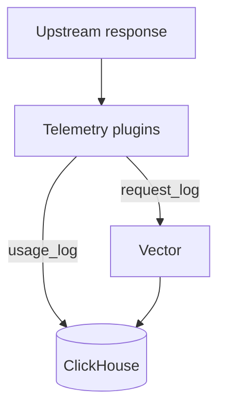
```mermaid
flowchart TB
    Response[Upstream response]
    Tele[Telemetry plugins]
    CH[(ClickHouse)]
    Vector[Vector]

    Response --> Tele
    Tele -->|usage_log| CH
    Tele -->|request_log| Vector
    Vector --> CH
```

`sse-usage` writes `usage_log` directly (as `apisix_rw`); `http-logger`
ships full request/response metadata to Vector, which inserts `request_log`
(metadata) and `request_bodies` (bodies; `req_body` is PII-tokenized by the
`redact` plugin before logging, and is invisible to the Grafana datasource).

| Table | Written By | Key Columns |
|-------|-----------|-------------|
| `request_log` | Vector (from http-logger) | `request_id`, model, status, identity columns (no bodies) |
| `request_bodies` | Vector (from http-logger) | `event_id`, `request_id`, `req_body`, `resp_body` (`ops_admin`-only) |
| `usage_log` | sse-usage plugin (via timer) | `request_id`, model, token breakdown, `cost`, `cost_source` |
| `billing_ledger` | MV on `usage_log` INSERT | cost `Decimal64(6)`, rate_input/output, cache_status |
| `billing_discrepancies` | v2 reconciler (deferred) | gateway_tokens, provider_tokens, divergence |

Retention moves old parts to a tiered, ZSTD-recompressed archive volume rather
than deleting them.
The ops-health storage panel monitors growth, and nightly backups land on
`/mnt/ws-backup`.

### Grafana Dashboards

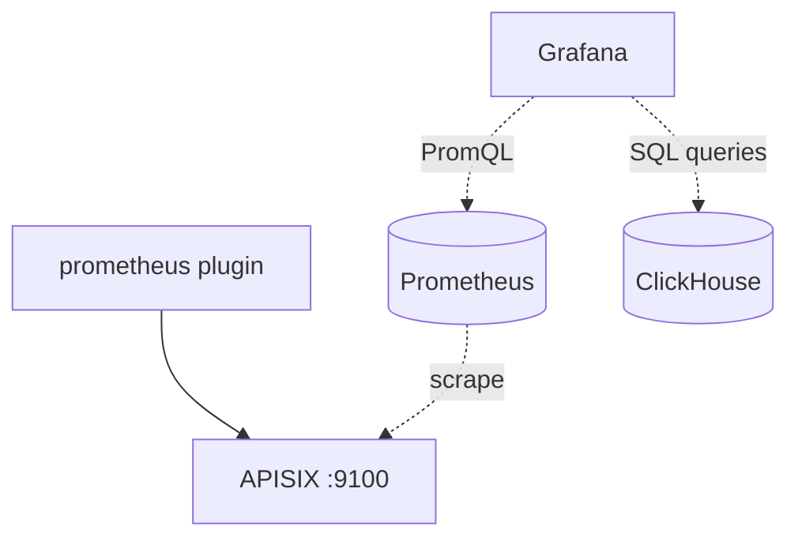
```mermaid
flowchart TB
    Plugin[prometheus plugin]
    Export["APISIX :9100"]
    Prom[(Prometheus)]
    Grafana[Grafana]
    CH[(ClickHouse)]

    Plugin --> Export
    Prom -.->|scrape| Export
    Grafana -.->|PromQL| Prom
    Grafana -.->|SQL queries| CH
```

The `prometheus` plugin exports request metrics at `:9100`. Prometheus
scrapes every 15s (`conf/prometheus.yml`). Grafana uses **Prometheus** for
ops panels (latency, error rate) and **ClickHouse** for cost and usage.
Grafana only queries data; it does not write.

Five provisioned dashboards (default: `now-90d` lookback, `5s` refresh):

| Dashboard | URL |
|-----------|-----|
| Gateway Cost & Usage | `http://localhost:3030/d/gateway-cost-usage?from=now-90d&to=now&refresh=5s` |
| Gateway Operations & Health | `http://localhost:3030/d/gateway-ops-health?from=now-90d&to=now&refresh=5s` |
| Gateway Cost Leaderboard | `http://localhost:3030/d/gateway-cost-leaderboard?from=now-90d&to=now&refresh=5s` |
| Gateway Model Experience | `http://localhost:3030/d/gateway-model-experience?from=now-90d&to=now&refresh=5s` |
| Gateway Model Performance | `http://localhost:3030/d/gateway-model-performance?from=now-90d&to=now&refresh=5s` |

Cost & Usage breaks spend down by token category and model:

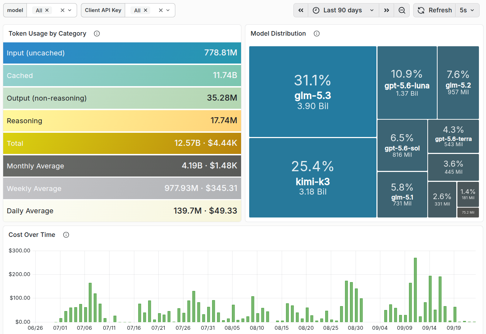

Operations & Health covers live traffic, error rate, and status codes:

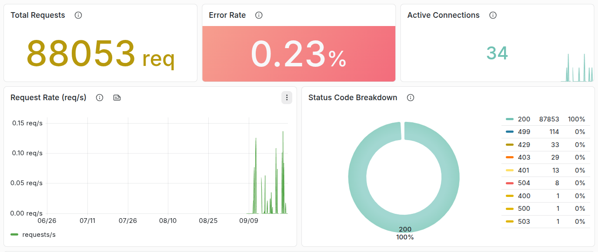

Model Experience ranks each model by a behavioural usefulness score built from
satisfaction, friction, and abandonment signals:

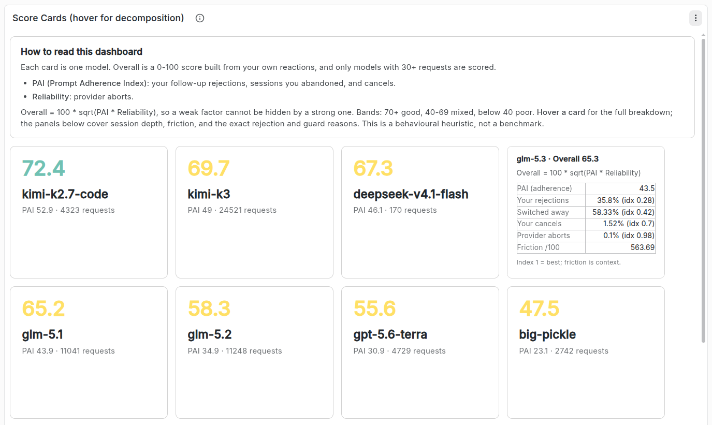

Model Performance tracks speed, stream reliability, and time to first token:

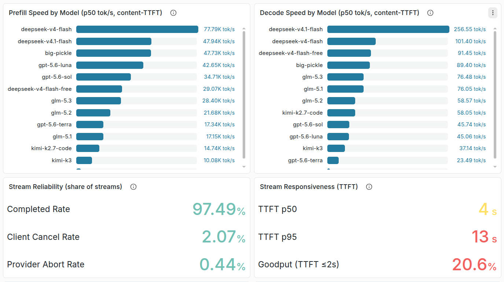

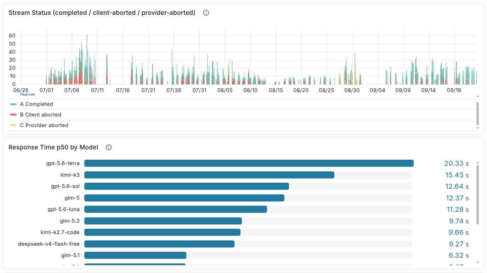

The leaderboard shows top clients (p20) and top models (p21) by cost and
tokens. After editing dashboard JSON, run `make gw-restart-grafana` to
reload provisioning.

---

## opencode Integration

The gateway registers canonical auth-mode providers: OpenCode Go virtual/API
key, OpenCode Zen API key, llamafile no-auth, three Moonshot Kimi modes
(device OAuth, virtual key, and API key), and Z.ai GLM API-key passthrough
as custom providers in opencode.

```bash
# Refresh the gateway-side provider/model catalog (does NOT touch client config)
make sync-models

# Install ALL gateway providers into opencode config (auth skipped by default)
make setup-providers

# Same, prompting for API keys / running OAuth device flows:
make setup-providers REQUIRE_AUTH=1

# Add a key for one provider later:
bash res/scripts/opencode-provider-login.sh --provider-id workspace-gw-zai-api-key --require-auth
```

This enriches the gateway catalog from `/opencode_federated/v1/models` (Go
tier, `*-free` models filtered out), `/opencode_zen/v1/models` (all Zen/free
models), and `/llamafile/v1/models` (local llamafile upstream), with canonical
metadata (name, context limit, capabilities, cost, modalities) from
[models.dev](https://models.dev), including `variants` (reasoning-effort
presets) derived from models.dev reasoning options exactly as opencode derives
them.
Provider entries are written into `~/.config/opencode/opencode.jsonc` by the
login script above, which fetches each ready-made block from
`/gateway/providers/<id>/opencode`:

- `workspace-gw-opencode-go-virtual-key`: virtual-key mode, Go tier
- `workspace-gw-opencode-go-api-key`: API-key passthrough, Go tier
- `workspace-gw-opencode-zen-api-key`: API-key passthrough, free/Zen models
- `workspace-gw-llamafile-no-auth`: no-auth local LLM
- `workspace-gw-kimi-device-oauth`: device OAuth (gateway-managed Kimi token)
- `workspace-gw-kimi-virtual-key`: virtual-key mode for Kimi (`vgw-*`)
- `workspace-gw-kimi-api-key`: API-key passthrough for Kimi
- `workspace-gw-zai-api-key`: API-key passthrough for Z.ai GLM (Coding Plan endpoint)
- `workspace-gw-anthropic-passthrough`: API-key passthrough for Anthropic
- `workspace-gw-anthropic-device-oauth`: device OAuth for Anthropic
- `workspace-gw-openai-device-oauth`: device OAuth for OpenAI (ChatGPT)
- `workspace-gw-alibaba-token-plan-passthrough`: API-key passthrough, Alibaba Token Plan
- `workspace-gw-alibaba-token-plan-cn-passthrough`: API-key passthrough, Alibaba Token Plan (China)

For the OAuth providers, the login script starts the device flow and prints
the verification URL.

Each provider receives the full enriched catalog, because opencode drops
providers that expose zero models. The two Go providers
(`workspace-gw-opencode-go-virtual-key` and `workspace-gw-opencode-go-api-key`)
filter out `*-free` models, since their relay rewrites to `/zen/go/` (paid
only); free models are served only through
`workspace-gw-opencode-zen-api-key`. The llamafile provider takes its model
list from `/llamafile/v1/models` (or a default id when the server is down);
MiniCPM5 uses context `131072` (scaled to `104857` at 80%) with `tool_call:
true`. The script runs automatically on `make gw-start` and `make gw-restart`
via the Ansible playbook.

Context limits are scaled by `CONTEXT_LIMIT_PCT` (default 80) from `.env`,
so e.g. `CONTEXT_LIMIT_PCT=80` reduces a 200000-token context to 160000.
An absolute ceiling `CONTEXT_LIMIT_CEILING` (default 128000) is then
applied: any scaled value exceeding the ceiling is clamped to it. Set to
0 to disable.

Result in opencode config:

```json
{
  "provider": {
    "workspace-gw-opencode-go-virtual-key": {
      "api": "http://localhost:9080/opencode_federated/v1",
      "npm": "@ai-sdk/openai-compatible",
      "options": {
        "baseURL": "http://localhost:9080/opencode_federated/v1",
        "apiKey": "vgw-gateway-key",
        "headers": { "X-Tenant-ID": "default", "X-User-ID": "agent" }
      },
      "models": {
        "minimax-m3": {
          "name": "MiniMax M3",
          "family": "minimax",
          "release_date": "2026-06-01",
          "attachment": true,
          "reasoning": true,
          "temperature": true,
          "tool_call": true,
          "cost": { "input": 15, "output": 75, "cache_read": 1.5, "cache_write": 18.75 },
          "limit": { "context": 160000, "output": 24000 },
          "modalities": { "input": ["text", "image", "pdf"], "output": ["text"] },
          "status": "active"
        }
      }
    },
    "workspace-gw-opencode-go-api-key": {
      "api": "http://localhost:9080/opencode/v1",
      "npm": "@ai-sdk/openai-compatible",
      "options": {
        "baseURL": "http://localhost:9080/opencode/v1",
        "headers": { "X-Tenant-ID": "default", "X-User-ID": "agent" }
      },
      "models": { "...": "same enriched models as workspace-gw-opencode-go-virtual-key" }
    }
  }
}
```

---

## Testing

```bash
make test          # Run all stages (excludes live upstream API tests)
make test-live     # Run all stages including live upstream API tests
make gw-test       # Same as test, against the running stack
```

1. Lua unit tests via `resty` CLI inside the APISIX container
2. Config validation: 25 scripts (YAML, SQL, TOML, JSON, dashboard structure, migrations)
3. Reconciler static analysis: syntax, strict mode, error handling
4. Integration: black-box HTTP against the running stack (llamafile e2e,
   event_id alignment, data flow, cost e2e, Grafana panel checks)
5. Repository hooks: pre-commit and pre-push hooks present and wired
6. E2E: real Go API calls (gated behind `RUN_LIVE_API_TESTS=1`)

---

## Make Targets

### Gateway Lifecycle (systemd-managed)

The stack is owned by the systemd user unit `gateway-compose`
(`make gw-deploy` installs it with linger). Start/stop/restart go through
systemctl so an unmanaged compose stack never fights the unit's
`Restart=always`.

| Target | Description |
|--------|-------------|
| `make gw-build` | Build container images |
| `make gw-start` | Start stack via systemd, provision keys, health checks |
| `make gw-stop` | Stop stack via systemd (keep volumes) |
| `make gw-restart` | Restart the stack via systemd. NOTE: the unit's ExecStart force-recreates every container from the current compose (it does NOT preserve running containers or apply compose network changes selectively) |
| `make gw-update` | Build images, redeploy changed services via systemd, reconcile, and verify |
| `make gw-reconcile` | Reconcile routes, schema, and provider catalog without restarting containers |
| `make gw-verify` | Health report: status + one request through the gateway |
| `make gw-status` | Show systemd unit + containers |
| `make gw-logs` | Tail container logs |
| `make gw-shell` | Exec into APISIX container |
| `make gw-test` | Run full test suite against the running stack |
| `make gw-restart-service SVC=name` | Restart one existing service without recreating it |
| `make gw-recreate-service SVC=name` | Recreate ONE service from the current compose (applies network/env changes; grafana/clickhouse/vector/openbao/prometheus/etcd) |
| `make gw-restart-grafana` | Restart Grafana, reload provisioning, sync dashboard defaults |
| `make gw-deploy` | Install + enable gateway compose on boot (systemd user + linger) |
| `make gw-undeploy` | Disable + remove gateway compose systemd unit |
| `make gw-systemd-logs` | Tail gateway systemd unit logs |
| `make ch-migrate` | Apply pending ClickHouse schema migrations |
| `make ch-migrate-status` | Show ClickHouse migration version |

### Key Management

| Target | Description |
|--------|-------------|
| `make issue-key` | Create new `vgw-*` key in OpenBao |
| `make issue-key KEY_ID=... POOL=...` | Create a key attached to an upstream key pool |
| `make list-keys` | List all keys with metadata |
| `make revoke-key KEY_ID=vgw-xxx` | Revoke a key |
| `make pool-key ARGS='list'` | List upstream key pools |
| `make pool-key ARGS='create kimi'` | Create a new upstream key pool |
| `make pool-key ARGS='add kimi k1 sk-...'` | Add a key to an upstream pool |
| `make sync-models` | Refresh gateway-side provider/model catalog |
| `make setup-providers` | Install all gateway providers into opencode config (`REQUIRE_AUTH=1` to prompt for keys) |

### Quality Gates

| Target | Description |
|--------|-------------|
| `make lint` | Shell syntax + YAML validation |
| `make type-check` | Lua syntax check via `resty` in Podman |
| `make test` | Run all test stages (excludes live upstream API) |
| `make test-live` | Run all stages including live upstream API tests |
| `make check` | lint + type-check + test |
| `make check-push` | check + E2E tests (if Go key set) |
| `make plugin-install` | Install the gateway OpenCode plugin's Bun deps (`BUN=` overridable) |
| `make plugin-type-check` | TypeScript check of the OpenCode plugin via Bun |
| `make plugin-test` | Run the OpenCode plugin's Bun test suite |

---

## License

- **Apache APISIX 3.18.0**: Apache 2.0
- **OpenBao 2.4.4**: MPL 2.0
- **ClickHouse 24.8**: Apache 2.0
- **Vector 0.40**: MPL 2.0
- **Prometheus v3.13.1**: Apache 2.0
- **Grafana 13.0.2**: AGPLv3
