# WORKSPACE-GATEWAY Architecture

> Complete technical reference: every component, plugin, data flow, schema,
> script, test, and configuration file in the WORKSPACE-GATEWAY LLM gateway.

---

## 1. System Overview

WORKSPACE-GATEWAY is a multi-tenant LLM gateway built on **Apache APISIX
3.17.0** (standalone YAML mode, Apache 2.0). The gateway provides three
custom Lua plugins, six APISIX built-in plugins, OpenBao-backed virtual
key management, PII redaction with re-hydration, billing-grade token
accounting in ClickHouse, and Prometheus metrics. It ships with a bundled
demo provider configuration pointing at **OpenCode Go**
(`https://opencode.ai/zen/go/v1`) which exposes 20+ Chinese model families
(MiniMax, Kimi, GLM, DeepSeek, Qwen, MiMo, HY3). The upstream is fully
configurable - replace the `nodes` entry in `conf/apisix.yaml` to point at
any provider.

**Two routes**: `/opencode/*` (passthrough, no key-resolver) and
`/opencode_federated/*` (virtual-key, key-resolver for `vgw-*` keys),
both proxied to `opencode.ai:443` with TLS and proxy-rewrite on both
routes (default configuration).

**Zero sidecars on the hot path.** All request-time logic runs in pure
Lua inside the APISIX Nginx worker process.

---

## 2. Container Topology

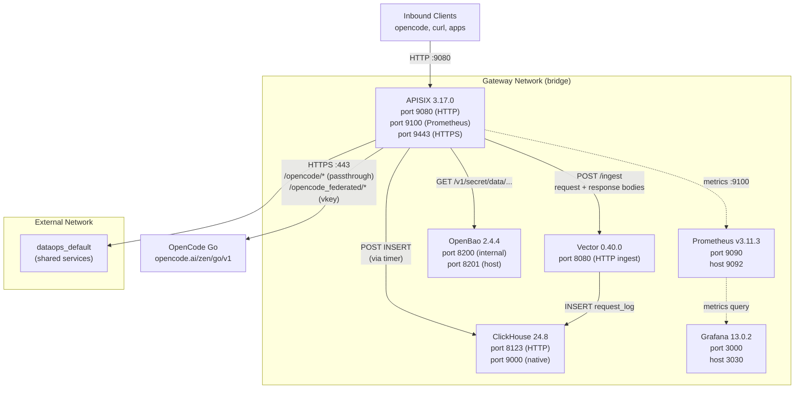

### Service Inventory

| Service | Image | Container Port | Host Port | Purpose |
|---------|-------|----------------|-----------|---------|
| APISIX | `apache/apisix:3.17.0-debian` (custom) | 9080, 9443, 9100 | 9080, 9443, 9100 | Data plane: routing, plugins, proxy |
| ClickHouse | `clickhouse/clickhouse-server:24.8-alpine` | 8123, 9000 | 8123, 9000 | Billing-grade token accounting |
| Vector | `timberio/vector:0.40.0-debian` | 8080 | 8080 | Telemetry ingest and transform |
| OpenBao | custom build from `res/docker/Dockerfile.openbao` | 8200 | 8201 | Virtual key storage (production file-storage, persistent volume) |
| Prometheus | `prom/prometheus:v3.11.3` | 9090 | 9092 | Metrics scraper (APISIX metrics endpoint) |
| Grafana | `grafana/grafana-oss:13.0.2` | 3000 | 3030 | Dashboards (Prometheus + ClickHouse data sources, 3 provisioned dashboards) |

### Networks

- **gateway** (bridge): APISIX, ClickHouse, Vector, OpenBao, Prometheus,
  Grafana communicate over this internal network. Container DNS resolves
  service names (`http://clickhouse:8123`, `http://vector:8080`,
  `http://openbao:8200`, `http://prometheus:9090`, `http://grafana:3000`).
  APISIX requires a DNS resolver config (`resolver:
  [10.89.0.1, 10.89.1.1]` in `config.yaml` under `nginx_config` or
  `apisix`) so that Lua cosockets can resolve container hostnames at
  request time.
- **dataops_default** (external): Shared network for cross-project
  services. APISIX is connected to both networks.

### Volumes

- **clickhouse-data**: Persistent storage for ClickHouse data. Survives
  container restarts. Destroyed only by `make dev-clean`.
- **openbao-data**: OpenBao persistent file storage at `/openbao/data`.
  Survives container restarts; preserves initialized cluster state and
  bootstrap keys. Destroyed only by `make dev-clean`.
- **prometheus-data**: Persistent storage for Prometheus time-series
  metrics. Survives container restarts. Destroyed only by
  `make dev-clean`.
- **grafana-data**: Persistent storage for Grafana dashboards and
  configuration. Survives container restarts. Destroyed only by
  `make dev-clean`.

---

## 3. Request Lifecycle

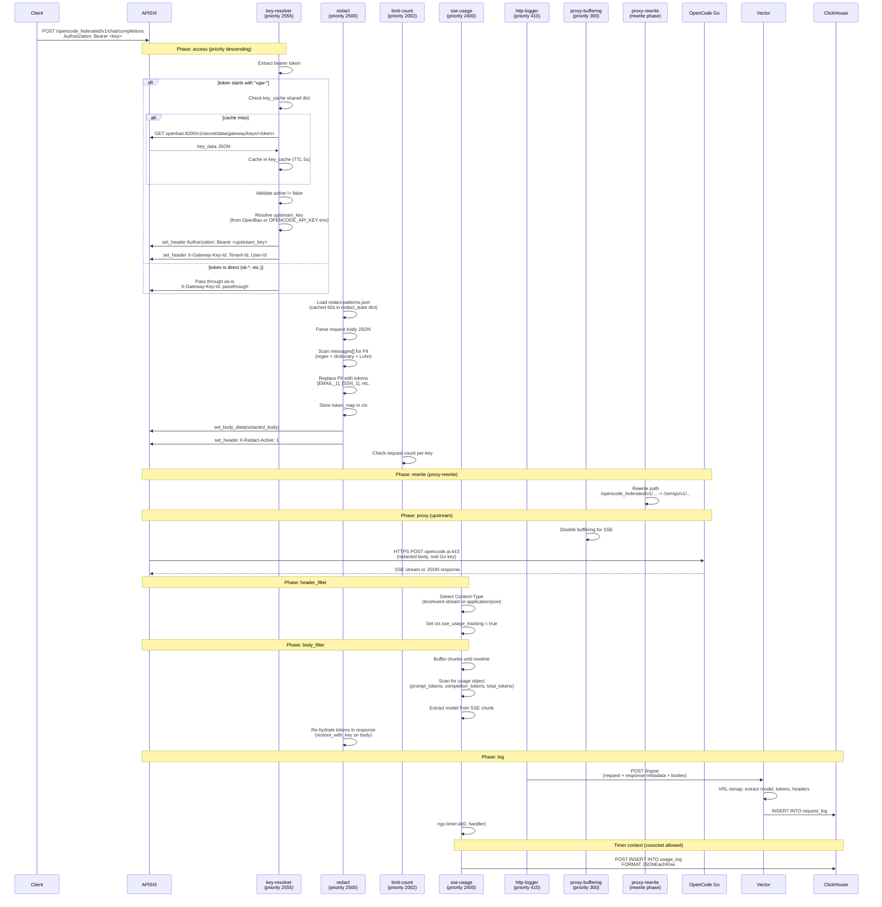

---

## 4. Plugin Pipeline

Plugins execute in **priority order** (highest first) during each Nginx
phase. The routes `/opencode/*` and `/opencode_federated/*` have eight
plugins configured (the federated route additionally enables
key-resolver):

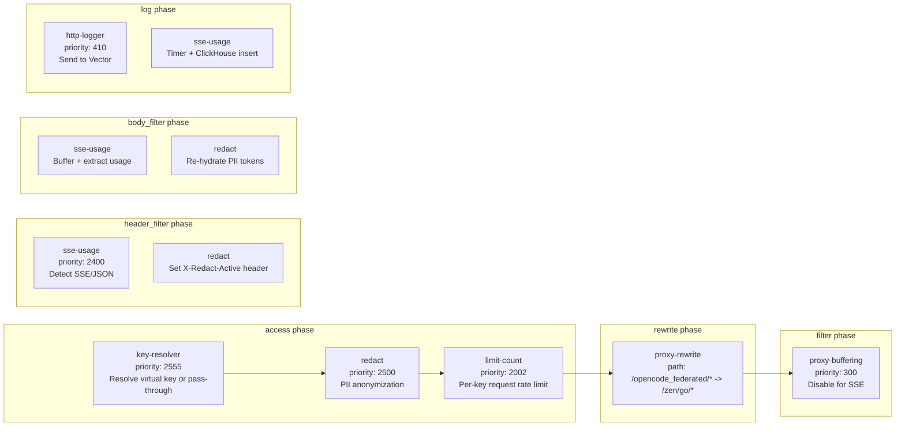

### Plugin Priority Table

| Plugin | Priority | Type | Phases | Purpose |
|--------|----------|------|--------|---------|
| `key-resolver` | 2555 | Custom Lua | access | Resolve virtual key via OpenBao or pass-through |
| `redact` | 2500 | Custom Lua | access, header_filter, body_filter, log | PII redaction and re-hydration |
| `limit-count` | 2002 | Built-in | access | Per-key request rate limiting (scoped by `X-Key-Hash`); variable `count`/`time_window` from `X-Gateway-Rate-Limit-*` headers |
| `sse-usage` | 2400 | Custom Lua | header_filter, body_filter, log | Extract token usage from SSE/JSON responses |
| `http-logger` | 410 | Built-in | log | Send request/response metadata to Vector |
| `proxy-buffering` | 300 | Built-in | filter | Disable Nginx buffering for SSE streaming |
| `proxy-rewrite` | N/A | Built-in | rewrite | Rewrite `/opencode_federated/*` to `/zen/go/*` (and `/opencode/*` to `/zen/go/*`) |
| `prometheus` | N/A | Built-in | log | Export metrics at `/apisix/prometheus/metrics` |

---

## 5. Custom Plugins

### 5.1 key-resolver.lua

**File**: `plugins/custom/key-resolver.lua` (180 lines)
**Priority**: 2555 (first plugin to execute)
**Schema**: `openbao_addr`, `openbao_token_env`, `upstream_key_env`,
`key_prefix`, `cache_ttl`, `virtual_key_prefix`

#### Key Resolution Logic

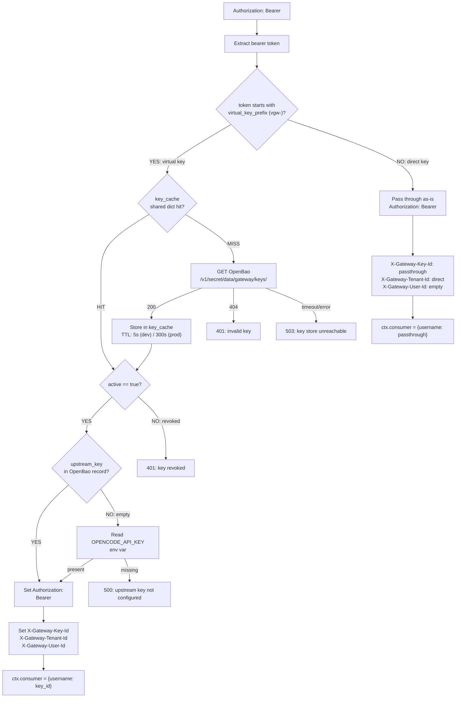

#### Two Key Modes

1. **Virtual keys** (`vgw-*` prefix): Looked up in OpenBao KVv2 secret
   store. The OpenBao record contains `virtual_key`, `upstream_key`,
   `tenant_id`, `user_id`, `active`, `created_at`. If `upstream_key` is
   empty, the resolver reads `OPENCODE_API_KEY` from the Nginx
   worker environment. Cached in `key_cache` shared dict with
   configurable TTL (5 seconds in dev for fast revocation propagation,
   300 seconds in production). OpenBao runs in production file-storage
   mode with persistent volumes (not dev mode).

2. **Direct pass-through keys** (any non-`vgw-` prefix, e.g. `sk-*`):
   Forwarded directly to the upstream as the Authorization header. No
   OpenBao lookup. Identity headers set to `passthrough` / `direct`.
   This allows users to bring their own OpenCode Go API keys. Proxy to
   OpenCode Go via the `/opencode/*` passthrough route (which does not
   enable key-resolver).

#### Error Handling (No Suppressed Errors)

| Condition | HTTP Status | Response Body |
|-----------|-------------|---------------|
| Missing Authorization header | 401 | `{"error":"key-resolver: missing Authorization header"}` |
| Invalid bearer format | 401 | `{"error":"key-resolver: invalid Authorization format"}` |
| Key not found in OpenBao | 401 | `{"error":"key-resolver: invalid key"}` |
| Key revoked (active=false) | 401 | `{"error":"key-resolver: key revoked"}` |
| OpenBao unreachable | 503 | `{"error":"key-resolver: cannot reach key store: ..."}` |
| key_cache not configured | 500 | `{"error":"key-resolver: key_cache shared dict not configured"}` |
| Upstream key not configured | 500 | `{"error":"key-resolver: upstream key not configured"}` |

#### Shared Dict

```yaml
custom_lua_shared_dict:
  key_cache: 5m    # 5 MB cache for resolved virtual keys
```

#### OpenBao KVv2 Path Structure

```
secret/data/gateway/keys/<virtual_key>
```

Example record:
```json
{
  "data": {
    "virtual_key": "vgw-gateway-key",
    "upstream_key": "",
    "tenant_id": "default",
    "user_id": "agent",
    "active": true,
    "created_at": "2026-01-01T00:00:00Z"
  }
}
```

---

### 5.2 redact.lua + redact_lib.lua

**Files**:
- `plugins/custom/redact.lua` (196 lines) - APISIX plugin adapter
- `plugins/custom/redact_lib.lua` (101 lines) - Pure logic module

**Priority**: 2500 (after key-resolver, before sse-usage)
**Schema**: `patterns_file`, `stream_mode`, `on_error`, `redact_ips`

#### Extract-Testable-Core Pattern

`redact_lib.lua` exports four pure functions with no Nginx dependencies
(only `cjson` and `ngx.re` for PCRE). `redact.lua` is a thin adapter
that handles APISIX lifecycle phases, shared dict caching, and ctx
management.

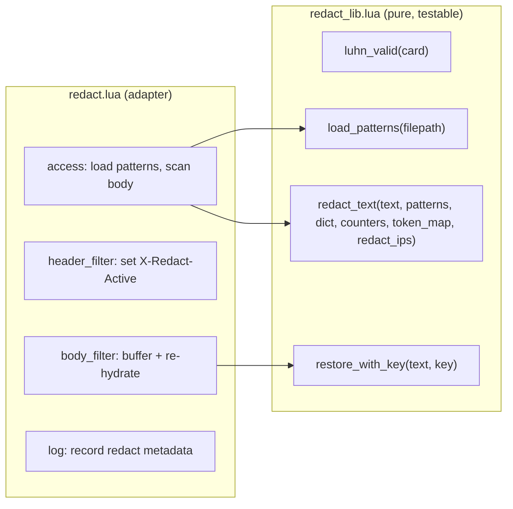

#### Redaction Flow (access phase)

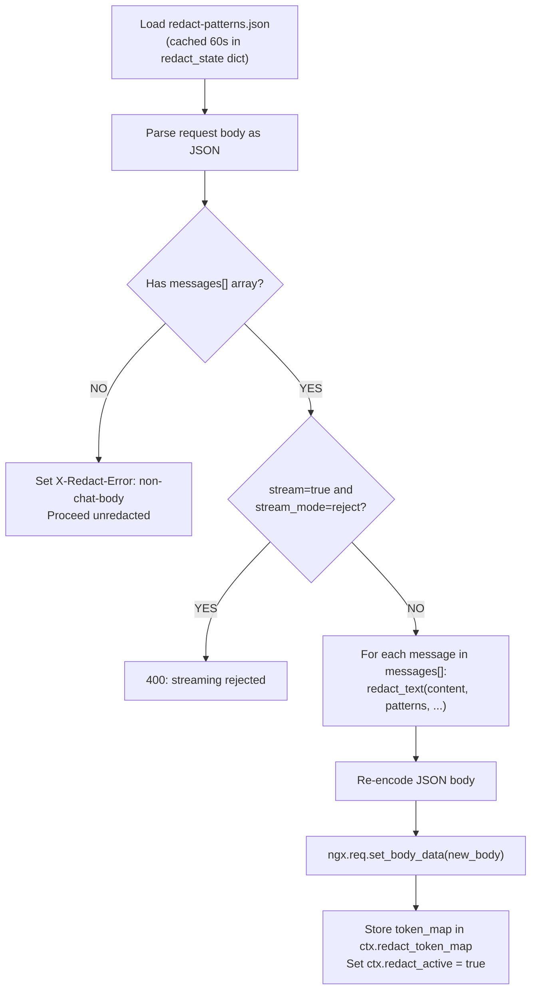

#### Pattern Matching

Six regex patterns and two dictionary categories are defined in
`conf/redact-patterns.json`:

| Kind | Pattern | Luhn Check | Example Match |
|------|---------|------------|---------------|
| `email` | `[A-Z0-9._%+-]+@[A-Z0-9.-]+\.[A-Z]{2,}` | No | `john@example.com` |
| `ssn` | `\d{3}-\d{2}-\d{4}` | No | `123-45-6789` |
| `credit_card` | 13-16 digits (with spaces/dashes) | Yes | `4111111111111111` |
| `api_key` | `sk\|pk\|key-[A-Za-z0-9]{20,}` | No | `sk-C0kLBSzAOK7bYPDueOkR` |
| `phone` | International phone format | No | `+1-800-555-1234` |
| `jwt` | `eyJ...\.eyJ...\.[...]` | No | `eyJhbGci.eyJzdWI.sflKxwR` |
| `ipv4` (optional) | `\d{1,3}\.\d{1,3}\.\d{1,3}\.\d{1,3}` | No | `192.168.1.1` (only if `redact_ips: true`) |

Dictionary entries are escaped and joined into a single alternation
pattern. Current dictionary has 5 entries across 2 categories
(organization, person_name).

#### Token Format

Matched PII is replaced with uppercase tokens:
```
[EMAIL_1], [SSN_1], [CREDIT_CARD_1], [API_KEY_1], [PHONE_1], [JWT_1],
[DICTIONARY_1], [DICTIONARY_2], ...
```

The token-to-original mapping is stored in `ctx.redact_token_map` (a
per-request Lua table). This map is used in `body_filter` to restore
original PII in the response.

#### Re-hydration (body_filter phase)

For **non-streaming** responses: the full JSON response body is
buffered, `choices[].message.content` is scanned for tokens, and each
token is replaced with the original PII value from the token map.

For **streaming** responses (SSE): the entire response is buffered
(stream_mode=buffer), tokens are restored across all chunks, and the
complete re-hydrated body is sent when EOF is received.

For **passthrough** mode (stream_mode=passthrough): streaming responses
are not re-hydrated. The response passes through with tokens intact.
This mode trades privacy for latency.

#### Luhn Validation

Credit card matches are validated with the Luhn algorithm before
redaction. Invalid card numbers (failing checksum) are left unchanged.
This prevents false positives on long digit sequences that are not
credit cards.

```lua
function M.luhn_valid(card_number)
    card_number = card_number:gsub("[%s-]", "")
    local sum, parity = 0, 0
    for i = #card_number, 1, -1 do
        local digit = tonumber(card_number:sub(i, i))
        if not digit then return false end
        if parity % 2 == 1 then
            digit = digit * 2
            if digit > 9 then digit = digit - 9 end
        end
        sum = sum + digit
        parity = parity + 1
    end
    return sum % 10 == 0
end
```

#### Shared Dict

```yaml
custom_lua_shared_dict:
  redact_state: 1m    # 1 MB cache for patterns JSON + dict_alt
```

Patterns are cached for 60 seconds. On cache miss, the patterns file is
read from disk, parsed, and stored in the shared dict.

---

### 5.3 sse-usage.lua + sse_usage_lib.lua

**Files**:
- `plugins/custom/sse-usage.lua` (147 lines) - APISIX plugin adapter
- `plugins/custom/sse_usage_lib.lua` (55 lines) - Pure logic module

**Priority**: 2400 (after redact, before http-logger)
**Schema**: `clickhouse_addr`

#### Purpose

Extracts token usage (`prompt_tokens`, `completion_tokens`,
`total_tokens`) and the actual model name from LLM responses. This
plugin exists because:

1. **Streaming responses** (SSE): The usage object appears only in the
   final chunk before `[DONE]`, inside a `data:` line with
   `choices: []` and a `usage` object. The http-logger captures the
   response body, but Vector's VRL `parse_json` fails on truncated
   8192-byte bodies (SSE streams exceed this limit).

2. **Non-streaming responses** (JSON): The usage object is in the
   top-level response JSON. Vector can extract it, but sse-usage
   provides a second independent source for cross-validation.

3. **Model capture**: The model in the response may differ from the
   requested model (OpenCode Go may route to a different provider). sse-usage
   captures the actual model from the response.

#### Extract-Testable-Core Pattern

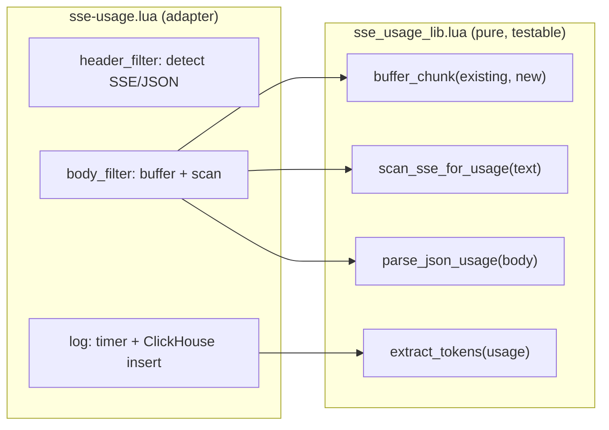

#### SSE Buffering Algorithm

The `buffer_chunk` function accumulates incoming chunks and returns
complete lines (split by `\n`):

```lua
function M.buffer_chunk(existing, new_chunk)
    local buf = (existing or "") .. new_chunk
    local last_nl = nil
    for i = #buf, 1, -1 do
        if buf:byte(i) == 10 then last_nl = i; break end
    end
    if not last_nl then return "", buf end
    return buf:sub(1, last_nl), buf:sub(last_nl + 1)
end
```

This ensures that `data:` lines are never split across chunks when
scanning for the usage object.

#### SSE Usage Scan

```lua
function M.scan_sse_for_usage(text)
    for line in text:gmatch("[^\r\n]+") do
        local payload = line:match("^data:%s*(.+)$")
        if payload and payload ~= "[DONE]" then
            local obj = cjson.decode(payload)
            if obj and obj.usage then
                return obj.usage, obj.model
            end
        end
    end
    return nil, nil
end
```

Scans each `data:` line for a JSON object with a `usage` field. Returns
the usage table and model string. The last match wins (the final usage
chunk before `[DONE]` overwrites earlier ones).

#### Cosocket Timer Pattern

OpenResty disables `ngx.socket.tcp` in the `log_by_lua` phase. The
`resty.http` library uses cosockets internally, so calling it directly
in `log` fails with `API disabled in the context of log_by_lua*`.

The fix: defer the ClickHouse INSERT to a zero-delay timer:

```lua
function plugin.log(conf, ctx)
    local entry = cjson.encode({...})
    local timer_handler
    timer_handler = function(premature)
        if premature then return end
        local httpc = http.new()
        local res, err = httpc:request_uri(clickhouse_addr .. "/", {
            method = "POST",
            query = {query = "INSERT INTO llm_gateway.usage_log FORMAT JSONEachRow"},
            body = body,
            headers = {["Content-Type"] = "application/json"},
            timeout = 5000,
        })
        if not res then
            core.log.error("sse-usage: clickhouse insert failed: ", err)
            return
        end
        if res.status ~= 200 then
            core.log.error("sse-usage: clickhouse returned status ", res.status,
                           ": ", res.body or "")
        end
    end
    ngx.timer.at(0, timer_handler)
end
```

The timer creates a new context where cosockets are allowed. The
`query` parameter is a table (not a raw string) for proper URL encoding.

#### ClickHouse usage_log Table

```sql
CREATE TABLE IF NOT EXISTS llm_gateway.usage_log (
    event_id          String,
    model             LowCardinality(String) DEFAULT '',
    prompt_tokens     UInt32 DEFAULT 0,
    completion_tokens UInt32 DEFAULT 0,
    total_tokens      UInt32 DEFAULT 0,
    timestamp         DateTime64(3) DEFAULT now()
)
ENGINE = MergeTree()
PARTITION BY toYYYYMM(timestamp)
ORDER BY (event_id, timestamp)
TTL toDateTime(timestamp) + INTERVAL 13 MONTH
```

The `event_id` is constructed as `<route_id>_<start_time>`, matching the
same event_id used in `request_log`. This allows JOIN queries between
the two tables for cross-validation.

---

## 6. Built-in Plugins

### 6.1 limit-count (Request RPM)

**Priority**: 2002 (APISIX built-in)

Enforces per-key request rate limiting via the `limit-count` plugin (fixed
window algorithm). The plugin is enabled on both routes, scoped by
`X-Key-Hash` (set by `key-meta` at priority 2530) to give each unique
client key its own counter.

**Passthrough route**: static limit, same for all passthrough keys:
```yaml
limit-count:
  count: 100
  time_window: 60
  rejected_code: 429
  key_type: var
  key: http_x_key_hash
  policy: local
```

**Federated route**: per-key variable limits read from OpenBao by
`key-resolver` and injected as headers:
```yaml
limit-count:
  rules:
    - count: "$http_x_gateway_rate_limit_rpm"
      time_window: "$http_x_gateway_rate_limit_window"
      key: "$http_x_key_hash"
  rejected_code: 429
  policy: local
```

The `X-Gateway-Rate-Limit-RPM` and `X-Gateway-Rate-Limit-Window` headers
are set by `key-resolver` from the key's OpenBao record (or defaults of
100/60 for passthrough keys). The `key` is `$http_x_key_hash` on both
routes so every unique client key is scoped independently.

### 6.2 Budget enforcement (Tier 3: per-key token/cost)

**Purely in custom Lua** (NOT an APISIX built-in). The `key-resolver`
plugin reads `token_budget`, `cost_budget`, `budget_window`, and
`budget_type` from the OpenBao key record at access phase and checks a
`ngx.shared.quota_counters` dict. If the key's cumulative spend equals or
exceeds its budget, the request is rejected with 429.

The `sse-usage` plugin (log phase) increments the shared dict counter by
the tokens or cost (converted to cents) consumed in the response. The
window is aligned to calendar boundaries (floor division), so stale
entries auto-expire via TTL.

**Race**: concurrent requests may over-spend by the number of in-flight
requests per key. Acceptable for rate limiting; for hard quota precision
add Redis-atomic counters.

### 6.3 http-logger

**Priority**: 410 (APISIX built-in)
**Config**: `uri: "http://vector:8080/ingest"`, `method: POST`,
`content_type: "application/json"`, `batch_max_size: 1`,
`include_req_body: true`, `include_resp_body: true`,
`max_req_body_bytes: 8192`, `max_resp_body_bytes: 8192`

Sends the full request and response metadata (including bodies, up to
8KB each) to Vector on every request. `batch_max_size: 1` means every
request is sent immediately (no batching). No custom `log_format` is
used; APISIX default log format includes `request.body`, `response.body`,
`client_ip`, `upstream_latency`, `route_id`, `start_time`, `consumer`,
and all request headers.

### 6.4 prometheus

**Priority**: N/A (APISIX built-in, log phase)
**Config**: `prefer_name: true`

Exports metrics at `http://0.0.0.0:9100/apisix/prometheus/metrics`.
Metrics include:

| Metric | Type | Description |
|--------|------|-------------|
| `apisix_http_requests_total` | counter | Total HTTP requests by status code |
| `apisix_nginx_http_current_connections` | gauge | Current Nginx connections by state |
| `apisix_node_info` | gauge | Node info (version, hostname) |
| `apisix_shared_dict_*` | gauge | Shared dict capacity + used bytes |

### 6.5 proxy-buffering

**Priority**: 300 (APISIX built-in)
**Config**: `disable: true`

Disables Nginx proxy buffering for this route. Required for SSE
streaming: without this, Nginx buffers the entire upstream response
before sending anything to the client, breaking real-time streaming.

---

## 7. Key Management (OpenBao)

### 7.1 Architecture

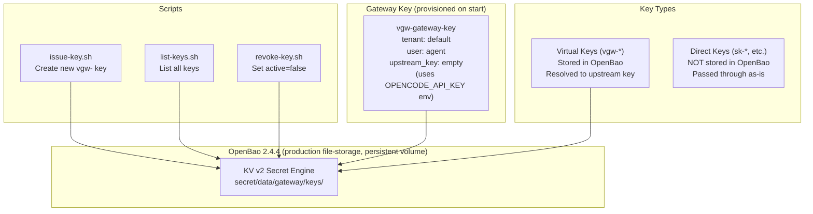

### 7.2 Virtual Key Lifecycle

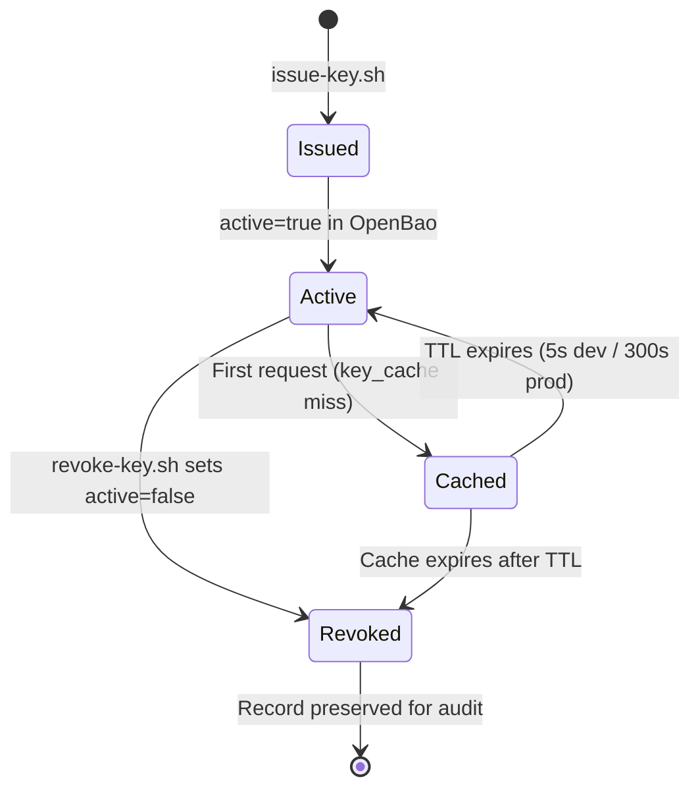

### 7.3 Key Data Schema (OpenBao KVv2)

```json
{
  "data": {
    "virtual_key": "vgw-<hex>",
    "upstream_key": "sk-<zen-key> or empty",
    "tenant_id": "default",
    "user_id": "agent",
    "active": true,
    "created_at": "2026-01-01T00:00:00Z",
    "revoked_at": null
  }
}
```

When `upstream_key` is empty, the key-resolver reads the
`OPENCODE_API_KEY` environment variable. This allows issuing keys
that all use the same upstream OpenCode Go key without duplicating it
in each OpenBao record.

### 7.4 Management Scripts

| Script | Make Target | Purpose |
|--------|-------------|---------|
| `res/scripts/issue-key.sh` | `make issue-key` | Create new `vgw-<random>` key in OpenBao |
| `res/scripts/list-keys.sh` | `make list-keys` | List all keys with tenant, user, active status |
| `res/scripts/revoke-key.sh` | `make revoke-key KEY_ID=vgw-xxx` | Set `active=false`, preserve record |
| `res/scripts/reconciler.sh` | N/A (cron) | Daily billing reconciliation |

#### issue-key.sh

```bash
make issue-key
make issue-key KEY_ID=my-key TENANT_ID=acme USER_ID=alice UPSTREAM_KEY=sk-xxx
```

Generates `vgw-<32-char-hex>` by default using `openssl rand -hex 16`.
Stores the key data in OpenBao at `secret/data/gateway/keys/<key_id>`.

#### revoke-key.sh

Reads the existing key record, sets `active: false` and
`revoked_at: <ISO timestamp>`, writes the updated record back to OpenBao.
The key record is never deleted; it is preserved for audit purposes.

#### list-keys.sh

Lists all keys using the OpenBao LIST API
(`LIST /v1/secret/metadata/gateway/keys/`), then fetches each key's
data and prints a table:

```
KEY_ID                                  TENANT       USER         ACTIVE   CREATED
---------------------------------------- ------------ ------------ -------- --------------------
vgw-gateway-key                         default      agent        true     2026-01-01T00:00:00Z
vgw-test-1234567890                     test-tenant  test-user    true     2026-07-06T11:05:00Z
vgw-revoked-1234567890                  test         test         false    2026-07-06T11:05:00Z
```

### 7.5 Auto-Init / Auto-Unseal Entrypoint

OpenBao runs in **production file-storage mode** (not `-dev`). Storage
lives at `/openbao/data` on the persistent `openbao-data` named volume.
The custom image built from `res/docker/Dockerfile.openbao` ships an
entrypoint at `res/docker/openbao-entrypoint.sh` that is fully
idempotent:

**First start** (no existing storage):
1. Initialize OpenBao with 1 unseal key and threshold = 1.
2. Save bootstrap unseal key + root token to
   `/openbao/data/.bootstrap/`.
3. Create a fixed-ID service token matching `OPENBAO_TOKEN` from
   `.env`, so APISIX can authenticate without discovering a random
   root token.
4. Provision the gateway virtual key `vgw-gateway-key` from
   `OPENCODE_API_KEY` in `.env`.

**Restart** (storage already initialized):
1. Auto-unseal using the saved bootstrap key(s).
2. Ensure the fixed-ID service token matches `OPENBAO_TOKEN`.
3. Ensure the gateway virtual key is present.

All steps detect prior state and skip if already done (idempotent). The
OpenBao server config is loaded from `conf/openbao.hcl` (bind-mounted
into the container). The custom Dockerfile is
`res/docker/Dockerfile.openbao`.

---

## 8. Telemetry Pipeline

### 8.1 Data Flow

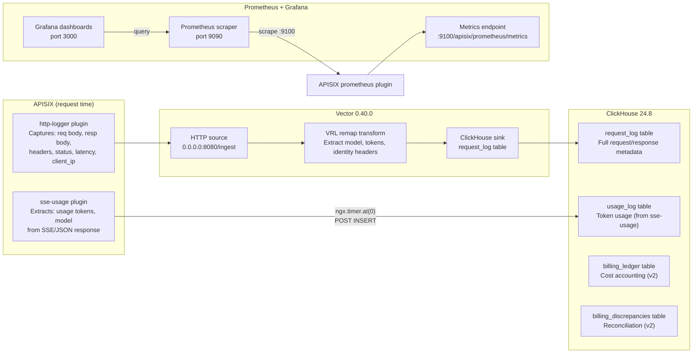

### 8.2 Vector VRL Transform

The remap transform (`conf/vector.toml`) extracts structured fields from
the APISIX default log format:

| Field | Source | Extraction Method |
|-------|--------|-------------------|
| `provider` | Static | `"opencode"` |
| `model` | `request.body` | `parse_json` then `.model` field |
| `stream` | `request.body` | `parse_json` then `.stream` field |
| `prompt_tokens` | `response.body` | `parse_json` then `.usage.prompt_tokens` |
| `completion_tokens` | `response.body` | `parse_json` then `.usage.completion_tokens` |
| `total_tokens` | `response.body` | `parse_json` then `.usage.total_tokens` |
| `key_id` | `request.headers` | `x-gateway-key-id` header |
| `tenant_id` | `request.headers` | `x-gateway-tenant-id` header |
| `user_id` | `request.headers` | `x-gateway-user-id` header |
| `session_id` | `request.headers` | `x-session-id` header |
| `parent_session_id` | `request.headers` | `x-parent-session-id` header |
| `user_agent` | `request.headers` | `user-agent` header |
| `api_key_id` | `consumer` object | `consumer.username` |
| `event_id` | `route_id` + `start_time` | Concatenated string |
| `timestamp` | `start_time` | `from_unix_timestamp` + `format_timestamp` |

**Why parse_json for model extraction?** `parse_json` is used because
the request body is typically small enough for the `.model` field to be
parsed successfully (the model field appears near the start of the JSON
structure). For truncated bodies, the model field is still extracted
because it appears early in the JSON structure, before any large message
content that would push the body past the 8192-byte limit.

**Why are tokens 0 in request_log for streaming?** Vector's
`parse_json` on the response body fails for SSE streams (truncated at
8192 bytes, not valid JSON). The sse-usage plugin writes accurate token
counts to the `usage_log` table instead. Cross-validation between
`request_log` and `usage_log` is possible via `event_id`.

### 8.3 Reconciler

`res/scripts/reconciler.sh` runs daily (via cron in production) and
queries ClickHouse for gateway-side token totals:

```sql
SELECT provider, model,
       sum(prompt_tokens), sum(completion_tokens), sum(total_tokens)
FROM llm_gateway.request_log
WHERE toDate(timestamp) = '<yesterday>'
GROUP BY provider, model
FORMAT TabSeparated
```

The reconciler logs per-model totals. Upstream provider API comparison
(against OpenCode Go's usage API) is v2 scope. Divergences are never
discarded.

---

## 9. ClickHouse Schema

### 9.1 Table Overview

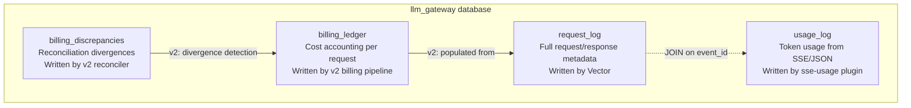

### 9.2 request_log Table

The primary telemetry table. Written by Vector from http-logger output.

| Column | Type | Default | Source |
|--------|------|---------|--------|
| `event_id` | String | `''` | route_id + start_time |
| `provider` | LowCardinality(String) | | Static "opencode" |
| `model` | LowCardinality(String) | `''` | Vector parse_json from request body |
| `stream` | Bool | false | Vector parse_json from request body |
| `method` | LowCardinality(String) | | HTTP method |
| `uri` | String | | Request URI |
| `status` | UInt16 | | HTTP response status |
| `upstream_response_time_s` | Float64 | 0 | Upstream latency / 1000 |
| `request_size` | UInt32 | 0 | Request body size |
| `response_size` | UInt32 | 0 | Response body size |
| `client_ip` | String | '0.0.0.0' | Client IP (String, not IPv4) |
| `api_key_id` | String | `''` | consumer.username |
| `tenant_id` | LowCardinality(String) | `''` | x-gateway-tenant-id header |
| `user_id` | String | `''` | x-gateway-user-id header |
| `key_id` | String | `''` | x-gateway-key-id header |
| `session_id` | String | `''` | x-session-id header |
| `request_id` | String | `''` | (reserved) |
| `project_id` | String | `''` | (reserved) |
| `parent_session_id` | String | `''` | x-parent-session-id header |
| `client_type` | LowCardinality(String) | `''` | (reserved) |
| `agent_name` | LowCardinality(String) | `''` | (reserved) |
| `opencode_version` | LowCardinality(String) | `''` | (reserved) |
| `user_agent` | String | `''` | user-agent header |
| `prompt_tokens` | UInt32 | 0 | Vector from response body (0 for SSE) |
| `completion_tokens` | UInt32 | 0 | Vector from response body (0 for SSE) |
| `total_tokens` | UInt32 | 0 | Vector from response body (0 for SSE) |
| `req_body` | String | `''` | Request body (truncated 8KB) |
| `resp_body` | String | `''` | Response body (truncated 8KB) |
| `redact_active` | Bool | false | (reserved for redact metadata) |
| `redact_token_count` | UInt32 | 0 | (reserved for redact metadata) |
| `timestamp` | DateTime64(3) | now() | Request start time |

**Engine**: MergeTree
**Partition**: `toYYYYMM(timestamp)` (monthly partitions)
**ORDER BY**: `(provider, model, timestamp)` (prefix-pruned queries)
**TTL**: `toDateTime(timestamp) + INTERVAL 13 MONTH`
**Settings**: `index_granularity = 8192`

### 9.3 usage_log Table

Written directly by the sse-usage plugin via `ngx.timer.at(0, ...)`.
Contains accurate token counts from SSE/JSON response parsing.

| Column | Type | Default |
|--------|------|---------|
| `event_id` | String | |
| `model` | LowCardinality(String) | `''` |
| `prompt_tokens` | UInt32 | 0 |
| `completion_tokens` | UInt32 | 0 |
| `total_tokens` | UInt32 | 0 |
| `timestamp` | DateTime64(3) | now() |

**ORDER BY**: `(event_id, timestamp)`
**TTL**: 13 months

### 9.4 billing_ledger Table (v2)

Detailed cost accounting per request. Populated by a v2 billing
pipeline (not yet implemented).

Key columns: `cost Decimal64(6)`, `rate_input Decimal64(8)`,
`rate_output Decimal64(8)`, `reasoning_tokens`, `cached_tokens`,
`cache_status`, `ttft_ms` (time to first token), `upstream_resp_id`.

**ORDER BY**: `(tenant_id, user_id, timestamp)`

### 9.5 billing_discrepancies Table (v2)

Records divergences between gateway-side and upstream provider token
counts.

**ORDER BY**: `(date, tenant_id, provider, model_name)`

### 9.6 Idempotent Init

ClickHouse init SQL runs on every `make dev-start` via Ansible:

```yaml
- name: Run ClickHouse init SQL (idempotent)
  ansible.builtin.shell: >
    podman exec -i docker_clickhouse_1 clickhouse-client --multiquery
    < {{ project_root }}/conf/clickhouse-init.sql
```

This is necessary because Docker volumes persist the database across
container restarts. The init SQL in `/docker-entrypoint-initdb.d/` only
runs on first volume creation. The Ansible task ensures schema changes
(ALTER TABLE ADD COLUMN IF NOT EXISTS) are applied on every start.

---

## 10. Configuration Files

### 10.1 conf/config.yaml

APISIX standalone YAML mode configuration. Defines the data plane role,
plugin list, shared dicts, Nginx environment variables, DNS resolver
(for Lua cosocket hostname resolution), and Prometheus export address.
The file is bind-mounted into the APISIX container by docker-compose.yml
(not only baked into the Docker image), so edits take effect on
container restart without rebuilding.

```yaml
deployment:
  role: data_plane
  role_data_plane:
    config_provider: yaml

apisix:
  admin_key: ""
  resolver: ["10.89.0.1", "10.89.1.1"]

plugins:
  - key-resolver
  - key-meta
  - proxy-buffering
  - proxy-rewrite
  - http-logger
  - prometheus
  - redact
  - sse-usage
  - limit-count

plugin_attr:
  prometheus:
    export_addr:
      ip: "0.0.0.0"
      port: 9100

nginx_config:
  envs:
    - OPENCODE_API_KEY
    - OPENBAO_TOKEN
  http:
    custom_lua_shared_dict:
      redact_state: 1m
      key_cache: 5m
      quota_counters: 5m
    proxy_buffering: "on"
```

**Key details**:
- `nginx_config.envs` (not `nginx_config.http.envs`): APISIX 3.17
  schema has `envs` at the `nginx_config` root level. This passes env
  vars from the container environment into Nginx worker processes so
  Lua code can read them via `os.getenv()`.
- `apisix.resolver`: Lua cosockets (used by key-resolver to reach
  `openbao` by container hostname) cannot use Nginx's built-in DNS in
  standalone YAML mode. The resolver list points Nginx at the
  container-runtime DNS so hostnames like `openbao`, `clickhouse`,
  `vector`, `prometheus`, `grafana` resolve at request time.
- `custom_lua_shared_dict`: APISIX 3.17 uses this key (not
  `lua_shared_dict`) for user-defined shared dicts.
- `proxy_buffering: "on"` at the global level, overridden per-route by
  the `proxy-buffering` plugin with `disable: true`.

### 10.2 conf/apisix.yaml

Route and plugin configuration. Two routes, eight plugins (the
federated route additionally enables key-resolver). Both routes share
the same upstream (`opencode.ai:443`) and a `proxy-rewrite` plugin that
rewrites the inbound path to the `/zen/go/*` upstream path. http-logger
uses the APISIX default log format (no custom `log_format`). The
`sse-usage` plugin is enabled on both routes. There is no `key-auth`
plugin or `consumers` section; authentication is handled by the custom
`key-resolver` plugin on the federated route only.

```yaml
routes:
  - id: relay-opencode
    uri: /opencode/*
    upstream:
      type: roundrobin
      scheme: https
      pass_host: node
      nodes:
        "opencode.ai:443": 1
    plugins:
      proxy-rewrite:
        regex_uri: ["^/opencode/(.*)$", "/zen/go/$1"]
      key-meta: {}
      limit-count:
        count: 100
        time_window: 60
        rejected_code: 429
        key_type: var
        key: http_x_key_hash
        policy: local
      prometheus:
        prefer_name: true
      http-logger:
        uri: "http://vector:8080/ingest"
        method: POST
        content_type: "application/json"
        batch_max_size: 1
        include_req_body: true
        include_resp_body: true
        max_req_body_bytes: 8192
        max_resp_body_bytes: 8192
      proxy-buffering:
        disable: true
      redact:
        patterns_file: "/etc/apisix/redact-patterns.json"
      sse-usage:
        clickhouse_addr: "http://clickhouse:8123"

  - id: relay-opencode-federated
    uri: /opencode_federated/*
    upstream:
      type: roundrobin
      scheme: https
      pass_host: node
      nodes:
        "opencode.ai:443": 1
    plugins:
      proxy-rewrite:
        regex_uri: ["^/opencode_federated/(.*)$", "/zen/go/$1"]
      key-resolver:
        openbao_addr: "http://openbao:8200"
        openbao_token_env: "OPENBAO_TOKEN"
        upstream_key_env: "OPENCODE_API_KEY"
        key_prefix: "secret/data/gateway/keys/"
        cache_ttl: 5
        virtual_key_prefix: "vgw-"
      limit-count:
        rules:
          - count: "$http_x_gateway_rate_limit_rpm"
            time_window: "$http_x_gateway_rate_limit_window"
            key: "$http_x_key_hash"
        rejected_code: 429
        policy: local
      prometheus:
        prefer_name: true
      http-logger:
        uri: "http://vector:8080/ingest"
        method: POST
        content_type: "application/json"
        batch_max_size: 1
        include_req_body: true
        include_resp_body: true
        max_req_body_bytes: 8192
        max_resp_body_bytes: 8192
      proxy-buffering:
        disable: true
      redact:
        patterns_file: "/etc/apisix/redact-patterns.json"
      sse-usage:
        clickhouse_addr: "http://clickhouse:8123"

#END
```

**`#END` marker**: Required by APISIX standalone YAML mode to indicate
the end of the configuration file. Without it, APISIX may not parse the
file correctly.

**`pass_host: node`**: Preserves the upstream Host header
(`opencode.ai`), which is required for TLS SNI and OpenCode Go to route
correctly.

**`proxy-rewrite.regex_uri`**: Rewrites the inbound URI so that
`/opencode/<rest>` and `/opencode_federated/<rest>` both reach the
upstream at `/zen/go/<rest>`. The passthrough route (`relay-opencode`)
does not enable `key-resolver`; the federated route
(`relay-opencode-federated`) does, resolving `vgw-*` virtual keys
against OpenBao.

### 10.3 conf/redact-patterns.json

PII detection patterns. Six regex patterns, two dictionary categories.

### 10.4 conf/vector.toml

Vector pipeline: HTTP source on :8080, VRL remap transform, ClickHouse
sink to `request_log` table. `skip_unknown_fields = true` allows
ClickHouse to ignore fields not in the table schema. The remap
transform uses `parse_json` to extract the `.model` and `.stream`
fields from the request body (not `parse_regex`).

### 10.5 conf/clickhouse-init.sql

Database and table creation with `IF NOT EXISTS` and `ADD COLUMN IF NOT
EXISTS` for idempotent execution.

### 10.6 res/docker/Dockerfile.apisix

```dockerfile
FROM apache/apisix:3.17.0-debian

COPY plugins/custom/key-resolver.lua /usr/local/apisix/apisix/plugins/key-resolver.lua
COPY plugins/custom/key-meta.lua /usr/local/apisix/apisix/plugins/key-meta.lua
COPY plugins/custom/sse-usage.lua /usr/local/apisix/apisix/plugins/sse-usage.lua
COPY plugins/custom/sse_usage_lib.lua /usr/local/apisix/apisix/plugins/sse_usage_lib.lua
COPY plugins/custom/cost_calc.lua /usr/local/apisix/apisix/plugins/cost_calc.lua
COPY plugins/custom/redact.lua /usr/local/apisix/apisix/plugins/redact.lua
COPY plugins/custom/redact_lib.lua /usr/local/apisix/apisix/plugins/redact_lib.lua
COPY conf/config.yaml /usr/local/apisix/conf/config.yaml
COPY conf/redact-patterns.json /etc/apisix/redact-patterns.json

EXPOSE 9080 9443 9100
```

Plugin files are copied directly to `/usr/local/apisix/apisix/plugins/`
(not a `custom/` subdirectory) so `require("apisix.plugins.redact_lib")`
and `require("apisix.plugins.cost_calc")` resolve correctly in the
APISIX Lua module path. All 7 plugins are also volume-mounted `:ro`
in docker-compose.yml for live development.

### 10.7 res/docker/docker-compose.yml

Six services: apisix, clickhouse, vector, openbao, prometheus,
grafana. APISIX has `env_file: ../../.env` to pass environment variables
into the container and bind-mounts `conf/config.yaml` (so config edits
take effect on restart without rebuilding the image). APISIX
`depends_on: [vector, openbao]`. OpenBao runs in production file-storage
mode: built from a custom Dockerfile
(`res/docker/Dockerfile.openbao`), launched via the auto-init/auto-unseal
entrypoint (`res/docker/openbao-entrypoint.sh`), and backed by the
persistent `openbao-data` named volume (no `-dev` flag, no fixed root
token; the entrypoint creates a fixed-ID service token matching
`OPENBAO_TOKEN`). Prometheus (`prom/prometheus:v3.11.3`, host port 9092)
scrapes the APISIX metrics endpoint and is backed by the
`prometheus-data` volume. Grafana (`grafana/grafana-oss:13.0.2`, host
port 3030) queries Prometheus and ClickHouse and is backed by the
`grafana-data` volume. Grafana serves 3 provisioned dashboards:
Gateway Cost & Usage (`gateway-cost-usage`), Gateway Operations &
Health (`gateway-ops-health`), and Gateway Cost Leaderboard
(`gateway-cost-leaderboard`), all auto-discovered from
`conf/grafana/dashboards/*.json` via file provisioning.

---

## 11. Dev Lifecycle (Ansible)

### 11.1 Architecture

```mermaid
graph TB
    subgraph "Makefile targets"
        START["make dev-start"]
        STOP["make dev-stop"]
        RESTART["make dev-restart"]
        REBUILD["make dev-rebuild"]
        LOGS["make dev-logs"]
        STATUS["make dev-status"]
        CLEAN["make dev-clean"]
        SHELL["make dev-shell"]
        RESETDB["make dev-reset-db"]
        TEST["make dev-test"]
        SANITY["make dev-sanity"]
    end

    subgraph "Ansible playbook (res/ansible/dev.yml)"
        T_START["tag: start<br/>create network, build, up,<br/>wait for OpenBao,<br/>provision gateway key,<br/>wait for APISIX/CH/Prom,<br/>run init SQL"]
        T_STOP["tag: stop<br/>podman-compose down"]
        T_CLEAN["tag: clean<br/>podman-compose down -v"]
        T_STATUS["tag: status<br/>podman ps + health checks"]
        T_LOGS["tag: logs<br/>podman-compose logs -f"]
        T_TEST["tag: test<br/>run tests/run_all.sh"]
        T_SANITY["tag: sanity<br/>single curl request"]
        T_RESET["tag: reset-db<br/>DROP + CREATE tables"]
    end

    START --> T_START
    STOP --> T_STOP
    RESTART --> T_STOP
    RESTART --> T_START
    REBUILD --> T_STOP
    REBUILD --> T_START
    LOGS --> T_LOGS
    STATUS --> T_STATUS
    CLEAN --> T_CLEAN
    SHELL --> T_SHELL
    RESETDB --> T_RESET
    TEST --> T_TEST
    SMOKE --> T_SMOKE
```

### 11.2 Start Sequence

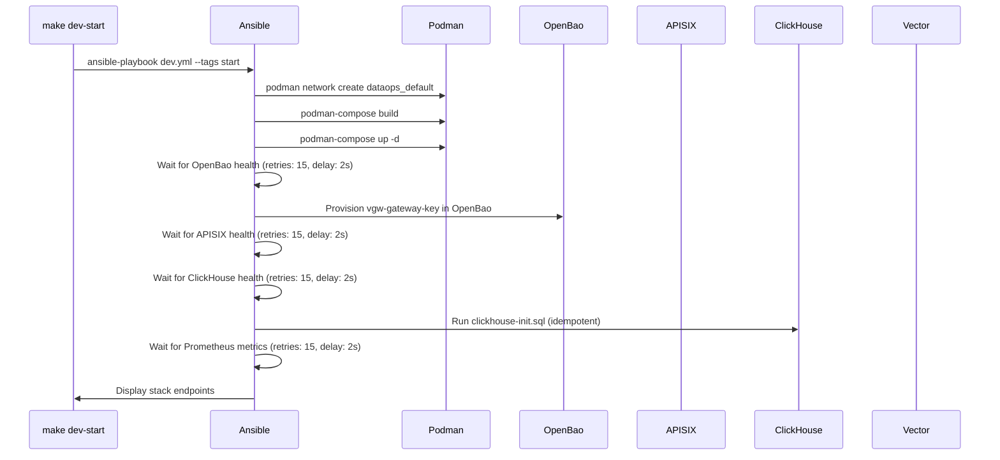

### 11.3 Makefile Targets

| Target | Description |
|--------|-------------|
| `make setup` | Create `.venv` with `podman-compose` |
| `make install` | Setup + build images + install hooks |
| `make dev-start` | Start gateway stack (Ansible-managed) |
| `make dev-stop` | Stop stack (keep volumes) |
| `make dev-restart` | Stop + start |
| `make dev-rebuild` | Stop + start (rebuilds images) |
| `make dev-logs` | Tail container logs |
| `make dev-status` | Show running containers + health |
| `make dev-clean` | Stop + destroy volumes (data loss) |
| `make dev-shell` | Exec into APISIX container |
| `make dev-reset-db` | Drop + recreate ClickHouse tables |
| `make dev-test` | Run full test suite |
| `make dev-sanity` | Single curl request through gateway |
| `make sync-models` | Sync models from gateway to opencode config |
| `make issue-key` | Issue new virtual key in OpenBao |
| `make list-keys` | List all virtual keys |
| `make revoke-key` | Revoke a virtual key |
| `make lint` | Shell syntax + YAML validation |
| `make type-check` | Lua syntax check via `resty` in Podman |
| `make test` | Run all test stages (excludes live upstream API) |
| `make test-live` | Run all stages including live upstream API tests |
| `make check` | lint + type-check + test |
| `make check-push` | check + E2E tests (if Go key set) |

---

## 12. Testing Strategy

### 12.1 Six-Stage Test Suite

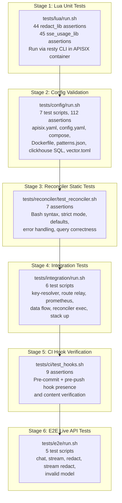

### 12.2 Extract-Testable-Core Pattern

Pure logic is extracted into `*_lib.lua` modules that can be required
and tested without Nginx. The APISIX plugin adapter (`*.lua`) is a thin
wrapper that handles lifecycle phases.

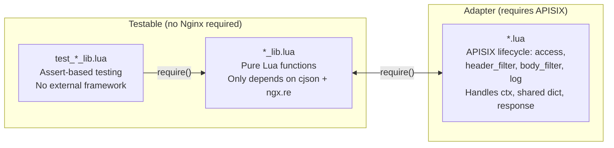

Unit tests run via `resty` CLI inside the APISIX container:
```bash
podman exec docker_apisix_1 resty /workspace/tests/lua/test_redact_lib.lua
```

### 12.3 EXTERNAL_STACK Pattern

Tests detect if the gateway stack is already running and skip both
startup and teardown:

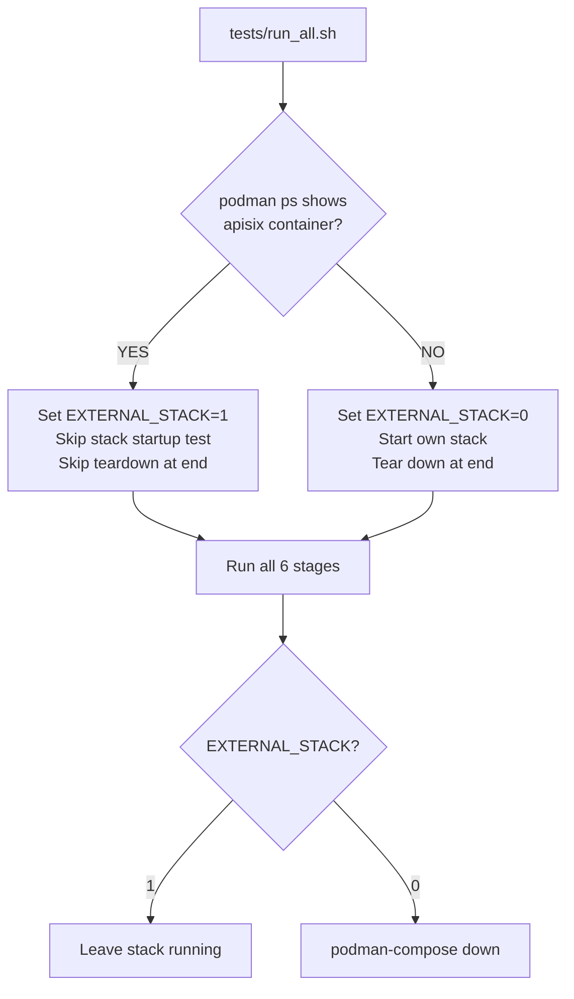

This prevents tests from destroying a running dev stack that the
developer is actively using.

### 12.4 Test Assertion Counts

| Stage | Scripts | Assertions | Description |
|-------|---------|------------|-------------|
| 1 | 2 | 89 | Lua unit tests (44 redact + 45 sse_usage) |
| 2 | 7 | 112 | Config validation |
| 3 | 1 | 7 | Reconciler static analysis |
| 4 | 6 | 20 | Integration (black-box HTTP) |
| 5 | 1 | 9 | CI hook verification |
| 6 | 5 | 17 | E2E live API (gated, real upstream) |
| **Total** | **22** | **254** | |

---

## 13. opencode Integration

### 13.1 workspace-gateway Provider

The gateway is registered as a custom provider named
`workspace-gateway` in the opencode user config
(`~/.config/opencode/opencode.jsonc`). The built-in `opencode` provider
is untouched.

```json
{
  "provider": {
    "workspace-gateway": {
      "api": "http://localhost:9080/zen/v1",
      "options": {
        "baseURL": "http://localhost:9080/zen/v1",
        "apiKey": "vgw-gateway-key",
        "headers": {
          "X-Tenant-ID": "default",
          "X-User-ID": "agent"
        }
      },
      "models": {
        "big-pickle": {},
        "claude-sonnet-4-5": {},
        "gpt-5": {},
        "...": {}
      }
    }
  }
}
```

### 13.2 Model Discovery

The `sync-opencode-models.sh` script fetches the model list from the
gateway's `/zen_federated/v1/models` endpoint using the virtual gateway
key, then enriches each model with canonical metadata (name, context
limit, capabilities, cost, modalities) from
[models.dev](https://models.dev/api.json), and writes all enriched model
entries into the opencode config under TWO providers:

```bash
make sync-models
```

This is necessary because opencode drops custom providers that have zero
models configured, and because the Zen `/v1/models` endpoint only returns
bare model IDs (no names, no context limits, no capabilities). The script
cross-references models.dev to produce a complete provider entry. The
script runs automatically on every `make dev-start` and `make dev-restart`
via the Ansible playbook (`res/ansible/dev.yml`, `start` tag).

Context limits are scaled by `CONTEXT_LIMIT_PCT` (default 100) from `.env`,
so e.g. `CONTEXT_LIMIT_PCT=80` reduces a 200000-token context to 160000.
An absolute ceiling `CONTEXT_LIMIT_CEILING` (default 128000) is then
applied: any scaled value exceeding the ceiling is clamped to it. Set to
0 to disable.

### 13.3 Identity Headers

Three sources of identity headers arrive at the gateway:

| Header | Source | Set By |
|--------|--------|--------|
| `X-Gateway-Key-Id` | Virtual key resolution | key-resolver plugin |
| `X-Gateway-Tenant-Id` | Virtual key resolution | key-resolver plugin |
| `X-Gateway-User-Id` | Virtual key resolution | key-resolver plugin |
| `X-Session-Id` | opencode session tracking | opencode client (request.ts) |
| `x-parent-session-id` | opencode session hierarchy | opencode client (request.ts) |
| `User-Agent` | opencode version info | opencode client (request.ts) |
| `X-Tenant-ID` | Static config | opencode.jsonc headers |
| `X-User-ID` | Static config | opencode.jsonc headers |

The `X-Gateway-*` headers are set by the key-resolver from OpenBao key
data. The `X-Tenant-ID` and `X-User-ID` headers are static, set in the
opencode config. A future opencode plugin could dynamically set
`X-Agent-Name` and `X-Opencode-Version` (deferred).

### 13.4 Dynamic Model List (models.dev)

opencode's built-in `opencode` provider auto-refreshes models from
`models.dev` every 5 minutes. The `zen` and `zen_federated` custom
providers do not auto-refresh; the `sync-models` script fetches
models.dev at stack start time, enriches the gateway model list with
canonical names, context limits (scaled by `CONTEXT_LIMIT_PCT`,
capped by `CONTEXT_LIMIT_CEILING`),
capabilities, and costs, then writes the merged result into the opencode
config.

---

**Last updated**: 2026-07-06
**Document version**: v4.0 (complete architecture reference)
