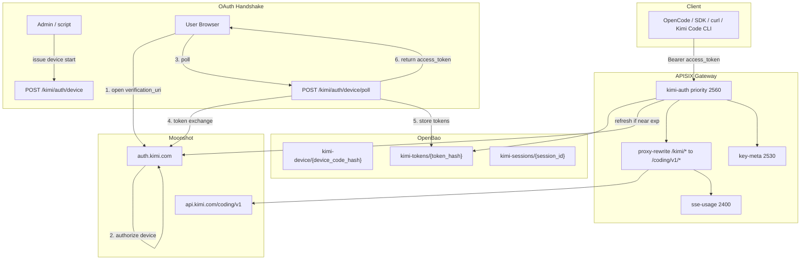
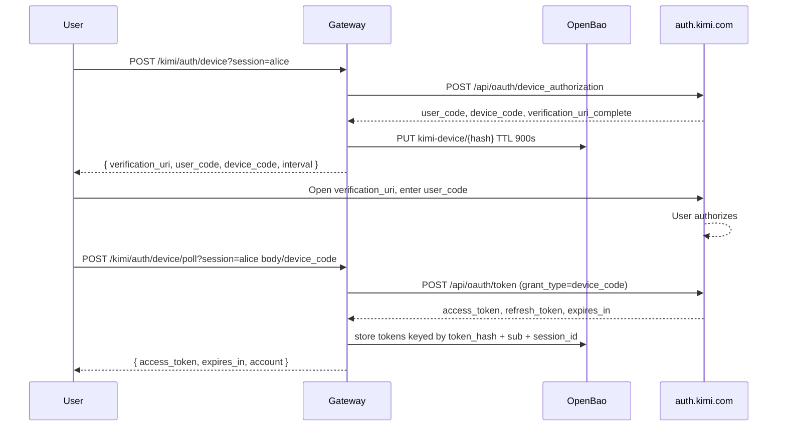

# Provider Spec: Moonshot Kimi (OAuth Device Code + API Proxy)

> **SCOPE NOTE:** This document covers the full Moonshot Kimi provider
> integration with the WORKSPACE-GATEWAY: OAuth 2.0 device-code
> authentication, automatic token refresh, and API proxying to the Kimi
> Code managed service at `api.kimi.com`. The managed service endpoints
> (`/v1/chat/completions`, `/v1/models`) are **fully OpenAI-compatible** -
> the existing `sse-usage.lua` / `sse_usage_lib.lua` parser and
> `cost_calc.lua` module require **zero changes** to support Kimi.

**Document ID:** AMI-PROP-LLMGW-PROVIDER-MOONSHOT-KIMI-v1.0
**Status:** Draft
**Date:** 2026-07-17
**Parent:** `docs/architecture/README.md` / `docs/ARCHITECTURE.md`
**Companion:** `docs/COST-CALC-LUA.md`, `docs/PLUGIN-FOUNDATION.md`, `docs/OPENCODE-INTEGRATION.md`

### Sources of truth (protocol)

| Priority | Source | Use for |
|----------|--------|---------|
| 1 | [MoonshotAI/kimi-code](https://github.com/MoonshotAI/kimi-code) `packages/oauth/src/` | Device-code endpoints, token refresh, storage wire format, identity headers |
| 2 | Kimi Code CLI docs (`configuration/providers-and-models`) | Provider type, base URLs, model capabilities |
| 3 | Kimi Open Platform docs (`platform.kimi.ai`) | API-key surface, model list, console API keys |

---

## 1. Background and Rationale

### 1.1 Why Moonshot Kimi

Moonshot AI's Kimi models are long-context, reasoning-capable coding agents
with native tool use, image/video input, and thinking modes. The Kimi Code
managed service exposes them through an OpenAI-compatible endpoint, making
gateway relay straightforward.

### 1.2 Three API surfaces / gateway routes

| Surface | Route | Request shape | Response shape | Auth | Status |
|---------|-------|---------------|----------------|------|--------|
| Managed OAuth proxy | `POST /kimi/*` | `messages[]` (OpenAI format) | `choices[].message` (OpenAI format) | `kimi-auth` (gateway-managed OAuth) | Fully supported; usage-tracked |
| Federated API-key proxy | `POST /kimi-federated/*` | `messages[]` (OpenAI format) | `choices[].message` (OpenAI format) | `key-resolver` (`vgw-*` → `KIMI_API_KEY` in OpenBao) | Fully supported; usage-tracked |
| Own API-key passthrough | `POST /kimi-key/*` | `messages[]` (OpenAI format) | `choices[].message` (OpenAI format) | none (client sends own `sk-...`) | Fully supported; usage-tracked |
| `GET /v1/models` | any of the above |: | OpenAI models list | per-route | Catalog refresh for sync |
| `GET /v1/usages` | any of the above |: | Managed usage/limits | per-route | Optional; not tracked by gateway parser |

**`/v1/chat/completions` is fully OpenAI-compatible** on all three routes. The
existing `sse_usage_lib.lua` / `cost_calc.lua` need **no changes**. Prices for
federated and own-key routes come from the `moonshotai` provider on
`models.dev`; the managed OAuth route may use upstream catalog metadata when
available and is cross-checked against `models.dev` for display/cost parity.

### 1.3 Three client access modes

**There are three first-class Kimi access modes.** Each has its own route, auth
mechanism, and OpenCode provider id. Do not mix them:

| Mode | Client `Authorization: Bearer` | Gateway route | Auth plugin | Who holds the secret | OpenCode provider id |
|------|------------------------------|---------------|-------------|----------------------|----------------------|
| **OAuth session (managed)** | Kimi **`access_token` JWT** from gateway device flow | `/kimi/*` | `kimi-auth` | **Gateway** (OpenBao holds `refresh_token`) | `workspace-gw-kimi-oauth` |
| **Federated API key** | `vgw-*` virtual key | `/kimi-federated/*` | `key-resolver` | **Gateway** (OpenBao holds upstream `KIMI_API_KEY`) | `workspace-gw-kimi-private` |
| **Own API key passthrough** | `sk-...` from `platform.kimi.ai` / `platform.kimi.com` | `/kimi-key/*` | none | **Client** | `workspace-gw-kimi-own` |

The OAuth path is the original managed-service path. The two API-key paths are
for Moonshot Platform API keys (`sk-...`):

- `/kimi-federated/*` uses the gateway's `vgw-*` virtual-key system: the client
  sends a virtual key, the gateway resolves it to a real `KIMI_API_KEY` stored in
  OpenBao, and proxies to `api.kimi.com` (or `api.moonshot.ai`). This is the same
  pattern as `/opencode_federated/*`.
- `/kimi-key/*` passes the client's own `sk-...` through untouched. The gateway
  never sees the raw key in its own config (other than the request header).

**Naming trap (read carefully):** OpenAI-compatible clients label their credential
slot `api_key` / `apiKey`. That is the **HTTP header field name**, not “you must
use a Kimi console API key.”

- On `/kimi/*`, the value is the **OAuth `access_token` JWT**.
- On `/kimi-federated/*`, the value is a **gateway virtual key** (`vgw-*`).
- On `/kimi-key/*`, the value is the user's own **Moonshot API key** (`sk-...`).

```python
# OAuth mode
OpenAI(base_url="http://gateway:9080/kimi", api_key="<oauth access_token JWT>")
# Federated API-key mode
OpenAI(base_url="http://gateway:9080/kimi-federated", api_key="vgw-...")
# Own API-key mode
OpenAI(base_url="http://gateway:9080/kimi-key", api_key="sk-...")
```

**Not used for Kimi OAuth:** `vgw-*` virtual keys, `key-resolver`, or
`secret/data/gateway/keys/`. That system is used for the **federated** route, not
the OAuth route. Kimi OAuth uses its own storage path (`kimi-tokens/`).

### 1.4 Client workflow (pick one mode)

Same wire shape as any OpenAI-compatible client: no custom portal. The only
difference is the route and the kind of credential.

**OAuth mode (`workspace-gw-kimi-oauth` / `/kimi/*`):**

```
1. Admin or tooling starts an OAuth handshake and gives the user a way to
   finish Kimi login (device-code URL + user_code).
2. User authenticates on real Kimi pages (auth.kimi.com / account.kimi.com only).
3. User receives the OAuth access_token JWT and pastes it into the client's
   normal credential slot (api_key). Base URL = http://gateway:9080/kimi
4. Gateway holds refresh_token, refreshes proactively, proxies every request
   to api.kimi.com until refresh fails → user re-runs handshake once.
```

**Federated API-key mode (`workspace-gw-kimi-private` / `/kimi-federated/*`):**

```
1. Admin provisions a Moonshot API key (KIMI_API_KEY) in OpenBao.
2. Admin creates or distributes a vgw-* virtual key for the client.
3. Client sends Authorization: Bearer vgw-... and baseURL http://gateway:9080/kimi-federated
4. Gateway resolves the virtual key, adds the real KIMI_API_KEY upstream, and proxies.
```

**Own API-key mode (`workspace-gw-kimi-own` / `/kimi-key/*`):**

```
1. User obtains their own sk-... key from platform.kimi.ai.
2. Client sends Authorization: Bearer sk-... and baseURL http://gateway:9080/kimi-key
3. Gateway proxies with the client's key unchanged.
```

**There is no login portal to code**: only device-code plumbing and a minimal
“here is your OAuth access_token” JSON page for scripts. API-key modes are
purely config.

### 1.5 Official client extras (optional later)

Official `kimi` CLI also supports:

- **Local Kimi server** (`kimi server run`) exposing REST/WebSocket APIs: a
  separate integration, out of scope for this provider relay.
- **ACP (Agent Client Protocol)** for IDE driving: out of scope.
- **Open Platform API key** path for direct Moonshot API access.

v1 of this gateway targets **`api.kimi.com/coding/v1` + Bearer access_token or
`sk-` key**.

---

## 2. Architecture



### 2.1 Container topology

Reuses existing gateway topology (APISIX, OpenBao, Vector, ClickHouse). No new
containers. `kimi-auth` runs in the APISIX Lua worker.

### 2.2 Routes

| Route ID | URI | Upstream | Auth | Purpose |
|----------|-----|----------|------|---------|
| `relay-kimi` | `/kimi/*` | `api.kimi.com:443` | `kimi-auth` | OAuth-only proxy + device endpoints; rewrites `/kimi/*` paths to `/coding/v1/*` |
| `relay-kimi-v1` | `/kimi/v1/*` | `api.kimi.com:443` | `kimi-auth` | OAuth-only route for OpenAI-SDK-style `/kimi/v1/*` paths; same rewrite target |
| `relay-kimi-federated` | `/kimi-federated/*` | `api.kimi.com:443` | `key-resolver` | Virtual-key API-key proxy (`vgw-*` → `KIMI_API_KEY` in OpenBao); rewrites `/kimi-federated/*` to `/coding/v1/*` |
| `relay-kimi-federated-v1` | `/kimi-federated/v1/*` | `api.kimi.com:443` | `key-resolver` | SDK-style `/kimi-federated/v1/*` paths; same rewrite target |
| `relay-kimi-key` | `/kimi-key/*` | `api.kimi.com:443` | none | Explicit API-key passthrough; rewrites `/kimi-key/*` paths to `/coding/v1/*` |
| `relay-kimi-key-v1` | `/kimi-key/v1/*` | `api.kimi.com:443` | none | Explicit API-key passthrough for OpenAI-SDK-style `/kimi-key/v1/*` paths |

The OAuth device endpoints (`/kimi/auth/device` and `/kimi/auth/device/poll`)
are handled inside the `relay-kimi` route by `kimi-auth` before any upstream
proxying occurs. The more-specific `relay-kimi-v1` route lets standard
OpenAI-SDK shapes (`/kimi/v1/chat/completions`) reach `api.kimi.com/coding/v1/*`.

The new federated route (`/kimi-federated/*`) uses the same `key-resolver`
plugin as `/opencode_federated/*`, but resolves `vgw-*` virtual keys to the
upstream secret `KIMI_API_KEY` rather than `OPENCODE_API_KEY`. It supports both
raw (`/kimi-federated/chat/completions`) and `/v1` SDK-style paths.

Console API keys (`sk-...`) are **never** accepted on `/kimi/*` or
`/kimi-federated/*`; use the explicit `/kimi-key/*` route for own-key passthrough.

### 2.3 Two strings (do not conflate)

| String | Who picks it | Where used | Role |
|--------|--------------|------------|------|
| **session_id** | Admin / tooling | `?session=` on device/poll | Handshake correlation, audit labels only |
| **access_token** | Kimi OAuth response | Client `api_key` / `Authorization: Bearer` | Runtime credential; gateway lookup key |

`session_id` is **never** required on API calls after handshake. `vgw-` is
**not** part of this flow.

---

## 3. OAuth 2.0 Device Code (official protocol)

### 3.1 Protocol constants

From `@moonshot-ai/kimi-code-oauth` `src/constants.ts` + `src/oauth.ts`:

| Constant | Value | Notes |
|----------|-------|-------|
| `CLIENT_ID` | `17e5f671-d194-4dfb-9706-5516cb48c098` | Public client for Kimi Code CLI / managed service |
| `DEFAULT_OAUTH_HOST` | `https://auth.kimi.com` | OIDC/OAuth host |
| `DEVICE_AUTHORIZATION_URL` | `{oauth_host}/api/oauth/device_authorization` | RFC 8628 device authorization |
| `TOKEN_URL` | `{oauth_host}/api/oauth/token` | Device-code exchange + refresh |
| `GRANT_TYPE_DEVICE` | `urn:ietf:params:oauth:grant-type:device_code` | |
| `GRANT_TYPE_REFRESH` | `refresh_token` | |
| `DEVICE_CODE_TIMEOUT` | `15 * 60` seconds (local budget) | Client-side polling budget |
| `DEFAULT_INTERVAL` | `5` seconds | Polling interval fallback |
| `REFRESH_THRESHOLD` | `max(300, expires_in * 0.5)` seconds | Proactive refresh window |
| `HTTP_TIMEOUT` | `30_000` ms | OAuth request timeout |

The protocol does **not** use PKCE or browser redirect. It is pure RFC 8628
device code.

### 3.2 Device authorization request

```
POST {oauth_host}/api/oauth/device_authorization
Content-Type: application/x-www-form-urlencoded
Accept: application/json

client_id=17e5f671-d194-4dfb-9706-5516cb48c098
```

Optional `X-Msh-*` identity headers may be included; they are not required for
the protocol but are sent by the official client.

### 3.3 Device authorization response

```json
{
  "user_code": "ABCD-EFGH",
  "device_code": "eyJ...",
  "verification_uri": "https://auth.kimi.com/activate",
  "verification_uri_complete": "https://auth.kimi.com/activate?user_code=ABCD-EFGH",
  "expires_in": 900,
  "interval": 5
}
```

All fields except `verification_uri` and `expires_in` are required by the
client implementation.

### 3.4 Token polling

```
POST {oauth_host}/api/oauth/token
Content-Type: application/x-www-form-urlencoded
Accept: application/json

client_id=17e5f671-d194-4dfb-9706-5516cb48c098
grant_type=urn:ietf:params:oauth:grant-type:device_code
device_code=eyJ...
```

Pending responses:

```json
{ "error": "authorization_pending", "error_description": "" }
{ "error": "slow_down", "error_description": "" }
```

On `slow_down`, add at least 5 seconds to the polling interval and continue.

Success response:

```json
{
  "access_token": "eyJ...",
  "refresh_token": "...",
  "expires_in": 3600,
  "token_type": "Bearer",
  "scope": "..."
}
```

### 3.5 Token refresh

```
POST {oauth_host}/api/oauth/token
Content-Type: application/x-www-form-urlencoded
Accept: application/json

client_id=17e5f671-d194-4dfb-9706-5516cb48c098
grant_type=refresh_token
refresh_token=...
```

Response uses the same shape as the initial token response. Both
`access_token` and `refresh_token` are required fields; if either is missing
the client rejects the response. Store the new `refresh_token`.

Proactive refresh in proxy `access` phase when JWT `exp` (or `expires_at`) is
within the refresh threshold. Never wait for 401 unless early-refresh path missed.

### 3.6 Device-code sequence



---

## 4. Plugin: kimi-auth.lua

### 4.1 Manifest

```lua
local plugin_name = "kimi-auth"
local plugin = {
    version = 0.1,
    priority = 2560,  -- before key-meta (2530), after key-resolver (2555) if both present
    name = plugin_name,
}
```

Kimi routes use **`kimi-auth` only**: not `key-resolver`.

### 4.2 Schema

```lua
plugin.schema = {
    type = "object",
    properties = {
        oauth_host = { type = "string", default = "https://auth.kimi.com" },
        api_host = { type = "string", default = "https://api.kimi.com/coding" },
        client_id = {
            type = "string",
            default = "17e5f671-d194-4dfb-9706-5516cb48c098",
        },
        openbao_addr = { type = "string", default = "http://openbao:8200" },
        openbao_token_env = { type = "string", default = "OPENBAO_TOKEN" },
        token_prefix = { type = "string", default = "secret/data/gateway/kimi-tokens/" },
        device_prefix = { type = "string", default = "secret/data/gateway/kimi-device/" },
        refresh_threshold = { type = "integer", default = 300 },
    },
}
```

### 4.3 Phase handlers

| Phase | Path | Behavior |
|-------|------|----------|
| `access` | `/kimi/auth/device` | Request device code; store pending device record |
| `access` | `/kimi/auth/device/poll` | Poll token endpoint; store; return access_token |
| `access` | `/kimi/*` (proxy) | Resolve OAuth Bearer → session refresh; reject `sk-` and missing credentials |

#### 4.3.1 Device start

1. Read optional `session` query param (session_id).
2. POST `device_authorization` with `client_id`.
3. Store pending record in OpenBao `secret/data/gateway/kimi-device/{sha256(device_code)}`:
   `{ device_code, session_id, expires_at, interval, created_at }`.
4. Return JSON:
   `{ verification_uri, verification_uri_complete, user_code, device_code, interval, expires_in }`.

#### 4.3.2 Device poll

1. Accept `device_code` via JSON body.
2. Load pending record from OpenBao; verify not expired.
3. POST token endpoint with `grant_type=device_code`.
4. On success: decode JWT `sub`; store session keyed by `sha256(access_token)`.
5. Delete pending device record.
6. Response JSON: `{ "access_token", "expires_in", "account", "session_id" }`.

#### 4.3.3 Proxy

```
Authorization: Bearer <oauth-access-token>
```

`/kimi/*` accepts **only** OAuth access tokens issued by the gateway device flow.
API keys (`sk-...`) are rejected with a clear pointer to the `/kimi-key/*` routes.

| Credential | Behavior |
|------------|----------|
| OAuth access_token JWT with active gateway session | Lookup OpenBao session by `sha256(credential)`. If expiring within `refresh_threshold` → refresh, update the same session key. Set upstream `Authorization: Bearer <fresh access_token>`. |
| OAuth access_token JWT with no gateway session | `401`: run the device flow first. |
| Starts with `sk-` | `401`: use `/kimi-key/*` for API-key passthrough. |
| Missing Authorization header | `401`: missing Authorization header. |

Headers for downstream plugins:

- `X-Gateway-Key-Id`: token hash prefix
- `X-Gateway-User-Id`: JWT `sub` from token record
- `X-Gateway-Tenant-Id`: `session_id` if set, otherwise `default`
- `X-Gateway-Rate-Limit-RPM` / `X-Gateway-Rate-Limit-Window`: rate-limit metadata
- `ctx.consumer.username` = key id for logging

**No request body rewrite.** Only `Authorization` and gateway meta headers are
changed. The session record is keyed by the original issued access token, so it
keeps working after refresh without the client needing a new credential.

#### 4.3.4 Errors

| Condition | Status | Body |
|-----------|--------|------|
| Missing `device_code` | 400 | `kimi-auth: missing device_code` |
| Device record not found or expired | 400 | `kimi-auth: device session expired or invalid` |
| Token exchange server error | 502 | `kimi-auth: token exchange failed: …` |
| Missing Authorization header | 401 | `kimi-auth: missing Authorization header` |
| Bearer starts with `sk-` on `/kimi/*` | 401 | `kimi-auth: API keys are not accepted on /kimi; use /kimi-key` |
| Bearer JWT with no gateway session | 401 | `kimi-auth: session not found; run device flow first` |
| Refresh failed (`invalid_grant`) | 401 | `kimi-auth: re-authenticate` |
| Token refresh transient failure | 503 | `kimi-auth: token refresh failed` |
| Token refresh transient failure | 503 | `kimi-auth: token refresh failed` |
| OpenBao down / unwritable | 503 | `kimi-auth: cannot reach token store` |

### 4.4 Supporting modules

| File | Role |
|------|------|
| `kimi_device.lua` | Device-code request/response helpers |
| `kimi_jwt.lua` | Decode claims (no verify for exp/sub), `is_expiring` |
| `kimi_tokens.lua` | Exchange, refresh, normalize, OpenBao CRUD, token_hash |

---

## 5. Module details

### 5.1 kimi_jwt.lua

| Function | Returns |
|----------|---------|
| `decode_claims(token)` | table or `{}` (base64url payload, no signature verify) |
| `is_expiring(token, threshold)` | true if `exp <= now + threshold` or unparseable with force-refresh policy |
| `token_hash(token)` | hex sha256 of raw token string |

### 5.2 kimi_tokens.lua

| Function | Behavior |
|----------|----------|
| `store_device(conf, device_code, record)` | POST pending device record to OpenBao KVv2 |
| `load_device(conf, device_code)` | GET pending device record by `sha256(device_code)` |
| `delete_device(conf, device_code)` | DELETE pending device record |
| `store_session(conf, bearer, record)` | POST session under `sha256(bearer)` |
| `load_session_by_bearer(conf, bearer)` | GET session by `sha256(bearer)`; also used for `sub` fallback lookup |
| `delete_session(conf, bearer)` | DELETE session on permanent refresh failure |

### 5.3 Identity headers

The official client sends `X-Msh-*` headers on provider requests. The gateway
may optionally forward stable values to remain well-behaved:

```lua
{
  ["X-Msh-Platform"] = "workspace_gateway",
  ["X-Msh-Version"] = "1.0.0",
  ["X-Msh-Device-Name"] = "gateway",
  ["X-Msh-Device-Model"] = "apisix",
  ["X-Msh-Os-Version"] = "linux",
  ["X-Msh-Device-Id"] = "<static gateway device id>",
}
```

These headers are **not required** for API access; they are included for parity
with the official client.

---

## 6. OpenBao storage

### 6.1 Device pending

**Path:** `secret/data/gateway/kimi-device/{device_code_hash}`
where `device_code_hash = sha256(device_code)`.

The record is cleaned up after successful exchange or on expiry check:

```json
{
  "device_code": "eyJ...",
  "session_id": "alice",
  "expires_at": 1752780000,
  "interval": 5,
  "created_at": "..."
}
```

### 6.2 OAuth session (persistent)

**Path:** `secret/data/gateway/kimi-tokens/{token_hash}`
where `token_hash = sha256(access_token_as_issued_to_user)`.

```json
{
  "access_token": "eyJ...",
  "refresh_token": "...",
  "token_type": "Bearer",
  "expires_in": 3600,
  "expires_at": 1752783600,
  "scope": "...",
  "issued_access_token_hash": "...",
  "live_access_token_hash": "...",
  "sub": "user-sub",
  "session_id": "alice",
  "updated_at": "..."
}
```

The record is stored and updated under the **original issued access token hash**.
After a refresh, the same key still resolves, so the user’s unchanged
`api_key` / Bearer string continues to work.

### 6.3 Refresh race

Concurrent requests near expiry may both refresh. The current implementation
relies on the short request window and OpenBao write consistency; for
high-concurrency production use, add a `resty.lock` around the refresh path.
If Kimi rotates the refresh_token and a stale refresh attempt is made, the
plugin clears the session and returns `401 re-authenticate`.

---

## 7. Configuration

### 7.1 Routes (sketch)

```yaml
routes:
  - id: relay-kimi
    uri: /kimi/*
    plugins:
      kimi-auth: {}
      proxy-rewrite:
        regex_uri: ["^/kimi/(.*)", "/coding/v1/$1"]
      key-meta: {}
      limit-count: {}
      redact: {}
      sse-usage: {}
      # ... existing stack plugins as other relays
    upstream:
      type: roundrobin
      scheme: https
      nodes:
        "api.kimi.com:443": 1
      pass_host: node

  - id: relay-kimi-v1
    uri: /kimi/v1/*
    plugins:
      kimi-auth: {}
      proxy-rewrite:
        regex_uri: ["^/kimi/v1/(.*)", "/coding/v1/$1"]
      key-meta: {}
      limit-count: {}
      redact: {}
      sse-usage: {}
      # ... existing stack plugins as other relays
    upstream:
      type: roundrobin
      scheme: https
      nodes:
        "api.kimi.com:443": 1
      pass_host: node

  - id: relay-kimi-federated
    uri: /kimi-federated/*
    plugins:
      proxy-rewrite:
        regex_uri: ["^/kimi-federated/(.*)", "/coding/v1/$1"]
      key-resolver:
        openbao_addr: "http://openbao:8200"
        openbao_token_env: "OPENBAO_TOKEN"
        upstream_key_env: "KIMI_API_KEY"
        key_prefix: "secret/data/gateway/keys/"
        cache_ttl: 5
        virtual_key_prefix: "vgw-"
      key-meta: {}
      limit-count: {}
      redact: {}
      sse-usage: {}
      # ... existing stack plugins as other relays
    upstream:
      type: roundrobin
      scheme: https
      nodes:
        "api.kimi.com:443": 1
      pass_host: node

  - id: relay-kimi-federated-v1
    uri: /kimi-federated/v1/*
    plugins:
      proxy-rewrite:
        regex_uri: ["^/kimi-federated/v1/(.*)", "/coding/v1/$1"]
      key-resolver:
        openbao_addr: "http://openbao:8200"
        openbao_token_env: "OPENBAO_TOKEN"
        upstream_key_env: "KIMI_API_KEY"
        key_prefix: "secret/data/gateway/keys/"
        cache_ttl: 5
        virtual_key_prefix: "vgw-"
      key-meta: {}
      limit-count: {}
      redact: {}
      sse-usage: {}
      # ... existing stack plugins as other relays
    upstream:
      type: roundrobin
      scheme: https
      nodes:
        "api.kimi.com:443": 1
      pass_host: node

  - id: relay-kimi-key
    uri: /kimi-key/*
    plugins:
      proxy-rewrite:
        regex_uri: ["^/kimi-key/(.*)", "/coding/v1/$1"]
      key-meta: {}
      limit-count: {}
      redact: {}
      sse-usage: {}
      # ... existing stack plugins as other relays
    upstream:
      type: roundrobin
      scheme: https
      nodes:
        "api.kimi.com:443": 1
      pass_host: node

  - id: relay-kimi-key-v1
    uri: /kimi-key/v1/*
    plugins:
      proxy-rewrite:
        regex_uri: ["^/kimi-key/v1/(.*)", "/coding/v1/$1"]
      key-meta: {}
      limit-count: {}
      redact: {}
      sse-usage: {}
      # ... existing stack plugins as other relays
    upstream:
      type: roundrobin
      scheme: https
      nodes:
        "api.kimi.com:443": 1
      pass_host: node
```

### 7.2 Shared dict

```yaml
# conf/config.yaml nginx_config.http_configuration_snippet or lua_shared_dict
# kimi_cache 5m
```

### 7.3 Env

```
OPENBAO_TOKEN=...
KIMI_CLIENT_ID=17e5f671-d194-4dfb-9706-5516cb48c098   # optional override
KIMI_OAUTH_HOST=https://auth.kimi.com
KIMI_API_HOST=https://api.kimi.com/coding
```

### 7.4 Docker volume mounts

Mount `kimi-auth.lua`, `kimi_device.lua`, `kimi_jwt.lua`, `kimi_tokens.lua`
into APISIX plugins path (same pattern as existing custom plugins).

---

## 8. Client usage

### 8.1 One-time OAuth (device code: preferred)

```bash
# 1. Start device flow
 curl -sS -X POST "http://gateway:9080/kimi/auth/device?session=alice"
# → { verification_uri, verification_uri_complete, user_code, device_code, interval, expires_in }

# 2. User opens verification_uri and enters user_code on any device.

# 3. Poll until tokens
 curl -sS -X POST "http://gateway:9080/kimi/auth/device/poll" \
   -H "Content-Type: application/json" \
   -d '{"device_code":"eyJ..."}'
# → {"access_token":"eyJ...","expires_in":3600,"account":{...}}
```

### 8.2 Ongoing API requests (OAuth access_token as Bearer)

Primary path after handshake. The JWT is what clients usually put in a
parameter named `api_key`: it is still the **OAuth session token**, not a
console `sk-` key.

```bash
export KIMI_OAUTH_ACCESS_TOKEN='eyJ...'   # from /auth/device/poll

curl http://gateway:9080/kimi/chat/completions \
  -H "Authorization: Bearer $KIMI_OAUTH_ACCESS_TOKEN" \
  -H "Content-Type: application/json" \
  -d '{"model":"kimi-k2.7-code","messages":[{"role":"user","content":"Hello"}],"stream":true}'
```

```python
from openai import OpenAI
client = OpenAI(
    base_url="http://gateway:9080/kimi",
    # SDK calls this "api_key"; value is the OAuth JWT from the handshake.
    api_key=os.environ["KIMI_OAUTH_ACCESS_TOKEN"],
)
```

Gateway on every request: load session by token hash/sub → refresh if near
expiry → proxy to `api.kimi.com` with a fresh Bearer. Client never sees refresh.

### 8.3 Optional: console API key passthrough (explicit `/kimi-key/*` route)

Only if someone already has an `sk-...` key from `platform.kimi.ai` /
`platform.kimi.com`. **Does not replace OAuth.** Use the explicit `/kimi-key/*`
routes; `kimi-auth` rejects `sk-` tokens on `/kimi/*`.

```bash
curl http://gateway:9080/kimi-key/chat/completions \
  -H "Authorization: Bearer sk-..." \
  -H "Content-Type: application/json" \
  -d '{"model":"kimi-k2.7-code","messages":[{"role":"user","content":"Hello"}]}'
```

For OpenCode, add a second provider pointing at `baseURL:
http://gateway:9080/kimi-key` and store the `sk-` key as its API credential.

### 8.4 What gets proxied

| Client | Upstream |
|--------|----------|
| `POST /kimi/chat/completions` | `POST https://api.kimi.com/coding/v1/chat/completions` |
| `GET /kimi/models` | `GET https://api.kimi.com/coding/v1/models` |
| `GET /kimi/usages` | `GET https://api.kimi.com/coding/v1/usages` |
| `POST /kimi/v1/chat/completions` | `POST https://api.kimi.com/coding/v1/chat/completions` |
| `GET /kimi/v1/models` | `GET https://api.kimi.com/coding/v1/models` |
| `POST /kimi-federated/chat/completions` | `POST https://api.kimi.com/coding/v1/chat/completions` |
| `GET /kimi-federated/models` | `GET https://api.kimi.com/coding/v1/models` |
| `POST /kimi-federated/v1/chat/completions` | `POST https://api.kimi.com/coding/v1/chat/completions` |
| `GET /kimi-federated/v1/models` | `GET https://api.kimi.com/coding/v1/models` |
| `POST /kimi-key/chat/completions` | `POST https://api.kimi.com/coding/v1/chat/completions` |
| `GET /kimi-key/models` | `GET https://api.kimi.com/coding/v1/models` |
| `POST /kimi-key/v1/chat/completions` | `POST https://api.kimi.com/coding/v1/chat/completions` |
| `GET /kimi-key/v1/models` | `GET https://api.kimi.com/coding/v1/models` |

### 8.5 Token lifecycle (invisible to client after step 3)

```
Client Bearer <issued access_token>
  → kimi-auth load session by hash/sub
  → if near expiry: refresh, update live token in OpenBao
  → upstream Bearer <fresh access_token>
  → client keeps same api_key string forever until re-auth
```

---

## 9. Security

### 9.1 Endpoint pinning

OAuth and API hosts must be HTTPS on `kimi.com` / `*.kimi.com` or the configured
overrides. Reject others before sending refresh tokens.

### 9.2 Device code TTL

900s; single-use delete after exchange.

### 9.3 Token storage

OpenBao KVv2; same operational security as other gateway secrets. Never log
access/refresh tokens (`redact` plugin).

### 9.4 Refresh rotation

If refresh_token rotates, store new; concurrent use of old may force re-auth.

### 9.5 Access token as session handle

The client-held string is a secret. Treat equally to API keys (HTTPS only,
no logs). Hash for OpenBao path / key-meta identity.

---

## 10. Usage / cost

Unchanged: OpenAI-compatible path → `sse-usage` → Vector → ClickHouse.

Model costs are sourced from `models.dev` (`moonshotai` provider) for all three
routes. Model IDs are normalized to lowercase and any `moonshotai/` prefix is
stripped before lookup. The same cost table is used for the federated route,
the own-key route, and as the fallback for the OAuth route when the managed
service does not return explicit per-request cost metadata.

---

## 11. Failure modes

| Scenario | Behavior |
|----------|----------|
| User closes browser mid-login | Device code TTL expires; restart device flow |
| Device code expired | Poll returns `expired_token`; start new device flow |
| Refresh invalid_grant | Clear session; 401 re-auth |
| Subscription/tier 403 | 403; do not clear unnecessarily |
| OpenBao down | 503 |
| Stale access_token in client after refresh | Still works via issued hash / sub index |

---

## 12. Implementation plan

### 12.1 Deliverables

| Artifact | Notes |
|----------|-------|
| `plugins/custom/kimi_device.lua` | Device-code request/response helpers |
| `plugins/custom/kimi_jwt.lua` | Decode claims, exp check, token hash |
| `plugins/custom/kimi_tokens.lua` | Device exchange, refresh, normalize, storage |
| `plugins/custom/kimi-auth.lua` | device start, device poll, proxy |
| Unit tests under `tests/lua/` | device parse, jwt, normalize |
| Integration `tests/integration/test_kimi_*.sh` | Mock token endpoint where possible |
| Route config | apisix / seed-routes |
| `.env.example` | KIMI_* vars |

### 12.2 Build order

1. `kimi_device` + `kimi_jwt` + unit tests
2. `kimi_tokens` exchange/refresh/normalize
3. `kimi-auth` device start + poll
4. `kimi-auth` proxy lookup + refresh
5. Routes + e2e against real auth only in manual/dev

### 12.3 Out of scope v1

- `key-resolver` integration for the **OAuth** route (OAuth uses `kimi-auth`, not virtual keys). The **federated** route (`/kimi-federated/*`) does use `key-resolver`; that is in scope.
- Kimi Code local server (`kimi server run`) relay
- ACP (Agent Client Protocol) bridging
- Browser/PKCE flow (managed service uses device code only)
- `/usages` usage parser (informational endpoint only)

---

## 13. Admin runbook (copy-paste)

```bash
# Preferred remote: device code
curl -sS -X POST "http://gateway:9080/kimi/auth/device?session=alice" | tee /tmp/device.json
# Tell user: open verification_uri, enter user_code
curl -sS -X POST "http://gateway:9080/kimi/auth/device/poll" \
  -H "Content-Type: application/json" \
  -d @/tmp/device.json
# Give user the access_token → api_key; base_url=http://gateway:9080/kimi
```

---

## 14. Using OpenCode with the gateway (config-only)

OpenCode supports any OpenAI-compatible provider through `opencode.json` and
stores credentials in `~/.local/share/opencode/auth.json`. Because the gateway's
Kimi relay is fully OpenAI-compatible, you can add it as a **config-only
provider** without writing an OpenCode plugin.

There are **three** Kimi provider blocks. Choose one per client need:

| Provider id | Gateway route | Credential type | When to use |
|-------------|---------------|-----------------|-------------|
| `workspace-gw-kimi-oauth` | `/kimi/*` | OAuth access token JWT | Managed Kimi Code service; gateway handles refresh |
| `workspace-gw-kimi-private` | `/kimi-federated/*` | Gateway virtual key (`vgw-*`) | Org shares a single Moonshot API key via virtual keys |
| `workspace-gw-kimi-own` | `/kimi-key/*` | Own Moonshot API key (`sk-...`) | User brings their own key; gateway passes it through |

> **Important: OpenCode does not autorefresh OAuth tokens for LLM providers.**
> The gateway owns refresh on `/kimi/*`; OpenCode only stores the issued access
> token as a static API key. Use `res/scripts/opencode-provider-login.sh --provider-id workspace-gw-kimi-oauth` to run
> the device flow and plant the token automatically, or paste the token from
> `/kimi/auth/device/poll` manually.

### 14.1 opencode.json provider blocks

Model metadata is enriched from `models.dev` (`moonshotai` provider). IDs are
normalized to lowercase (e.g. `moonshotai/kimi-k2.6` → `kimi-k2.6`). The example
below shows the canonical models and `models.dev` costs as of 2026-07-17; run
`opencode-provider-login.sh` (or call `POST /gateway/providers/sync`) to
refresh the live provider blocks from the gateway.

```json
{
  "$schema": "https://opencode.ai/config.json",
  "provider": {
    "workspace-gw-kimi-oauth": {
      "npm": "@ai-sdk/openai-compatible",
      "name": "Workspace GW (Kimi OAuth)",
      "options": {
        "baseURL": "http://localhost:9080/kimi"
      },
      "models": {
        "kimi-k3": {
          "name": "Kimi K3",
          "limit": { "context": 1048576, "output": 131072 },
          "reasoning": true,
          "attachment": true,
          "tool_call": true,
          "cost": { "input": 3, "output": 15, "cache_read": 0.3 }
        },
        "kimi-k2.7-code": {
          "name": "Kimi K2.7 Code",
          "limit": { "context": 262144, "output": 262144 },
          "reasoning": true,
          "attachment": true,
          "tool_call": true,
          "cost": { "input": 0.95, "output": 4, "cache_read": 0.19 }
        },
        "kimi-k2.6": {
          "name": "Kimi K2.6",
          "limit": { "context": 262144, "output": 262144 },
          "reasoning": true,
          "attachment": true,
          "tool_call": true,
          "cost": { "input": 0.95, "output": 4, "cache_read": 0.16 }
        }
      }
    },
    "workspace-gw-kimi-private": {
      "npm": "@ai-sdk/openai-compatible",
      "name": "Workspace GW (Kimi Virtual Key)",
      "options": {
        "baseURL": "http://localhost:9080/kimi-federated"
      },
      "models": {
        "kimi-k3": {
          "name": "Kimi K3",
          "limit": { "context": 1048576, "output": 131072 },
          "reasoning": true,
          "attachment": true,
          "tool_call": true,
          "cost": { "input": 3, "output": 15, "cache_read": 0.3 }
        },
        "kimi-k2.7-code": {
          "name": "Kimi K2.7 Code",
          "limit": { "context": 262144, "output": 262144 },
          "reasoning": true,
          "attachment": true,
          "tool_call": true,
          "cost": { "input": 0.95, "output": 4, "cache_read": 0.19 }
        },
        "kimi-k2.6": {
          "name": "Kimi K2.6",
          "limit": { "context": 262144, "output": 262144 },
          "reasoning": true,
          "attachment": true,
          "tool_call": true,
          "cost": { "input": 0.95, "output": 4, "cache_read": 0.16 }
        }
      }
    },
    "workspace-gw-kimi-own": {
      "npm": "@ai-sdk/openai-compatible",
      "name": "Workspace GW (Kimi Own Key)",
      "options": {
        "baseURL": "http://localhost:9080/kimi-key"
      },
      "models": {
        "kimi-k3": {
          "name": "Kimi K3",
          "limit": { "context": 1048576, "output": 131072 },
          "reasoning": true,
          "attachment": true,
          "tool_call": true,
          "cost": { "input": 3, "output": 15, "cache_read": 0.3 }
        },
        "kimi-k2.7-code": {
          "name": "Kimi K2.7 Code",
          "limit": { "context": 262144, "output": 262144 },
          "reasoning": true,
          "attachment": true,
          "tool_call": true,
          "cost": { "input": 0.95, "output": 4, "cache_read": 0.19 }
        },
        "kimi-k2.6": {
          "name": "Kimi K2.6",
          "limit": { "context": 262144, "output": 262144 },
          "reasoning": true,
          "attachment": true,
          "tool_call": true,
          "cost": { "input": 0.95, "output": 4, "cache_read": 0.16 }
        }
      }
    }
  }
}
```

Notes:

- `baseURL` must **not** end in `/v1`. OpenCode's `@ai-sdk/openai-compatible`
  driver appends `/v1/chat/completions` and `/v1/models` automatically, so the
  gateway receives `/kimi/v1/*`, `/kimi-federated/v1/*`, or `/kimi-key/v1/*`
  requests.
- The recommended way to populate the provider blocks is to run
  `res/scripts/opencode-provider-login.sh --provider-id <id>` for each provider
  you want to use. It fetches the block from the gateway's provider-sync
  service, runs the required authentication, and writes the provider and
  credential into your OpenCode config.
- The OAuth provider block can also be generated by
  `res/scripts/opencode-provider-login.sh --provider-id workspace-gw-kimi-oauth`,
  which additionally runs the device-code handshake and stores the token in
  `auth.json`.

### 14.2 Cost source

For the federated and own-key routes, OpenCode uses the `cost` values from the
`moonshotai` provider on `models.dev`. Those values are in the model entries above.
For the OAuth route, the managed service may return additional cost metadata in
its stream; when absent, OpenCode falls back to the same `models.dev` costs.

The `models.dev` provider for Moonshot is `moonshotai`. Model IDs are normalized
to lowercase and any `moonshotai/` prefix is stripped before lookup. The
current canonical IDs are:

```
kimi-k3, kimi-k2.7-code, kimi-k2.7-code-highspeed, kimi-k2.6,
kimi-k2.5, kimi-k2-thinking, kimi-k2-thinking-turbo,
kimi-k2-turbo-preview, kimi-k2-0905-preview, kimi-k2-0711-preview
```

### 14.3 Getting a credential

Choose one of the three modes:

**A. Gateway device flow (OAuth mode, provider `workspace-gw-kimi-oauth`)**

```bash
# 1. Start the device flow
curl -sS -X POST "http://localhost:9080/kimi/auth/device?session=alice" | tee /tmp/kimi-device.json

# 2. Open the printed verification_uri and enter the user_code.

# 3. Poll until the token is ready
curl -sS -X POST "http://localhost:9080/kimi/auth/device/poll" \
  -H "Content-Type: application/json" \
  -d @/tmp/kimi-device.json
# → copy the access_token value
```

**B. Gateway virtual key (federated mode, provider `workspace-gw-kimi-private`)**

Obtain a `vgw-*` virtual key from the gateway admin. The gateway resolves that
virtual key to a real `KIMI_API_KEY` stored in OpenBao. Paste the `vgw-*` value
into OpenCode when asked for the API key.

**C. Own Moonshot API key (own-key mode, provider `workspace-gw-kimi-own`)**

Obtain a `sk-...` key from `platform.kimi.ai` and paste it into OpenCode when
asked for the API key. The gateway passes the key through untouched.

### 14.4 Storing the credential in OpenCode

```bash
opencode providers login
# or /connect in the TUI
```

1. Select **Other**.
2. Enter the provider id: `workspace-gw-kimi-oauth`, `workspace-gw-kimi-private`,
   or `workspace-gw-kimi-own`.
3. Paste the credential (OAuth token, `vgw-*`, or `sk-...`) when asked for the
   API key.

After storing the credential, run `opencode providers list` to confirm it
appears with the expected display name.

### 14.5 Using the provider

```bash
# OAuth mode
opencode -m workspace-gw-kimi-oauth/kimi-k2.7-code

# Federated virtual-key mode
opencode -m workspace-gw-kimi-private/kimi-k2.7-code

# Own-key mode
opencode -m workspace-gw-kimi-own/kimi-k2.7-code
```

Or use the TUI: `/models` → pick the provider → pick the model.

### 14.6 Why this is config-only

- No OpenCode source code changes are required.
- No plugin installation is required.
- The gateway transparently handles the upstream OAuth session refresh on
  `/kimi/*`, so the token OpenCode stores remains valid as long as the gateway
  session stays refreshable.
- The only manual step for OAuth is copying the initial access token into
  OpenCode. API-key modes are fully credential-driven.

### 14.7 One-command OAuth login script

`res/scripts/opencode-provider-login.sh --provider-id workspace-gw-kimi-oauth`
automates the device-code handshake for the OAuth provider and plants the
access token directly into OpenCode's config. Run it from the
`WORKSPACE-GATEWAY` directory:

```bash
bash res/scripts/opencode-provider-login.sh --provider-id workspace-gw-kimi-oauth
```

Options:

```bash
bash res/scripts/opencode-provider-login.sh \
  --provider-id workspace-gw-kimi-oauth \
  --gateway http://gateway:9080 \
  --session alice \
  --config-file ~/.config/opencode/opencode.jsonc \
  --auth-file ~/.local/share/opencode/auth.json
```

What it does:

1. Fetches the provider block from `GET /gateway/providers/workspace-gw-kimi-oauth/opencode`.
2. Starts the OAuth device-code flow via `POST /kimi/auth/device`.
3. Prints the `verification_uri_complete` URL and `user_code`.
4. Waits for you to authorize in the browser, then polls
   `POST /kimi/auth/device/poll` until the access token is ready.
5. Writes the access token into `~/.local/share/opencode/auth.json` as an API
   key entry for the chosen provider id:
   `{ "workspace-gw-kimi-oauth": { "type": "api", "key": "<oauth-access-token>" } }`.
6. Merges the gateway-built provider block (models, limits, costs, headers)
   into `~/.config/opencode/opencode.jsonc` without destroying other providers;
   creates the file if it does not exist.

Requirements: `curl`, `jq`. No Lua, no Python, no Podman.

> **Note:** The script stores the OAuth access token under `type: "api"` because
> OpenCode's generic `@ai-sdk/openai-compatible` driver only reads `type: "api"`
> credentials at runtime. The value is still the OAuth JWT issued by Kimi; the
> gateway continues to refresh the session transparently.


---

## 15. Revision history

| Version | Date | Notes |
|---------|------|-------|
| v1.0 | 2026-07-17 | Initial draft aligned to Kimi Code CLI `@moonshot-ai/kimi-code-oauth` source; device-code OAuth primary, Kimi Platform API key secondary passthrough |
| v1.1 | 2026-07-17 | Added OpenCode config-only provider instructions and route split (`relay-kimi` / `relay-kimi-v1`) |
| v1.2 | 2026-07-17 | Added `res/scripts/opencode-kimi-login.sh` to automate device-code OAuth and OpenCode config planting |
| v1.3 | 2026-07-17 | Removed silent fallbacks from `kimi-auth`; added explicit `/kimi-key/*` API-key passthrough routes |
| v1.4 | 2026-07-17 | `opencode-kimi-login.sh` now fetches the live Kimi model catalog and applies `CONTEXT_LIMIT_PCT`/`CONTEXT_LIMIT_CEILING` context scaling before writing the provider block |
| v1.5 | 2026-07-17 | Refactored to three first-class providers: `workspace-gw-kimi-oauth`, `workspace-gw-kimi-private`, `workspace-gw-kimi-own`; added `relay-kimi-federated` route; model metadata and costs now come from `models.dev` (`moonshotai` provider); removed Python dependency from the sync flow |
| v1.6 | 2026-07-17 | Replaced `opencode-kimi-login.sh` and `sync-providers.sh` with the generic `opencode-provider-login.sh` client that consumes the gateway's `provider-sync` service |
