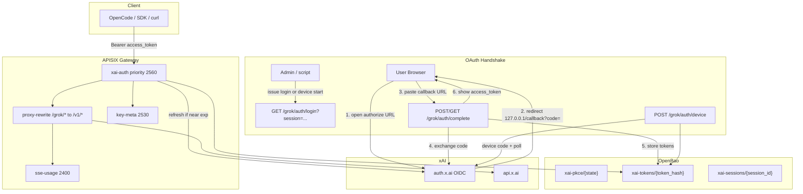
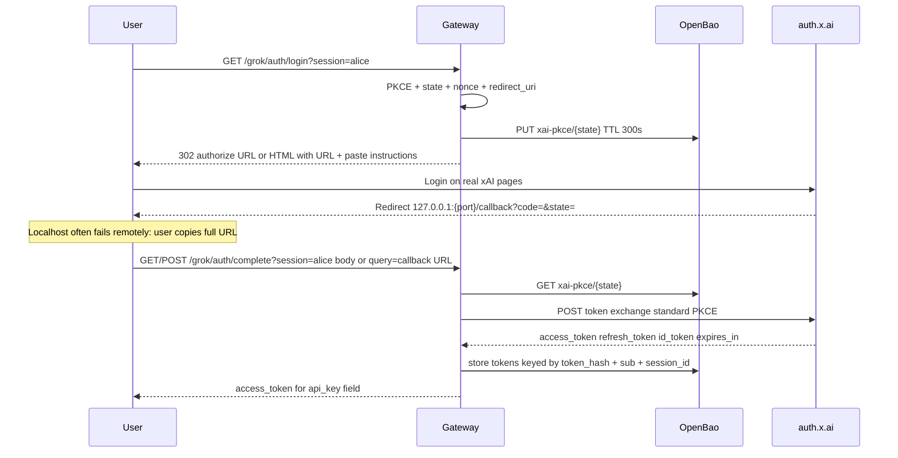

# Provider Spec: xAI Grok (OAuth PKCE + API Proxy)

> **SCOPE NOTE:** This document covers the full xAI Grok provider integration
> with the WORKSPACE-GATEWAY: OAuth 2.0 PKCE authentication (browser loopback,
> manual paste, device code), automatic token refresh, and API proxying to
> `api.x.ai`. The xAI `/v1/chat/completions` endpoint is **fully
> OpenAI-compatible**: the existing `sse-usage.lua` / `sse_usage_lib.lua`
> parser and `cost_calc.lua` module require **zero changes** to support xAI.

**Document ID:** AMI-PROP-LLMGW-PROVIDER-XAI-GROK-v1.1
**Status:** Draft
**Date:** 2026-07-12
**Parent:** `docs/architecture/README.md` / `docs/ARCHITECTURE.md`
**Companion:** `docs/COST-CALC-LUA.md`, `docs/PLUGIN-FOUNDATION.md`

### Sources of truth (protocol)

| Priority | Source | Use for |
|----------|--------|---------|
| 1 | [xai-org/grok-build](https://github.com/xai-org/grok-build) `crates/codegen/xai-grok-shell/src/auth/` | Authorize, exchange, refresh, device code, paste race |
| 2 | Official guide `02-authentication.md` (in grok-build) | Product UX, external auth provider, precedence |
| 3 | [ele-yufo/grokcli](https://github.com/ele-yufo/grokcli) | Secondary; many constants match, some “quirks” are **wrong** vs official |

**Corrections vs earlier draft (v1.0 / grokcli folklore):**

| Claim (v1.0) | Official reality |
|--------------|------------------|
| Must echo `code_challenge` on token exchange | **No**: only `code_verifier` (RFC 7636) |
| Must send `plan=generic` on authorize | **No**: not in official authorize URL |
| Fixed port `56121` always | Prod uses **ephemeral** port; `56121` only local-dev |
| `referrer=grokcli` | Official default **`grok-build`** |
| Client `api_key` = `vgw-` virtual key | Client `api_key` = **xAI `access_token` JWT** |
| Callback hosted on gateway public URL | Official always uses **loopback** `127.0.0.1` |

---

## 1. Background and Rationale

### 1.1 Why xAI Grok

xAI's Grok models (grok-4, grok-4.3, grok-4.5) are edge-class reasoning
models with native web search, code execution, and vision. The API is priced
competitively and accessible via API keys and OAuth (SuperGrok / X Premium+).

### 1.2 Two API surfaces

| Endpoint | Request shape | Response shape | Status |
|----------|--------------|----------------|--------|
| `POST /v1/chat/completions` | `messages[]` (OpenAI format) | `choices[].message` (OpenAI format) | Fully supported; usage-tracked |
| `POST /v1/responses` | `input[]` (xAI native) | `output[].content[].output_text` | Proxied; not usage-tracked by current parser |

**`/v1/chat/completions` is fully OpenAI-compatible** (messages, SSE deltas,
`usage.*`, `prompt_tokens_details.cached_tokens`,
`completion_tokens_details.reasoning_tokens`, `reasoning_content`,
`data: [DONE]`). Existing `sse_usage_lib.lua` / `cost_calc.lua` need **no
changes**. xAI’s proprietary `cost_in_usd_ticks` is ignored; Pathway B prices
from `models.dev`.

### 1.3 Primary path: OAuth + proxy (NOT console API keys)

**OAuth is the product.** Full stack stays in scope:

1. Browser / device-code OAuth against `auth.x.ai` (PKCE + refresh)
2. Gateway stores `refresh_token` in OpenBao and refreshes proactively
3. Gateway proxies `/grok/*` → `api.x.ai/v1/*` with a live Bearer JWT
4. Client talks only to the gateway (`base_url=http://gateway:9080/grok`)

| Mechanism | What the client sends as Bearer | Who refreshes | Role |
|-----------|----------------------------------|---------------|------|
| **OAuth session (primary)** | xAI **`access_token` JWT** from the OAuth handshake | **Gateway** (OpenBao holds `refresh_token`) | SuperGrok / Premium+ subscription path |
| Console API key (optional side door) | `xai-...` from console.x.ai | N/A | Optional passthrough only: **not** a replacement for OAuth |

**Naming trap (read carefully):** OpenAI-compatible clients label their credential
slot `api_key` / `apiKey`. That is the **HTTP header field**, not “you must use
an xAI console API key.” After OAuth, the value pasted there is the **OAuth
`access_token` JWT**. Example:

```python
OpenAI(base_url="http://gateway:9080/grok", api_key="<oauth access_token JWT>")
#                                      ^^^^^^^ SDK parameter name
#                                              value = OAuth token, not xai-...
```

**Not used for Grok OAuth:** `vgw-*` virtual keys, `key-resolver`, or
`secret/data/gateway/keys/`. That system remains for other providers
(`/opencode_federated/*`). Grok OAuth is a separate plugin and storage path.

### 1.4 Client workflow (dead simple: still full OAuth)

Same wire shape as any OpenAI-compatible client: no custom portal, no
Virtual/Own key UI. OAuth handshake once; then normal Bearer traffic forever.

```
1. Admin (or tooling) starts an OAuth handshake and gives the user a way to
   finish xAI login (login URL + paste path, or device-code URL + user_code).
2. User authenticates on real xAI pages (auth.x.ai / accounts.x.ai only).
3. User receives the OAuth access_token JWT and pastes it into the client's
   normal credential slot (often named api_key). Base URL =
   http://gateway:9080/grok
4. Gateway holds refresh_token, refreshes proactively, proxies every request
   to api.x.ai until refresh fails → user re-runs handshake once.
```

**There is no login portal to code**: only redirect / device-code plumbing and
a minimal “here is your OAuth access_token” page (or JSON for scripts).

### 1.5 Official client extras (optional later)

Official `grok` (grok-build) also supports:

- **Device code**: best remote UX (no loopback paste)
- **External auth provider**: subprocess: stderr = UX, stdout = token JSON
- **Enterprise OIDC**: customer IdP
- Coding proxy `https://cli-chat-proxy.grok.com/v1` + session header
  `X-XAI-Token-Auth: xai-grok-cli` for some session features

v1 of this gateway targets **`api.x.ai` + Bearer access_token or `xai-` key**.
Device code is in scope for remote users. Coding-proxy parity is out of scope
for v1.

---

## 2. Architecture



### 2.1 Container topology

Reuses existing gateway topology (APISIX, OpenBao, Vector, ClickHouse). No new
containers. `xai-auth` runs in the APISIX Lua worker.

### 2.2 Routes

| Route ID | URI | Upstream | Auth | Purpose |
|----------|-----|----------|------|---------|
| `xai-auth-login` | `/grok/auth/login` | none | xai-auth | Start PKCE; 302 to auth.x.ai |
| `xai-auth-complete` | `/grok/auth/complete` | none | xai-auth | Accept pasted callback URL / code; exchange; return access_token |
| `xai-auth-device` | `/grok/auth/device` | none | xai-auth | Device-code start + (optional) poll helper |
| `relay-grok` | `/grok/*` | `api.x.ai:443` | xai-auth | Proxy with session refresh or `xai-` passthrough |

Optional local helper: a process on the user’s machine binding
`127.0.0.1:<port>/callback` and forwarding the code to
`/grok/auth/complete`: same race as official `grok` (loopback vs paste).
Gateway **does not** require a public non-loopback `redirect_uri` for the
shared official `CLIENT_ID`.

### 2.3 Two strings (do not conflate)

| String | Who picks it | Where used | Role |
|--------|--------------|------------|------|
| **session_id** | Admin / tooling | `?session=` on login/complete/device | Handshake correlation, audit labels only |
| **access_token** | xAI OAuth response | Client `api_key` / `Authorization: Bearer` | Runtime credential; gateway lookup key |

`session_id` is **never** required on API calls after handshake. `vgw-` is
**not** part of this flow.

---

## 3. OAuth 2.0 PKCE (official protocol)

### 3.1 Protocol constants

From official `xai-grok-shell` `auth/config.rs` + `oidc/protocol.rs`:

| Constant | Value | Notes |
|----------|-------|-------|
| `CLIENT_ID` | `b1a00492-073a-47ea-816f-4c329264a828` | Same public client as official `grok` / grokcli |
| `ISSUER` | `https://auth.x.ai` | OIDC issuer |
| `DISCOVERY_URL` | `https://auth.x.ai/.well-known/openid-configuration` | |
| `DEFAULT_AUTH_ENDPOINT` | `https://auth.x.ai/oauth2/authorize` | Fallback if discovery fails |
| `DEFAULT_TOKEN_ENDPOINT` | `https://auth.x.ai/oauth2/token` | Fallback if discovery fails |
| `DEVICE_CODE_URL` | `https://auth.x.ai/oauth2/device/code` | RFC 8628 |
| `SCOPE` (min API) | `openid profile email offline_access grok-cli:access api:access` | Official default also adds conversations/workspaces scopes |
| `SCOPE` (official full) | min + `conversations:read conversations:write workspaces:read workspaces:write` | Use full when matching official CLI |
| `REDIRECT_HOST` | `127.0.0.1` | Loopback only for this client_id |
| `REDIRECT_PATH` | `/callback` | Official path (not `/grok/auth/callback`) |
| `AUTHORIZE_REFERRER` | `grok-build` | Attribution; overridable (e.g. `workspace-gateway`) |
| `REFRESH_SKEW` | `300` seconds | Matches `GROK_AUTH_EARLY_INVALIDATION_SECS` default |

**Removed (not official):** `plan=generic`, fixed mandatory `56121` in production,
echo of `code_challenge` / `code_challenge_method` on token exchange.

### 3.2 PKCE primitives (pure Lua)

```lua
-- xai_pkce.lua  (aligned with official generate_pkce: 32 random bytes)
function M.generate_verifier()
    local random = require("resty.random").bytes(32)
    return ngx.encode_base64(random):gsub("+", "-"):gsub("/", "_"):gsub("=", "")
end

function M.code_challenge(verifier)
    local sha = require("resty.sha256"):new()
    sha:update(verifier)
    return ngx.encode_base64(sha:final()):gsub("+", "-"):gsub("/", "_"):gsub("=", "")
end

function M.random_state()
    return require("resty.random").hex(16)
end
```

### 3.3 Authorize URL (official shape)

```
{authorization_endpoint}
  ?response_type=code
  &client_id={CLIENT_ID}
  &redirect_uri=http://127.0.0.1:{port}/callback
  &scope={SCOPE}
  &code_challenge={S256}
  &code_challenge_method=S256
  &state={state}
  &nonce={nonce}
  &referrer={AUTHORIZE_REFERRER}
  # optional: principal_type, principal_id (team preselect)
```

**No `plan=` parameter.**

`port` is chosen at login start: bind preference `56121` if free, else OS
ephemeral; store exact `redirect_uri` in PKCE state (must match token exchange).

### 3.4 Login sequence (browser + paste)



### 3.5 Token exchange: standard PKCE only

```lua
-- xai_tokens.lua  (official exchange_code fields only)
function M.exchange_code(httpc, params)
    local form = ngx.encode_args({
        grant_type = "authorization_code",
        code = params.code,
        redirect_uri = params.redirect_uri,
        client_id = params.client_id,
        code_verifier = params.code_verifier,
        -- DO NOT send code_challenge or code_challenge_method here
    })
    -- POST to token_endpoint, Accept application/json
end
```

### 3.6 Token refresh

```lua
function M.refresh(httpc, params)
    local form = ngx.encode_args({
        grant_type = "refresh_token",
        client_id = params.client_id,
        refresh_token = params.refresh_token,
        -- optional: principal_type, principal_id for team tokens
    })
    -- Response may omit refresh_token → keep previous
end
```

Proactive refresh in proxy `access` phase when JWT `exp` (or `expires_at`) is
within `skew_seconds` (default 300). Never wait for 401 unless early-refresh path
missed (optional reactive retry is a later enhancement).

### 3.7 Device code (primary remote path)

```
POST {ISSUER}/oauth2/device/code
  client_id, scope, referrer=grok-build
→ device_code, user_code, verification_uri, interval, expires_in

Poll token endpoint:
  grant_type=urn:ietf:params:oauth:grant-type:device_code
  device_code, client_id
```

Gateway endpoints:

1. `POST /grok/auth/device` with optional `session` → returns JSON
   `{ verification_uri, user_code, device_code, interval, expires_in }`
2. `POST /grok/auth/device/poll` with `device_code` + optional `session` → on
   success stores tokens and returns `{ access_token, expires_in, account }`

Admin can email: “Open {verification_uri}, enter {user_code}.” No paste of
localhost required.

### 3.8 Manual paste parsing

Port official / grokcli `parse_pasted_callback`:

- Full URL `http://127.0.0.1:.../callback?code=...&state=...`
- Query fragment `?code=...&state=...`
- Bare opaque `code` (state check skipped when empty)

---

## 4. Plugin: xai-auth.lua

### 4.1 Manifest

```lua
local plugin_name = "xai-auth"
local plugin = {
    version = 0.2,
    priority = 2560,  -- before key-meta (2530), after key-resolver (2555) if both present
    name = plugin_name,
}
```

Grok routes use **`xai-auth` only**: not `key-resolver`.

### 4.2 Schema

```lua
plugin.schema = {
    type = "object",
    properties = {
        openbao_addr = { type = "string", default = "http://openbao:8200" },
        openbao_token_env = { type = "string", default = "OPENBAO_TOKEN" },
        client_id = {
            type = "string",
            default = "b1a00492-073a-47ea-816f-4c329264a828",
        },
        issuer = { type = "string", default = "https://auth.x.ai" },
        referrer = { type = "string", default = "grok-build" },
        scope = {
            type = "string",
            default = "openid profile email offline_access grok-cli:access api:access",
        },
        preferred_redirect_port = { type = "integer", default = 56121 },
        cache_ttl = { type = "integer", default = 300 },
        skew_seconds = { type = "integer", default = 300 },
        pkce_ttl = { type = "integer", default = 300 },
    },
}
```

### 4.3 Phase handlers

| Phase | Path | Behavior |
|-------|------|----------|
| `init` |: | Warm OIDC discovery into `ngx.shared.xai_cache` |
| `access` | `/grok/auth/login` | PKCE + store state + 302 or HTML with authorize URL |
| `access` | `/grok/auth/complete` | Parse paste, exchange, store, return access_token |
| `access` | `/grok/auth/device` | Request device code |
| `access` | `/grok/auth/device/poll` | Poll until tokens; store; return access_token |
| `access` | `/grok/*` (proxy) | Resolve Bearer → session refresh or `xai-` passthrough |

#### 4.3.1 Login

1. Read optional `session` query param (session_id).
2. Generate verifier, challenge, state, nonce; pick `redirect_uri`.
3. Store in OpenBao `secret/data/gateway/xai-pkce/{state}`:
   `{ verifier, challenge, session_id, redirect_uri, nonce, created_at }` TTL 300s.
4. Build authorize URL; `ngx.redirect` or return HTML listing URL + complete
   instructions (not a branded portal).

#### 4.3.2 Complete (paste)

1. Accept callback via query, form body, or JSON: `url` or `code` + optional `state`.
2. Load PKCE by `state` (or by `session` if bare code + single pending: prefer state).
3. `exchange_code` (standard PKCE only).
4. `normalize_tokens`; extract account from `id_token` / access JWT (`sub`, `email`).
5. Persist OpenBao records (see §6); delete PKCE state.
6. Response:
   - `Accept: application/json` → `{ "access_token", "expires_in", "account", "session_id" }`
   - Else minimal HTML: show **access_token** as the value for the client’s
     `api_key` field (copy-friendly). Do **not** show or invent a `vgw-` key.

#### 4.3.3 Proxy

```
Authorization: Bearer <credential>
```

| Credential | Behavior |
|------------|----------|
| Starts with `xai-` | Passthrough Bearer to `api.x.ai` (API key path). Set `X-Gateway-Key-Id` to hash of key. |
| JWT / other (OAuth access_token) | Lookup OpenBao by `sha256(credential)` **or** JWT `sub` (and accept **stale** issued access_token as session handle after refresh rotated the live token). If expiring within skew → refresh, update store. Set upstream `Authorization: Bearer <fresh access_token>`. |
| Missing / unknown | `401` with hint to re-run login/device flow. |

Headers for downstream plugins:

- `X-Gateway-Key-Id`: token_hash or `xai-` key hash
- `X-Gateway-User-Id`: email or sub from token record
- `X-Gateway-Tenant-Id`: optional from session metadata
- `ctx.consumer.username` = key id for logging

**No request body rewrite.** Only Authorization (and gateway meta headers).

When access_token is rotated on refresh, **keep accepting the original
access_token string** the user put in `api_key` (index aliases: original hash
→ record). Re-auth only when refresh fails (`invalid_grant` / 401).

#### 4.3.4 Errors

| Condition | Status | Body |
|-----------|--------|------|
| Missing code / invalid paste | 400 | `xai-auth: invalid callback input` |
| PKCE state expired | 400 | `xai-auth: login session expired` |
| Token exchange failed | 502 | `xai-auth: token exchange failed: …` |
| Not authenticated (proxy) | 401 | `xai-auth: not authenticated` |
| Refresh failed (invalid grant) | 401 | `xai-auth: re-authenticate` |
| Refresh 403 / entitlement | 403 | `xai-auth: subscription does not include API access` |
| OpenBao down | 503 | `xai-auth: cannot reach token store` |

### 4.4 Supporting modules

| File | Role |
|------|------|
| `xai_pkce.lua` | Verifier, challenge, state |
| `xai_jwt.lua` | Decode claims (no verify for exp/sub), `is_expiring` |
| `xai_oidc.lua` | Discovery + HTTPS `*.x.ai` pin + cache |
| `xai_tokens.lua` | Exchange, refresh, normalize, OpenBao CRUD, token_hash |

---

## 5. Module details

### 5.1 xai_jwt.lua

| Function | Returns |
|----------|---------|
| `decode_claims(token)` | table or `{}` (base64url payload, no signature verify) |
| `is_expiring(token, skew)` | true if `exp <= now + skew` or unparseable with force-refresh policy |
| `token_hash(token)` | hex sha256 of raw token string |

### 5.2 xai_oidc.lua

| Function | Behavior |
|----------|----------|
| `discover(httpc)` | GET discovery; pin endpoints to HTTPS on `x.ai` / `*.x.ai`; cache 1h in `xai_cache` |
| Fallbacks | Hardcoded authorize + token endpoints if discovery fails |

### 5.3 xai_tokens.lua

| Function | Behavior |
|----------|----------|
| `exchange_code` | Standard PKCE form (no challenge echo) |
| `refresh` | Preserve refresh_token if omitted |
| `normalize_tokens(payload, previous)` | access, refresh, id_token, token_type, expires_in |
| `store_session(...)` | Write token_hash primary + sub + session indexes |
| `load_by_bearer(token)` | Hash lookup then sub lookup |
| `clear_session(...)` | Delete on permanent refresh failure |

---

## 6. OpenBao storage

### 6.1 PKCE pending

**Path:** `secret/data/gateway/xai-pkce/{state}`  
**TTL:** 300s  

```json
{
  "verifier": "...",
  "challenge": "...",
  "session_id": "alice",
  "redirect_uri": "http://127.0.0.1:56121/callback",
  "nonce": "...",
  "created_at": "..."
}
```

### 6.2 OAuth session (persistent)

**Primary path:** `secret/data/gateway/xai-tokens/{token_hash}`  
where `token_hash = sha256(access_token_as_issued_to_user)`.

```json
{
  "tokens": {
    "access_token": "eyJ...",
    "refresh_token": "...",
    "id_token": "...",
    "token_type": "Bearer",
    "expires_in": 3600
  },
  "issued_access_token_hash": "...",
  "live_access_token_hash": "...",
  "sub": "user-sub",
  "session_id": "alice",
  "account": { "email": "...", "user_id": "..." },
  "discovery": {
    "authorization_endpoint": "https://auth.x.ai/oauth2/authorize",
    "token_endpoint": "https://auth.x.ai/oauth2/token"
  },
  "client_id": "b1a00492-073a-47ea-816f-4c329264a828",
  "updated_at": "..."
}
```

**Secondary index (optional KVv2 path):**  
`secret/data/gateway/xai-tokens-by-sub/{sub}` → points at primary key  
`secret/data/gateway/xai-sessions/{session_id}` → points at primary key  

On refresh: update `tokens.access_token` and `live_access_token_hash`; **keep**
`issued_access_token_hash` so the user’s unchanged `api_key` still resolves.

### 6.3 Refresh race

Concurrent requests near expiry may both refresh. Prefer `resty.lock` on
`token_hash` / `sub` for serialization. If xAI rotates refresh_token, second
refresh may 401: clear session and return 401 re-auth.

---

## 7. Configuration

### 7.1 Routes (sketch)

```yaml
routes:
  - id: xai-auth-login
    uri: /grok/auth/login
    plugins:
      xai-auth:
        openbao_token_env: "OPENBAO_TOKEN"
        referrer: "grok-build"

  - id: xai-auth-complete
    uri: /grok/auth/complete
    methods: [GET, POST]
    plugins:
      xai-auth: {}

  - id: xai-auth-device
    uris:
      - /grok/auth/device
      - /grok/auth/device/poll
    methods: [POST, GET]
    plugins:
      xai-auth: {}

  - id: relay-grok
    uri: /grok/*
    plugins:
      xai-auth: {}
      proxy-rewrite:
        regex_uri: ["^/grok/(.*)", "/v1/$1"]
      key-meta: {}
      limit-count: {}
      redact: {}
      sse-usage: {}
      # ... existing stack plugins as other relays
    upstream:
      type: roundrobin
      scheme: https
      nodes:
        "api.x.ai:443": 1
      pass_host: node
```

### 7.2 Shared dict

```yaml
# conf/config.yaml nginx_config.http_configuration_snippet or lua_shared_dict
# xai_cache 5m
```

### 7.3 Env

```
OPENBAO_TOKEN=...
XAI_CLIENT_ID=b1a00492-073a-47ea-816f-4c329264a828   # optional override
XAI_OAUTH_REFERRER=grok-build
```

### 7.4 Docker volume mounts

Mount `xai-auth.lua`, `xai_pkce.lua`, `xai_jwt.lua`, `xai_oidc.lua`,
`xai_tokens.lua` into APISIX plugins path (same pattern as existing custom
plugins).

---

## 8. Client usage

### 8.1 One-time OAuth (browser + paste)

```bash
SESSION=alice

# 1. Start login (open printed/redirected URL in browser)
curl -sS "http://gateway:9080/grok/auth/login?session=$SESSION"

# 2. After xAI login, browser lands on 127.0.0.1/callback?... (may fail to load)
#    Copy the full URL from the address bar.

# 3. Complete handshake: get access_token
curl -sS -X POST "http://gateway:9080/grok/auth/complete?session=$SESSION" \
  -H "Content-Type: application/json" \
  -d '{"url":"http://127.0.0.1:56121/callback?code=...&state=..."}'
# → {"access_token":"eyJ...","expires_in":3600,"account":{...}}
```

### 8.2 One-time OAuth (device code: preferred remote)

```bash
curl -sS -X POST "http://gateway:9080/grok/auth/device?session=alice"
# → verification_uri, user_code, device_code, interval

# User opens verification_uri, enters user_code on any device.

curl -sS -X POST "http://gateway:9080/grok/auth/device/poll" \
  -d "device_code=..."
# → access_token
```

### 8.3 Ongoing API requests (OAuth access_token as Bearer)

Primary path after handshake. The JWT is what clients usually put in a
parameter named `api_key`: it is still the **OAuth session token**, not a
console `xai-` key.

```bash
export GROK_OAUTH_ACCESS_TOKEN='eyJ...'   # from /auth/complete or device poll

curl http://gateway:9080/grok/chat/completions \
  -H "Authorization: Bearer $GROK_OAUTH_ACCESS_TOKEN" \
  -H "Content-Type: application/json" \
  -d '{"model":"grok-4","messages":[{"role":"user","content":"Hello"}],"stream":true}'
```

```python
from openai import OpenAI
client = OpenAI(
    base_url="http://gateway:9080/grok",
    # SDK calls this "api_key"; value is the OAuth JWT from the handshake.
    api_key=os.environ["GROK_OAUTH_ACCESS_TOKEN"],
)
```

```javascript
const client = new OpenAI({
  baseURL: "http://gateway:9080/grok",
  apiKey: process.env.GROK_OAUTH_ACCESS_TOKEN, // OAuth JWT, not xai-...
});
```

Gateway on every request: load session by token hash/sub → refresh if near
expiry → proxy to `api.x.ai` with a fresh Bearer. Client never sees refresh.

### 8.4 Optional: console API key passthrough (secondary only)

Only if someone already has an `xai-...` key from console.x.ai. **Does not
replace OAuth.** Gateway forwards Bearer unchanged; no refresh_token storage.

```bash
curl http://gateway:9080/grok/chat/completions \
  -H "Authorization: Bearer xai-..." \
  ...
```

### 8.5 What gets proxied

| Client | Upstream |
|--------|----------|
| `POST /grok/chat/completions` | `POST https://api.x.ai/v1/chat/completions` |
| `POST /grok/responses` | `POST https://api.x.ai/v1/responses` |
| `GET /grok/models` | `GET https://api.x.ai/v1/models` |

### 8.6 Token lifecycle (invisible to client after step 3)

```
Client Bearer <issued access_token>
  → xai-auth load session by hash/sub
  → if near expiry: refresh, update live token in OpenBao
  → upstream Bearer <fresh access_token>
  → client keeps same api_key string forever until re-auth
```

---

## 9. Security

### 9.1 Endpoint pinning

OIDC discovery endpoints must be HTTPS on `x.ai` or `*.x.ai`. Reject others
before sending refresh tokens.

### 9.2 PKCE state TTL

300s; single-use delete after exchange.

### 9.3 Redirect URI

Exact match between authorize and token exchange. Loopback
`http://127.0.0.1:{port}/callback` only for the public official client_id.
Do not claim a gateway public host as redirect_uri without a registered
client.

### 9.4 Token storage

OpenBao KVv2; same operational security as other gateway secrets. Never log
access/refresh tokens (`redact` plugin).

### 9.5 Refresh rotation

If refresh_token rotates, store new; concurrent use of old may force re-auth.

### 9.6 Access token as session handle

The client-held string is a secret. Treat equally to API keys (HTTPS only,
no logs). Hash for OpenBao path / key-meta identity.

---

## 10. Usage / cost

Unchanged: OpenAI-compatible path → `sse-usage` → Vector → ClickHouse.
`cost_source = computed` via `models.dev` for xAI models. No
`estimated_cost` from upstream.

---

## 11. Failure modes

| Scenario | Behavior |
|----------|----------|
| User closes browser mid-login | PKCE TTL expires; restart login |
| Paste wrong URL | 400 invalid callback |
| Device code expired | Poll error; start new device flow |
| Refresh invalid_grant | Clear session; 401 re-auth |
| Subscription/tier 403 | 403; do not clear unnecessarily |
| OpenBao down | 503 |
| Stale access_token in client after refresh | Still works via issued hash / sub index |

---

## 12. Implementation plan

### 12.1 Deliverables

| Artifact | Notes |
|----------|-------|
| `plugins/custom/xai_pkce.lua` | |
| `plugins/custom/xai_jwt.lua` | |
| `plugins/custom/xai_oidc.lua` | |
| `plugins/custom/xai_tokens.lua` | Standard PKCE exchange |
| `plugins/custom/xai-auth.lua` | login, complete, device, proxy |
| Unit tests under `tests/lua/` | pkce, jwt, normalize, paste parse |
| Integration `tests/integration/test_grok_*.sh` | Mock token endpoint where possible |
| Route config | apisix / seed-routes |
| `.env.example` | XAI_* vars |

### 12.2 Build order

1. `xai_pkce` + `xai_jwt` + unit tests  
2. `xai_oidc` discovery pin  
3. `xai_tokens` exchange/refresh/normalize (no challenge echo)  
4. `xai-auth` login + complete  
5. `xai-auth` proxy lookup + refresh  
6. Device code endpoints  
7. Routes + e2e against real auth only in manual/dev  

### 12.3 Out of scope v1

- `vgw-` / `key-resolver` integration for OAuth  
- Public non-loopback redirect_uri registration  
- `cli-chat-proxy.grok.com` + `X-XAI-Token-Auth`  
- Enterprise customer OIDC  
- Full official external-auth-provider binary (can wrap complete later)  
- `/v1/responses` usage parser  

### 12.4 Optional: official `grok` external auth provider

A small script for `GROK_AUTH_PROVIDER_COMMAND` that:

1. Starts device or login flow against this gateway  
2. Prints status URLs on **stderr**  
3. Prints JSON `{access_token, refresh_token?, expires_in, issuer}` on **stdout**

Then official `grok` uses gateway-brokered tokens without a portal. Refresh:
re-run with `GROK_AUTH_EXPIRED=1` (gateway re-issues fresh access_token from
stored refresh, or returns error if re-auth needed).

---

## 13. Admin runbook (copy-paste)

```bash
# Preferred remote: device code
curl -sS -X POST "http://gateway:9080/grok/auth/device?session=alice" | tee /tmp/device.json
# Tell user: open verification_uri, enter user_code
curl -sS -X POST "http://gateway:9080/grok/auth/device/poll" \
  -H "Content-Type: application/json" \
  -d @/tmp/device.json
# Give user the access_token → api_key; base_url=http://gateway:9080/grok

# Local/browser: login + paste
open "http://gateway:9080/grok/auth/login?session=alice"
# After login, paste callback URL into complete
```

---

## 14. Revision history

| Version | Date | Notes |
|---------|------|-------|
| v1.0 | 2026-07-12 | Initial draft from grokcli reverse-engineering (`vgw-` swap, plan=generic, challenge echo) |
| v1.1 | 2026-07-12 | Aligned to official xai-org/grok-build; OAuth access_token in client credential slot (not vgw-); device code; standard PKCE; console xai- key remains optional passthrough only |
