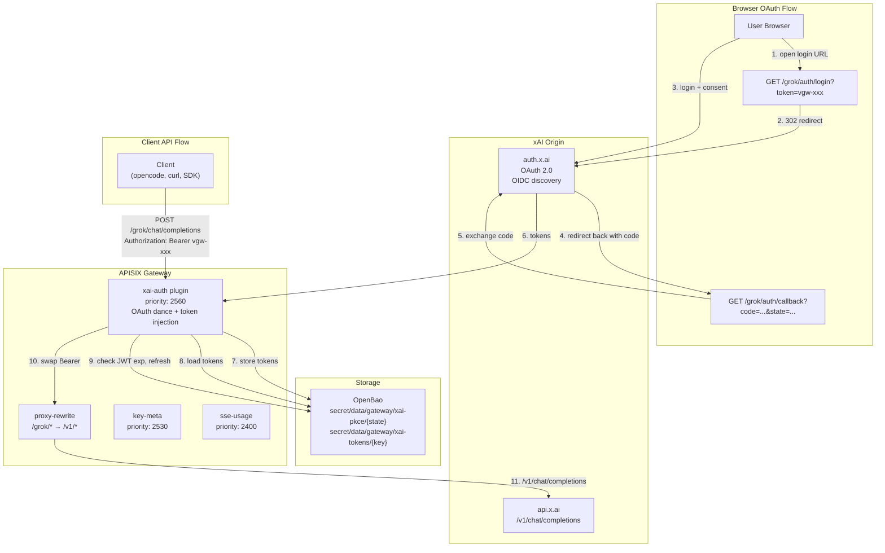
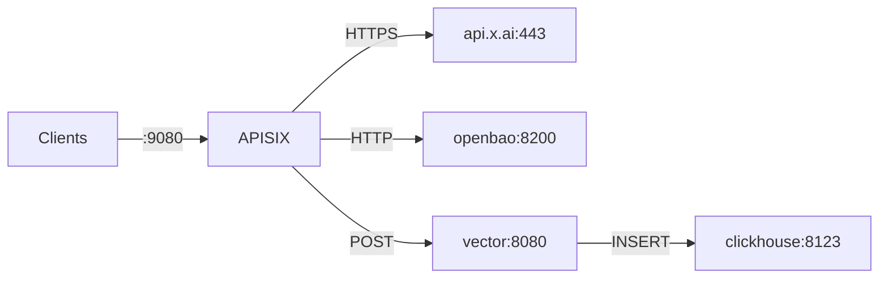
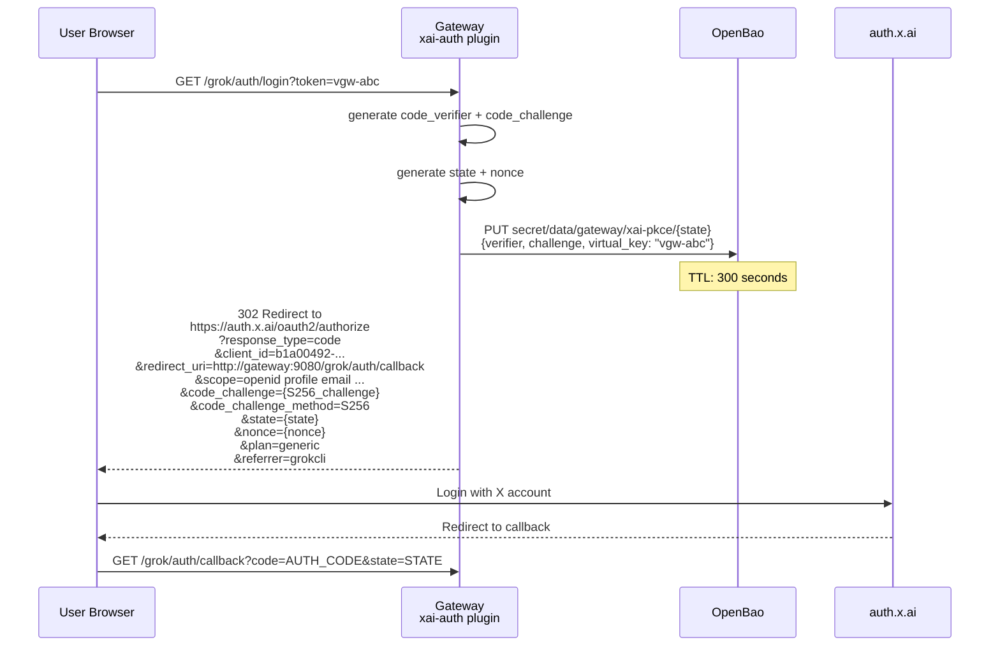
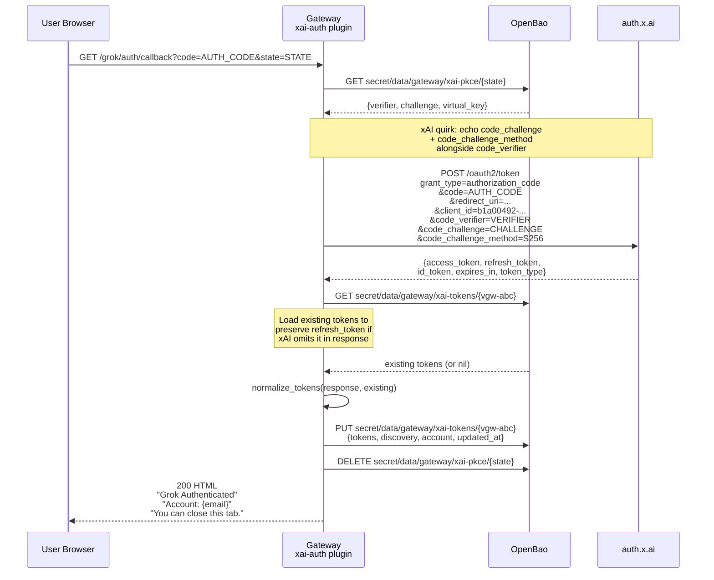

# Provider Spec: xAI Grok (OAuth PKCE + API Proxy)

> **SCOPE NOTE:** This document covers the full xAI Grok provider integration
> with the WORKSPACE-GATEWAY: OAuth 2.0 PKCE authentication flow (browser-based
> login, token exchange, ahead-of-expiry refresh) and API proxying to `api.x.ai`.
> The xAI `/v1/chat/completions` endpoint is **fully OpenAI-compatible** ,  the
> existing `sse-usage.lua` / `sse_usage_lib.lua` parser and `cost_calc.lua`
> module require **zero changes** to support xAI.

**Document ID:** AMI-PROP-LLMGW-PROVIDER-XAI-GROK-v1.0
**Status:** Draft
**Date:** 2026-07-12
**Parent:** `docs/ARCHITECTURE.md`
**Companion:** `docs/COST-CALC-LUA.md`, `docs/PLUGIN-FOUNDATION.md`

---

## 1. Background and Rationale

### 1.1 Why xAI Grok

xAI's Grok models (grok-4, grok-4.3, grok-4.5) are top-tier reasoning
models with native web search, code execution, and vision capabilities. The API
is priced competitively and accessible via both API keys and OAuth (SuperGrok /
X Premium+ subscription).

### 1.2 Two API surfaces

xAI exposes two inference endpoints:

| Endpoint | Request shape | Response shape | Status |
|----------|--------------|----------------|--------|
| `POST /v1/chat/completions` | `messages[]` (OpenAI format) | `choices[].message` (OpenAI format) | Legacy, fully supported |
| `POST /v1/responses` | `input[]` (xAI native) | `output[].content[].output_text` | Recommended by xAI |

**The `/v1/chat/completions` endpoint is fully OpenAI-compatible.** This means:

- `messages` array with `role`/`content` objects → identical to OpenAI
- `choices[0].delta.content` for SSE streaming → identical to OpenAI
- `usage.prompt_tokens`, `usage.completion_tokens`, `usage.total_tokens` → identical
- `usage.prompt_tokens_details.cached_tokens` → identical
- `usage.completion_tokens_details.reasoning_tokens` → identical
- `choices[0].delta.reasoning_content` → xAI extension, **already handled by parser**
- `data: [DONE]` stream terminator → identical
- OpenAI SDK, OpenAI-compatible clients, and all existing tooling work as-is

The `/v1/responses` endpoint uses different field names (`input` instead of
`messages`, `output` instead of `choices`, `input_tokens` instead of
`prompt_tokens`) and is **not** handled by the existing parser. It is accessible
through the proxy but usage tracking applies only to the OpenAI-compatible path.

### 1.3 Why OAuth PKCE (not just API keys)

xAI supports two auth mechanisms:

1. **API keys** (`xai-...`): Simple bearer tokens from the xAI console.
2. **OAuth 2.0 with PKCE**: Used by the official Grok CLI (`grokcli`). Enables
   authentication using an existing SuperGrok / X Premium+ subscription without
   generating a separate API key. The OAuth bearer is a JWT with automatic
   refresh.

This implementation supports **both**. The primary flow is OAuth PKCE (matching
grokcli's approach). API key passthrough also works via the existing
`key-resolver` plugin on a separate route, or by sending a direct `xai-*` key
through the Grok route (bypasses `xai-auth`, forwarded as-is).

### 1.4 SSE usage tracking compatibility

The existing `sse_usage_lib.lua` parser handles xAI's response format
**without changes**. Field-by-field verification:

| Parser reads | xAI `/v1/chat/completions` sends | Match |
|---|---|---|
| `usage.prompt_tokens` | `prompt_tokens` | exact |
| `usage.completion_tokens` | `completion_tokens` | exact |
| `usage.total_tokens` | `total_tokens` | exact |
| `usage.prompt_tokens_details.cached_tokens` | `prompt_tokens_details.cached_tokens` | exact |
| `usage.completion_tokens_details.reasoning_tokens` | `completion_tokens_details.reasoning_tokens` | exact |
| `choices[1].delta.reasoning_content` | `choices[0].delta.reasoning_content` | exact |
| `obj.model` | `model` | exact |
| `payload == "[DONE]"` | `data: [DONE]` | exact |

The only gap is cost: xAI reports `cost_in_usd_ticks` (proprietary integer)
instead of `estimated_cost`, so upstream-reported cost is always 0. This is
already handled by `cost_calc.lua` Pathway B ,  it computes cost from
`models.dev` pricing data, which includes xAI models (grok-4, grok-4.3,
grok-4.5, etc.).

---

## 2. Architecture



### 2.1 Container Topology

The Grok route reuses the existing gateway container topology (§2 of
`ARCHITECTURE.md`). No new containers are needed. The `xai-auth` plugin runs
inside the APISIX Lua worker process alongside the existing plugins.



### 2.2 Three Routes

| Route ID | URI | Upstream | Auth | Purpose |
|----------|-----|----------|------|---------|
| `xai-auth-login` | `/grok/auth/login` | none (no proxy) | xai-auth (initiate) | OAuth login redirect |
| `xai-auth-callback` | `/grok/auth/callback` | none (no proxy) | xai-auth (exchange) | OAuth callback receiver |
| `relay-grok` | `/grok/*` | `api.x.ai:443` (HTTPS) | xai-auth (inject) | API proxy with token injection |

---

## 3. OAuth 2.0 PKCE Flow

### 3.1 Protocol Constants

Derived from the official grokcli implementation (`grokcli/auth/oauth.py`):

| Constant | Value | Notes |
|----------|-------|-------|
| `CLIENT_ID` | `b1a00492-073a-47ea-816f-4c329264a828` | grokcli's registered client |
| `ISSUER` | `https://auth.x.ai` | OIDC issuer |
| `DISCOVERY_URL` | `https://auth.x.ai/.well-known/openid-configuration` | OIDC discovery document |
| `DEFAULT_AUTH_ENDPOINT` | `https://auth.x.ai/oauth2/authorize` | Fallback if discovery fails |
| `DEFAULT_TOKEN_ENDPOINT` | `https://auth.x.ai/oauth2/token` | Fallback if discovery fails |
| `SCOPE` | `openid profile email offline_access grok-cli:access api:access` | Required scopes |
| `REDIRECT_PORT` | `56121` | Loopback redirect port (configurable) |
| `REDIRECT_PATH` | `/grok/auth/callback` | Callback path on gateway |
| `AUTHORIZE_PLAN` | `generic` | Mandatory ,  without it, xAI rejects loopback OAuth |
| `AUTHORIZE_REFERRER` | `grokcli` | Attribution parameter |
| `REFRESH_SKEW` | `300` seconds | Proactive refresh window (5 minutes before expiry) |

### 3.2 PKCE Primitives

The gateway implements RFC 7636 PKCE in pure Lua (no external dependencies):

**Code Verifier** (43-128 chars, URL-safe random):
```lua
-- xai_pkce.lua
function M.generate_verifier()
    -- 64 random bytes → base64url → trim to 128 chars
    local random = resty.random.bytes(64)
    return ngx.encode_base64(random):gsub("+", "-"):gsub("/", "_"):gsub("=", ""):sub(1, 128)
end
```

**Code Challenge** (SHA-256 S256, base64url no-pad):
```lua
-- xai_pkce.lua
function M.code_challenge(verifier)
    local sha = resty.sha256:new()
    sha:update(verifier)
    local digest = sha:final()
    return ngx.encode_base64(digest):gsub("+", "-"):gsub("/", "_"):gsub("=", "")
end
```

**Random State** (32-char hex):
```lua
-- xai_pkce.lua
function M.random_state()
    return resty随机.hex(16)  -- 16 bytes = 32 hex chars
end
```

### 3.3 Login Sequence



### 3.4 Callback Sequence



### 3.5 Token Exchange ,  xAI Quirk

xAI's token endpoint requires the `code_challenge` and
`code_challenge_method` to be **echoed back** alongside `code_verifier` during
the token exchange. This is non-standard (most OIDC providers do not require
this) and must be handled explicitly:

```lua
-- xai_tokens.lua
function M.exchange_code(httpc, params)
    local form = ngx.encode_args({
        grant_type = "authorization_code",
        code = params.code,
        redirect_uri = params.redirect_uri,
        client_id = params.client_id,
        code_verifier = params.code_verifier,
        code_challenge = params.code_challenge,       -- echoed back
        code_challenge_method = "S256",               -- echoed back
    })
    -- POST to token_endpoint ...
end
```

Without echoing these fields, xAI returns a token exchange error.

### 3.6 Token Refresh

```lua
-- xai_tokens.lua
function M.refresh(httpc, params)
    local form = ngx.encode_args({
        grant_type = "refresh_token",
        client_id = params.client_id,
        refresh_token = params.refresh_token,
    })
    -- POST to token_endpoint ...
    -- Per xAI contract: response may omit refresh_token.
    -- Caller keeps the previous one in that case.
end
```

Token refresh is triggered proactively in the `access` phase of the proxy
route (§4.3). The gateway never waits for a 401 ,  it checks JWT `exp` and
refreshes 300 seconds before expiry.

---

## 4. Plugin: xai-auth.lua

### 4.1 Manifest

```lua
-- plugins/custom/xai-auth.lua
local core = require("apisix.core")
local cjson = require("cjson.safe")
local http = require("resty.http")
local pkce = require("apisix.plugins.xai_pkce")
local jwt_lib = require("apisix.plugins.xai_jwt")
local oidc = require("apisix.plugins.xai_oidc")
local tokens = require("apisix.plugins.xai_tokens")

local plugin_name = "xai-auth"

local plugin = {
    version = 0.1,
    priority = 2560,     -- runs before key-meta (2530), after key-resolver (2555)
    name = plugin_name,
}
```

**Priority placement**: 2560 ensures `xai-auth` executes before `key-meta`
(2530) and `sse-usage` (2400), but after `key-resolver` (2555) if both are on
the same route (they won't be ,  the Grok route uses `xai-auth` instead of
`key-resolver`).

### 4.2 Schema

```lua
plugin.schema = {
    type = "object",
    properties = {
        openbao_addr = {
            type = "string",
            default = "http://openbao:8200",
        },
        openbao_token_env = {
            type = "string",
            default = "OPENBAO_TOKEN",
        },
        client_id = {
            type = "string",
            default = "b1a00492-073a-47ea-816f-4c329264a828",
        },
        redirect_host = {
            type = "string",
            default = "127.0.0.1",
        },
        redirect_port = {
            type = "integer",
            default = 56121,
        },
        base_url = {
            type = "string",
            default = "https://api.x.ai/v1",
        },
        cache_ttl = {
            type = "integer",
            default = 300,
        },
        skew_seconds = {
            type = "integer",
            default = 300,
        },
        scope = {
            type = "string",
            default = "openid profile email offline_access grok-cli:access api:access",
        },
    },
}
```

### 4.3 Phase Handlers

| Phase | Path Match | Behavior |
|-------|-----------|----------|
| `init` | ,  | Warm up OIDC discovery cache via `ngx.timer.at(0, ...)` |
| `access` | `/grok/auth/login` | Initiate OAuth: generate PKCE + state, store in OpenBao, 302 redirect |
| `access` | `/grok/auth/callback` | Exchange code for tokens, store in OpenBao, return success HTML |
| `access` | `/grok/*` (proxy) | Resolve virtual key → load tokens → check JWT exp → refresh if near-expiry → inject Bearer → set gateway headers → set ctx.consumer |

#### 4.3.1 Init Phase (OIDC Discovery Warmup)

```lua
function plugin.init()
    local ok, err = ngx.timer.at(0, function(premature)
        if premature then return end
        local httpc = http.new()
        httpc:set_timeout(10000)
        oidc.discover(httpc)
    end)
    if not ok then
        core.log.warn("xai-auth: OIDC discovery warmup failed: ", err)
    end
end
```

OIDC discovery results are cached in `ngx.shared.xai_cache` with a 1-hour TTL.
The discovery fetch is validated to ensure endpoints are HTTPS on `x.ai` or
`*.x.ai` (security pin ,  prevents token theft via discovery poisoning).

#### 4.3.2 Login Handler (access phase)

```lua
function plugin.access(conf, ctx)
    local uri = ngx.var.uri

    if uri == "/grok/auth/login" then
        return handle_login(conf, ctx)
    elseif uri == "/grok/auth/callback" then
        return handle_callback(conf, ctx)
    end

    -- proxy route: resolve + inject
    return handle_proxy(conf, ctx)
end
```

**Login handler flow:**

1. Extract `virtual_key` from query param `token`
2. Generate `code_verifier`, `code_challenge` (S256), `state`, `nonce`
3. Store `{verifier, challenge, virtual_key}` in OpenBao at
   `secret/data/gateway/xai-pkce/{state}` with 300s TTL
4. Build authorize URL with all required params including `plan=generic` and
   `referrer=grokcli`
5. Return `ngx.redirect(authorize_url, 302)`

#### 4.3.3 Callback Handler (access phase)

**Callback handler flow:**

1. Extract `code` and `state` from query params
2. Load PKCE data from OpenBao: `secret/data/gateway/xai-pkce/{state}`
3. Call `tokens.exchange_code()` with echoed `code_challenge`
4. Load existing tokens from OpenBao (to preserve refresh_token if xAI omits it)
5. Normalize and store tokens at `secret/data/gateway/xai-tokens/{virtual_key}`
6. Delete PKCE state entry
7. Return HTML success page

```html
<html><body style="font-family:system-ui">
  <h2>Grok Authenticated</h2>
  <p>Account: {email}</p>
  <p>Key: <code>{virtual_key}</code></p>
  <p>You can close this tab.</p>
</body></html>
```

#### 4.3.4 Proxy Handler (access phase)

**Proxy handler flow:**

1. Extract virtual key from `Authorization: Bearer vgw-xxx`
2. Load tokens from OpenBao: `secret/data/gateway/xai-tokens/{virtual_key}`
3. Decode access_token JWT → extract `exp` claim
4. If `exp <= now + skew_seconds`: call `tokens.refresh()`, update stored tokens
5. Swap `Authorization` header: `Bearer vgw-xxx` → `Bearer xai_eyJ...`
6. Set gateway metadata headers:
   - `X-Gateway-Key-Id`: virtual key
   - `X-Gateway-Tenant-Id`: from token record
   - `X-Gateway-User-Id`: from token record (email from id_token)
7. Set `ctx.consumer = { username = virtual_key }` for downstream plugins

**No request body transformation** ,  the OpenAI-compatible request passes
through unchanged. Only the `Authorization` header is modified.

### 4.4 Error Handling

| Condition | HTTP Status | Response Body |
|-----------|-------------|---------------|
| Missing `token` param on login | 400 | `{"error":"xai-auth: missing token parameter"}` |
| PKCE state not found (expired) | 400 | `{"error":"xai-auth: login session expired, please try again"}` |
| Token exchange failed | 502 | `{"error":"xai-auth: token exchange failed: {detail}"}` |
| Missing Authorization header on proxy | 401 | `{"error":"xai-auth: missing Authorization header"}` |
| Virtual key not found (no tokens stored) | 401 | `{"error":"xai-auth: not authenticated, visit /grok/auth/login?token={key}"}` |
| Token refresh failed (401 from xAI) | 401 | `{"error":"xai-auth: token refresh failed, re-authenticate"}` |
| Token refresh failed (403 tier denied) | 403 | `{"error":"xai-auth: subscription does not include API access"}` |
| OpenBao unreachable | 503 | `{"error":"xai-auth: cannot reach token store"}` |

---

## 5. Utility Libraries

### 5.1 xai_pkce.lua ,  PKCE Primitives

**File**: `plugins/custom/xai_pkce.lua`
**Lines**: ~40
**Dependencies**: `resty.random`, `resty.string`, `resty.sha256`, `ngx.encode_base64`

| Function | Returns | Notes |
|----------|---------|-------|
| `generate_verifier()` | string (128 chars) | `resty.random.bytes(64)` → base64url → trim |
| `code_challenge(verifier)` | string (43 chars) | SHA-256 S256, base64url no-pad |
| `random_state()` | string (32 chars) | `resty随机.hex(16)` |

**Test coverage**: `tests/lua/test_xai_pkce.lua`

### 5.2 xai_jwt.lua ,  JWT Decode (No Verify)

**File**: `plugins/custom/xai_jwt.lua`
**Lines**: ~50
**Dependencies**: `cjson.safe`, `ngx.decode_base64`

The gateway only needs to **read** JWT claims (specifically `exp`), not verify
signatures. xAI issues the JWT; the gateway trusts it because it was obtained
through the OAuth code exchange. Token refresh is triggered proactively based
on `exp`, so the 401 reactive path is a safety net, not the primary mechanism.

| Function | Returns | Notes |
|----------|---------|-------|
| `decode_claims(token)` | table `{exp, iat, ...}` or `{}` | Split on `.`, base64url-decode payload |
| `is_expiring(token, skew)` | boolean | `true` if `exp <= now + skew` or token invalid |

**Test coverage**: `tests/lua/test_xai_jwt.lua`

### 5.3 xai_oidc.lua ,  OIDC Discovery

**File**: `plugins/custom/xai_oidc.lua`
**Lines**: ~80
**Dependencies**: `resty.http`, `ngx.shared.xai_cache`, `cjson.safe`

| Function | Returns | Notes |
|----------|---------|-------|
| `discover(httpc)` | `{authorization_endpoint, token_endpoint}` | Cached 1h in `xai_cache` dict |
| `build_authorize_url(params)` | URL string | Includes `plan=generic`, `referrer=grokcli` |
| `validate_endpoint(url, field)` | url or raises | Pins to HTTPS on `x.ai` / `*.x.ai` |

**Security pin**: All OIDC endpoints are validated to be HTTPS on `x.ai` or
`*.x.ai`. If the discovery document is tampered with (MITM), the gateway
rejects the endpoints rather than sending the refresh token to a hostile host.
This matches grokcli's `validate_endpoint()` behavior.

**Hardcoded fallbacks** (used when discovery fails):
```lua
local DEFAULT_AUTHORIZATION_ENDPOINT = "https://auth.x.ai/oauth2/authorize"
local DEFAULT_TOKEN_ENDPOINT = "https://auth.x.ai/oauth2/token"
```

**Test coverage**: `tests/lua/test_xai_oidc.lua`

### 5.4 xai_tokens.lua ,  Token Lifecycle + OpenBao Storage

**File**: `plugins/custom/xai_tokens.lua`
**Lines**: ~120
**Dependencies**: `resty.http`, `cjson.safe`, OpenBao HTTP API

| Function | Returns | Notes |
|----------|---------|-------|
| `exchange_code(httpc, params)` | token payload table | POST form-encoded, echoes code_challenge |
| `refresh(httpc, params)` | token payload table | POST form-encoded, preserves refresh_token |
| `normalize_tokens(payload, previous)` | normalized table | `{access_token, refresh_token, id_token, token_type, expires_in}` |
| `store_tokens(virtual_key, tokens, discovery)` | ok/nil, err | PUT to OpenBao KVv2 |
| `load_tokens(virtual_key)` | tokens table or nil | GET from OpenBao KVv2 |
| `clear_tokens(virtual_key)` | ok/nil, err | DELETE from OpenBao KVv2 |

### 5.5 Shared Dict

```yaml
# conf/config.yaml
nginx_config:
  http:
    custom_lua_shared_dict:
      xai_cache: 5m    # OIDC discovery cache (1h TTL, ~1KB entry)
```

---

## 6. OpenBao Storage Schema

### 6.1 PKCE State (short-lived)

**Path**: `secret/data/gateway/xai-pkce/{state}`
**TTL**: 300 seconds (auto-expired by OpenBao)
**Write**: On login initiation
**Read**: On callback
**Delete**: After successful token exchange

```json
{
  "data": {
    "code_verifier": "aBcDeFgHiJkLmNoPqRsTuVwXyZ0123456789_-abcdef",
    "code_challenge": "XyZ123-abc456_def789",
    "virtual_key": "vgw-abc123",
    "created_at": "2026-07-12T17:30:00Z"
  }
}
```

### 6.2 OAuth Tokens (persistent)

**Path**: `secret/data/gateway/xai-tokens/{virtual_key}`
**TTL**: None (persistent until deleted)
**Write**: On successful callback and on refresh
**Read**: On every proxy request

```json
{
  "data": {
    "tokens": {
      "access_token": "eyJhbGci...",
      "refresh_token": "dGhpcyBpcyBh...",
      "id_token": "eyJhbGci...",
      "token_type": "Bearer",
      "expires_in": 3600
    },
    "discovery": {
      "authorization_endpoint": "https://auth.x.ai/oauth2/authorize",
      "token_endpoint": "https://auth.x.ai/oauth2/token"
    },
    "account": {
      "email": "user@example.com",
      "user_id": "12345678"
    },
    "base_url": "https://api.x.ai/v1",
    "last_refresh": "2026-07-12T18:30:00Z",
    "last_auth_error": null,
    "updated_at": "2026-07-12T18:30:00Z"
  }
}
```

### 6.3 Token Refresh Race Handling

Multiple concurrent requests may detect expiry simultaneously. The refresh
cycle is:

1. Read tokens from OpenBao (fast, local-ish)
2. Decode JWT, check `exp`
3. If expiring: refresh via HTTP to xAI token endpoint
4. Write updated tokens back to OpenBao

**Race condition**: Two concurrent requests both read "expiring" tokens. Both
refresh. The second refresh uses a refresh_token that was already rotated by
the first. xAI rejects it → 401.

**Mitigation**: The `access` phase does NOT refresh synchronously on every
request. Instead:

1. Check `exp` from the cached JWT in `ngx.shared.xai_cache` (set by the
   previous request's handler).
2. Only if the cached check says "expiring", proceed to the full OpenBao read +
   refresh cycle.
3. After refresh, update the shared dict cache with the new `exp`.

This reduces (but does not eliminate) concurrent refreshes. For absolute
correctness, a Lua `resty.lock` on the virtual key can serialize refreshes.
The pragmatic approach is to accept the rare race ,  the worst case is one
request gets a 401 and the client retries (grokcli's reactive refresh pattern).

---

## 7. Route Configuration

### 7.1 conf/apisix.yaml

```yaml
routes:
  # ... existing routes ...

  # OAuth login redirect
  - id: xai-auth-login
    uri: /grok/auth/login
    plugins:
      xai-auth:
        openbao_addr: "http://openbao:8200"
        openbao_token_env: "OPENBAO_TOKEN"
        redirect_host: "127.0.0.1"
        redirect_port: 56121

  # OAuth callback
  - id: xai-auth-callback
    uri: /grok/auth/callback
    plugins:
      xai-auth:
        openbao_addr: "http://openbao:8200"
        openbao_token_env: "OPENBAO_TOKEN"

  # Grok API proxy
  - id: relay-grok
    uri: /grok/*
    upstream:
      type: roundrobin
      scheme: https
      pass_host: node
      nodes:
        "api.x.ai:443": 1
    plugins:
      proxy-rewrite:
        regex_uri: ["^/grok/(.*)", "/v1/$1"]
      xai-auth:
        openbao_addr: "http://openbao:8200"
        openbao_token_env: "OPENBAO_TOKEN"
        base_url: "https://api.x.ai/v1"
        redirect_port: 56121
      key-meta: {}
      limit-count:
        count: 100
        time_window: 60
        rejected_code: 429
        key_type: var
        key: http_x_key_hash
        policy: local
      prometheus:
        prefer_name: true
      request-id:
        header_name: X-Request-Id
        include_in_response: true
      http-logger:
        uri: "http://vector:8080/ingest"
        method: POST
        content_type: "application/json"
        batch_max_size: 1
        include_req_body: true
        include_resp_body: true
        max_req_body_bytes: 262144
        max_resp_body_bytes: 1048576
      proxy-buffering:
        disable: true
      redact:
        patterns_file: "/etc/apisix/redact-patterns.json"
      sse-usage:
        clickhouse_addr: "http://clickhouse:8123"
```

### 7.2 conf/config.yaml Changes

```yaml
plugins:
  # ... existing plugins ...
  - xai-auth

nginx_config:
  http:
    custom_lua_shared_dict:
      # ... existing dicts ...
      xai_cache: 5m
  envs:
    # ... existing envs ...
    - XAI_CLIENT_ID
```

### 7.3 .env Additions

```
# xAI Grok OAuth
XAI_CLIENT_ID=b1a00492-073a-47ea-816f-4c329264a828
XAI_REDIRECT_HOST=127.0.0.1
XAI_REDIRECT_PORT=56121
```

### 7.4 Docker Compose Volume Mounts

```yaml
# res/docker/docker-compose.yml → apisix service volumes
- ../../plugins/custom/xai-auth.lua:/usr/local/apisix/apisix/plugins/xai-auth.lua:ro
- ../../plugins/custom/xai_pkce.lua:/usr/local/apisix/apisix/plugins/xai_pkce.lua:ro
- ../../plugins/custom/xai_jwt.lua:/usr/local/apisix/apisix/plugins/xai_jwt.lua:ro
- ../../plugins/custom/xai_oidc.lua:/usr/local/apisix/apisix/plugins/xai_oidc.lua:ro
- ../../plugins/custom/xai_tokens.lua:/usr/local/apisix/apisix/plugins/xai_tokens.lua:ro
```

---

## 8. Client Usage

### 8.1 First-Time Authentication

```bash
# 1. Open this URL in your browser (one-time per virtual key)
open "http://gateway:9080/grok/auth/login?token=vgw-abc"

# 2. Log in with your X / SuperGrok account at auth.x.ai

# 3. See "Grok Authenticated" page ,  done
```

### 8.2 API Requests

```bash
# OpenAI-compatible chat completions
curl http://gateway:9080/grok/chat/completions \
  -H "Authorization: Bearer vgw-abc" \
  -H "Content-Type: application/json" \
  -d '{
    "model": "grok-4",
    "messages": [{"role": "user", "content": "Hello"}],
    "stream": true
  }'

# With OpenAI Python SDK
from openai import OpenAI
client = OpenAI(
    base_url="http://gateway:9080/grok",
    api_key="vgw-abc",
)
response = client.chat.completions.create(
    model="grok-4",
    messages=[{"role": "user", "content": "Hello"}],
)

# With OpenAI JavaScript SDK
import OpenAI from "openai";
const client = new OpenAI({
    baseURL: "http://gateway:9080/grok",
    apiKey: "vgw-abc",
});
const response = await client.chat.completions.create({
    model: "grok-4",
    messages: [{ role: "user", content: "Hello" }],
});

# xAI Responses API (native, also works)
curl http://gateway:9080/grok/responses \
  -H "Authorization: Bearer vgw-abc" \
  -H "Content-Type: application/json" \
  -d '{
    "model": "grok-4",
    "input": [{"role": "user", "content": "Hello"}],
    "stream": true
  }'
```

### 8.3 What Gets Proxied

The `proxy-rewrite` plugin strips the `/grok/` prefix and adds `/v1/`:

| Client sends | Gateway proxies to |
|---|---|
| `POST /grok/chat/completions` | `POST api.x.ai/v1/chat/completions` |
| `POST /grok/responses` | `POST api.x.ai/v1/responses` |
| `GET /grok/models` | `GET api.x.ai/v1/models` |
| `POST /grok/images/generations` | `POST api.x.ai/v1/images/generations` |

All xAI API endpoints are accessible through the `/grok/*` prefix.

### 8.4 Token Lifecycle (Invisible to Client)

```
Client sends request with Bearer vgw-abc
  → xai-auth loads tokens from OpenBao
  → xai-auth decodes JWT, checks exp
  → If expiring within 300s: refresh via xAI token endpoint
  → Swap Bearer to xAI access_token
  → Proxy to api.x.ai
  → Client sees standard OpenAI-compatible response
```

The client never sees the xAI access token. Refresh happens transparently.

---

## 9. Security Considerations

### 9.1 Endpoint Pinning

All OIDC endpoints are validated to be HTTPS on `x.ai` or `*.x.ai`. The
`validate_endpoint()` function rejects any endpoint on a different host or
scheme, preventing:

- Token theft via DNS rebinding
- Refresh token exfiltration via manipulated discovery document
- Redirect to hostile token endpoint

### 9.2 PKCE State TTL

PKCE state entries expire after 300 seconds in OpenBao. If the user does not
complete the OAuth flow within 5 minutes, the state is invalidated and a new
login must be initiated. This prevents replay attacks.

### 9.3 Redirect URI Exact Match

The `redirect_uri` sent in the authorize request must exactly match what xAI
has registered for the client. The gateway constructs it from config:

```
http://{redirect_host}:{redirect_port}/grok/auth/callback
```

xAI rejects mismatched redirect URIs at the token endpoint.

### 9.4 Token Storage

Tokens are stored in OpenBao KVv2 with the same security properties as the
existing virtual keys:

- Encrypted at rest (OpenBao file storage with seal key)
- Access controlled by `OPENBAO_TOKEN` (service token with scoped policy)
- Owner-only file permissions on the OpenBao data directory

### 9.5 No Token Logging

The `xai-auth` plugin never logs tokens. The `redact` plugin (priority 2500)
scans request/response bodies for JWT patterns and redacts them. The
`Authorization` header is not included in http-logger payloads (APISIX default
log format does not log request headers unless explicitly configured).

### 9.6 Refresh Token Rotation

When xAI rotates the refresh token on refresh, the gateway stores the new one.
The previous refresh_token is discarded. If a concurrent request uses the old
refresh_token, xAI returns 401 and the gateway logs the error (the client
retries).

---

## 10. Observability

### 10.1 ClickHouse Usage Tracking

xAI requests flow through the same logging pipeline as opencode and llamafile:

| Table | Writer | xAI-specific behavior |
|-------|--------|----------------------|
| `request_log` | Vector (http-logger) | Route `relay-grok` in `event_id`; model extracted by VRL |
| `usage_log` | sse-usage plugin | Tokens extracted from OpenAI-compatible response; `cost_source = 'computed'` (models.dev) |
| `billing_ledger` | billing_ledger_mv | Auto-populated from usage_log INSERT |

### 10.2 Cost Computation

xAI's `/v1/chat/completions` does not report cost in a parseable format (uses
`cost_in_usd_ticks`, a proprietary integer). The gateway always takes
**Pathway B** (computed cost) for xAI requests:

```
cost_source = 'computed'
cost = compute_cost(tokens, models.dev_pricing[req_model])
```

xAI models in `models.dev` include `grok-4`, `grok-4.3`, `grok-4.5`, and
variants with separate input/output/reasoning/cache rates.

### 10.3 Prometheus Metrics

The `relay-grok` route carries `prometheus: { prefer_name: true }`, so all
standard APISIX metrics (request count, latency, bandwidth) are exported with
the route name `relay-grok`. The Grafana dashboards filter by route_id.

---

## 11. Failure Modes

| Scenario | Behavior | User sees |
|----------|----------|-----------|
| User closes browser before callback | PKCE state expires in 300s | Must re-open login URL |
| xAI OAuth returns 403 (tier denied) | Callback page shows error | "Subscription does not include API access" |
| Token refresh fails (401) | Stored tokens cleared, request returns 401 | Client sees 401, must re-authenticate |
| Token refresh fails (403) | Stored tokens preserved, request returns 403 | "Subscription does not include API access" |
| OpenBao unreachable | Request returns 503 | "Cannot reach token store" |
| xAI API returns error | Error passes through to client | Standard xAI error response |
| Callback URL unreachable from browser | Browser shows connection error | User must ensure gateway port is exposed |
| OIDC discovery fails | Falls back to hardcoded endpoints | No user-visible impact |

---

## 12. Implementation Plan

### 12.1 New Files (5 Lua modules + 4 test files)

| File | Lines (est.) | Purpose |
|------|-------------|---------|
| `plugins/custom/xai_pkce.lua` | ~40 | PKCE code_verifier, code_challenge, state generation |
| `plugins/custom/xai_jwt.lua` | ~50 | JWT decode (no verify), expiry check |
| `plugins/custom/xai_oidc.lua` | ~80 | OIDC discovery, authorize URL builder, endpoint validation |
| `plugins/custom/xai_tokens.lua` | ~120 | Token exchange, refresh, normalize, OpenBao CRUD |
| `plugins/custom/xai-auth.lua` | ~250 | APISIX plugin: login, callback, proxy handlers |
| `tests/lua/test_xai_pkce.lua` | ~60 | PKCE primitive tests |
| `tests/lua/test_xai_jwt.lua` | ~80 | JWT decode + expiry tests |
| `tests/lua/test_xai_oidc.lua` | ~50 | URL builder + validation tests |
| `tests/lua/test_xai_tokens.lua` | ~60 | normalize_tokens + store/load mock tests |

### 12.2 Modified Files

| File | Change |
|------|--------|
| `conf/apisix.yaml` | Add 3 routes (login, callback, relay-grok) |
| `conf/apisix.yaml.j2` | Same 3 routes with Jinja2 templating |
| `conf/config.yaml` | Add `xai-auth` to plugins list, `xai_cache: 5m` shared dict, `XAI_CLIENT_ID` env |
| `.env.example` | Add `XAI_CLIENT_ID`, `XAI_REDIRECT_HOST`, `XAI_REDIRECT_PORT` |
| `res/docker/docker-compose.yml` | Add 5 volume mounts for new Lua files |

### 12.3 Implementation Order

1. `xai_pkce.lua` + `test_xai_pkce.lua` ,  smallest, no dependencies
2. `xai_jwt.lua` + `test_xai_jwt.lua` ,  small, no dependencies
3. `xai_oidc.lua` + `test_xai_oidc.lua` ,  needs `resty.http`, `ngx.shared`
4. `xai_tokens.lua` + `test_xai_tokens.lua` ,  needs `resty.http`, OpenBao
5. `xai-auth.lua` ,  orchestrates 1-4, APISIX plugin glue
6. Config changes (apisix.yaml, config.yaml, docker-compose.yml, .env)
7. Integration tests (`tests/integration/test_grok_e2e.sh`)

### 12.4 Test Plan

| Test | Type | What it validates |
|------|------|-------------------|
| `test_xai_pkce.lua` | Lua unit | Verifier length, challenge is base64url S256, state is hex |
| `test_xai_jwt.lua` | Lua unit | Decode known JWT, expiry check, malformed handling |
| `test_xai_oidc.lua` | Lua unit | Authorize URL contains all required params, endpoint validation |
| `test_xai_tokens.lua` | Lua unit | normalize_tokens preserves refresh_token, exchange form encoding |
| `test_apisix_yaml.sh` | Config | 3 new routes present, correct upstream, xai-auth plugin configured |
| `test_config_yaml.sh` | Config | xai-auth in plugins list, xai_cache dict present |
| `test_compose.sh` | Config | 5 new volume mounts for xai plugin files |
| `test_grok_e2e.sh` | Integration | Login redirect → callback → token stored → proxy request succeeds |

---

## 13. Out of Scope (v1)

- **API key passthrough route**: A separate `/grok_apikey/*` route using the
  existing `key-resolver` plugin for xAI API keys. Can be added later by
  creating a route that points at `api.x.ai` with `key-resolver` configured
  to resolve to xAI API keys stored in OpenBao.
- **Responses API usage tracking**: The `/v1/responses` endpoint uses different
  field names (`input_tokens` instead of `prompt_tokens`). Adding parser
  support is a v1.1 change.
- **Server-side conversation storage**: xAI's Responses API supports `store:
  true` and `previous_response_id` for stateful conversations. This works
  through the proxy as-is (opaque passthrough) but is not actively managed
  by the gateway.
- **Multi-user token isolation**: v1 stores one token set per virtual key. If
  multiple users share a virtual key, they share the OAuth token. A v2 could
  map user identity to separate token sets.

---

## 14. References

| Source | Used for |
|--------|----------|
| [grokcli](https://github.com/ele-yufo/grokcli) | OAuth PKCE flow, OIDC constants, xAI quirks |
| [xAI API Docs](https://docs.x.ai/docs/api-reference) | Endpoint formats, request/response schemas |
| [xAI Chat Completions](https://docs.x.ai/developers/rest-api-reference/inference/chat) | OpenAI-compatible endpoint verification |
| [xAI Responses API](https://docs.x.ai/developers/model-capabilities/text/generate-text) | Native endpoint format, migration guide |
| [RFC 7636](https://datatracker.ietf.org/doc/html/rfc7636) | PKCE specification |
| `sse_usage_lib.lua` | Parser field compatibility verification (§1.4) |
| `cost_calc.lua` | Cost computation pathway for xAI models |
| `key-resolver.lua` | Pattern reference for OpenBao integration |
