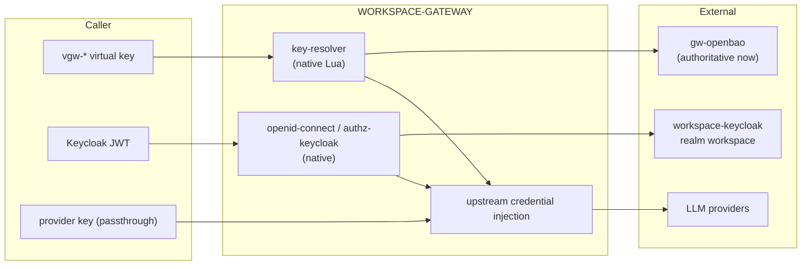

# Authentication Model

**Date:** 2026-09-23

How a request is authenticated, which credential classes exist, and where each
secret lives. For requirements see
[REQ-KEYCLOAK-INTEGRATION](../requirements/REQ-KEYCLOAK-INTEGRATION.md) and
[REQ-GATEWAY-GOVERNANCE](../requirements/REQ-GATEWAY-GOVERNANCE.md); for the
key/pool store see [KEY-MANAGEMENT](KEY-MANAGEMENT.md).

## 1. Two credential classes, one identity

The gateway accepts exactly two kinds of caller credential. Both resolve to a
Keycloak identity for attribution; neither is a third scheme.

| Class | Credential | Used by | Resolved by | Status |
|-------|------------|---------|-------------|--------|
| Inbound identity | Keycloak OIDC JWT | humans, services, control surface | native `openid-connect` / `authz-keycloak` | Target-state |
| Long-lived API key | `vgw-*` virtual key | agents, scripts, long-running clients | `key-resolver` + OpenBao | Implemented |

Passing a raw provider key (e.g. `sk-...`) through the federated route is a
*special case of the passthrough path*, not a third credential class: it is
treated as `passthrough` and carries no gateway identity.

## 2. Trust boundaries



Two planes:

- **Data plane** (`proxy-rewrite` + `key-resolver`): inbound `vgw-*` -> OpenBao
  lookup -> inject *upstream provider* credential -> provider.
- **Control plane** (target-state): Keycloak JWT -> `authz-keycloak` -> control
  action.

The inbound access token is never forwarded upstream
(REQ-KEYCLOAK-INTEGRATION FR-1.4); the gateway always substitutes the upstream
credential it resolved.

## 3. OpenBao vs Keycloak

| Concern | Owner | Notes |
|---------|-------|-------|
| Who is this caller? | Keycloak | `sub`, `azp`, `groups`/`realm_access.roles` |
| May they take this action? | Keycloak (+ `authz-keycloak`) | permissions/roles |
| What upstream secret do they map to? | OpenBao | `secret/data/gateway/keys/<vgw-*>` |
| Pool of upstream provider keys | OpenBao | `secret/data/gateway/upstream-pools/<pool>` |

OpenBao is a **credential store**, not an identity provider. Keycloak is the
**identity/authorization plane**, not a secret store. The gateway keeps them
separate.

### OpenBao instances

| Instance | Role | Durability |
|----------|------|------------|
| `gw-openbao` (dev stack) | authoritative for gateway secrets now | file storage + auto-unseal |
| `gw-prod-openbao` (prod stack) | prod mirror | file storage |
| `workspace-openbao` (DATAOPS, `secrets` profile) | convergence target-state | dev mode (in-memory); not durable |

Convergence onto `workspace-openbao` is a target-state (REQ-KEYCLOAK-INTEGRATION
FR-5.1); it is not required for the current model to work.

## 4. Virtual key lifecycle and identity binding

Today (`KEY-MANAGEMENT`): a `vgw-*` key is issued, cached in the `key_cache`
shared dict, and revoked by flipping `active: false`. Target-state adds identity
attributes so telemetry attributes to a Keycloak principal:

```json
{
  "data": {
    "virtual_key": "vgw-<hex>",
    "identity_sub": "<keycloak sub>",
    "identity_azp": "llm-gateway",
    "organization": "<org claim or group>",
    "tenant_id": "default",
    "user_id": "agent",
    "upstream_pool": "kimi",
    "active": true
  }
}
```

`key-resolver` already emits `X-Gateway-Key-Id`/`X-Gateway-Tenant-Id`/
`X-Gateway-User-Id`; the identity fields extend attribution without a second
identity store.

## 5. Provider OAuth is not inbound auth

The custom `provider-oauth` plugin cluster runs **outbound** OAuth flows
(device RFC 8628 / browser PKCE) to obtain and refresh *upstream provider*
credentials (ChatGPT, Anthropic, Kimi), storing them in OpenBao and injecting
them upstream. It is **not** a validator of inbound caller identity and must not
be confused with native `openid-connect`. See
[SPEC-PROVIDER-OPENAI](../specifications/SPEC-PROVIDER-OPENAI.md) and
[SPEC-PROVIDER-KIMI](../specifications/SPEC-PROVIDER-KIMI.md).

| Direction | Plugin | Purpose |
|-----------|--------|---------|
| Inbound | `openid-connect` (native) | authenticate callers (target-state) |
| Outbound | `provider-oauth` (custom) | obtain/refresh upstream provider tokens |

## 6. Credential resolution order (data plane)

`key-resolver.access` (`plugins/custom/key-resolver.lua`):

1. Bearer token not prefixed `vgw-` -> `passthrough` consumer; upstream key from
   env (`OPENCODE_API_KEY`).
2. `vgw-*` -> OpenBao `secret/data/gateway/keys/<token>`:
   - `upstream_pool` set -> sticky selection from the pool (rotation on
     `cooldown_on`/`disable_on` statuses);
   - else `upstream_key` -> that value;
   - else the environment key.
3. Inject `Authorization: Bearer <upstream key>` and `X-Gateway-*` context
   headers; set per-key RPM and token/cost budget context.

Identity binding (target-state) is recorded at issuance; resolution is
unchanged, so binding does not alter the hot path.

## 7. Current vs target state

| Capability | Now | Target |
|------------|-----|--------|
| Data-plane auth | virtual key / passthrough | same |
| Control-surface auth | host scripts, no gateway authz | `openid-connect` + `authz-keycloak` |
| Identity store | OpenBao record `tenant_id`/`user_id` | + Keycloak `sub`/`azp` binding |
| Operator OpenBao access | service `OPENBAO_TOKEN` | + Keycloak JWT (OIDC auth method) |
| Secret store | `gw-openbao` | `gw-openbao` (authoritative) |
| User/role UI | none (scripts) | Keycloak Admin/Account Console, portal |

## 8. Related documents

| Document | When to read |
|----------|--------------|
| [KEY-MANAGEMENT](KEY-MANAGEMENT.md) | OpenBao key/pool schema and scripts |
| [REQ-KEYCLOAK-INTEGRATION](../requirements/REQ-KEYCLOAK-INTEGRATION.md) + [SPEC](../specifications/SPEC-KEYCLOAK-INTEGRATION.md) | inbound OIDC requirements/config |
| [REQ-GATEWAY-GOVERNANCE](../requirements/REQ-GATEWAY-GOVERNANCE.md) + [SPEC](../specifications/SPEC-GATEWAY-GOVERNANCE.md) | control surface |
| [REQ-SECURITY-HARDENING](../requirements/REQ-SECURITY-HARDENING.md) | trust boundaries, grants |
| [RUNBOOK-KEYS](../runbooks/RUNBOOK-KEYS.md) | key/pool operations |
