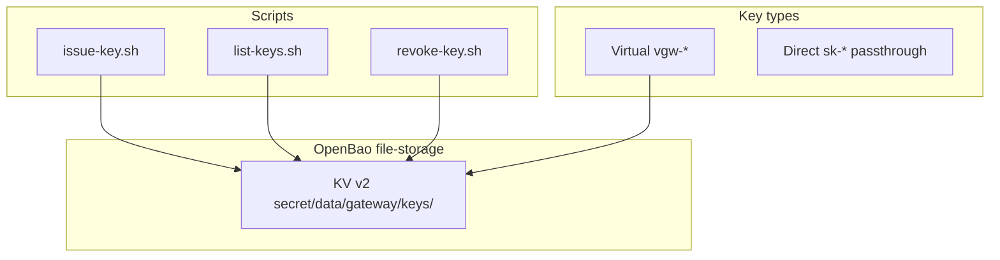

# Key Management (OpenBao)

Virtual keys (`vgw-*`) for federated route; direct passthrough on
`/opencode/*`. Decision flow diagram:
[`README.md` Key Management](../../README.md#key-management).

## Architecture



## Virtual key lifecycle

1. **Issued** via `make issue-key` -> OpenBao `active: true`
2. **Cached** in `key_cache` shared dict (5s dev TTL in route config)
3. **Revoked** via `make revoke-key` -> `active: false`, record preserved

## KV record schema

Path: `secret/data/gateway/keys/<virtual_key>`

```json
{
  "data": {
    "virtual_key": "vgw-<hex>",
    "upstream_key": "",
    "tenant_id": "default",
    "user_id": "agent",
    "active": true,
    "created_at": "2026-01-01T00:00:00Z",
    "revoked_at": null
  }
}
```

Empty `upstream_key` -> resolver uses `OPENCODE_API_KEY` env.

## Scripts

| Script | Make target |
|--------|-------------|
| `res/scripts/issue-key.sh` | `make issue-key` |
| `res/scripts/list-keys.sh` | `make list-keys` |
| `res/scripts/revoke-key.sh` | `make revoke-key KEY_ID=vgw-xxx` |

## Entrypoint

`res/docker/openbao-entrypoint.sh` (production file-storage, `openbao-data`
volume): auto-init, auto-unseal, fixed service token matching `OPENBAO_TOKEN`,
provisions `vgw-gateway-key` on first start. Idempotent on restart.

Image: `res/docker/Dockerfile.openbao`, config: `conf/openbao.hcl`.