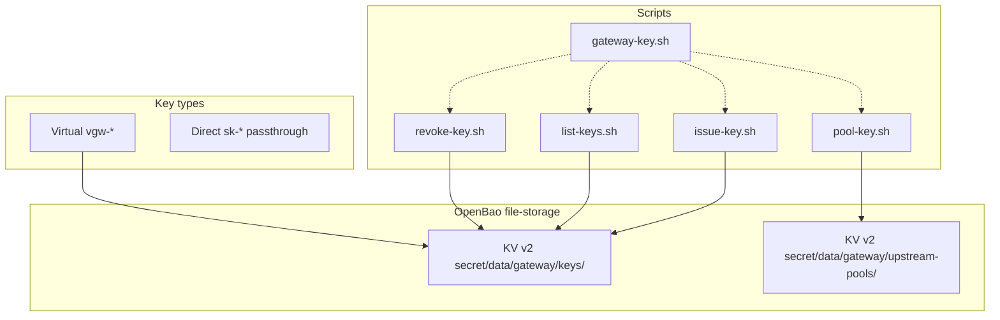

# Key Management (OpenBao)

Virtual keys (`vgw-*`) for federated route; direct passthrough on
`/opencode/*`. Decision flow diagram:
[`README.md` Key Management](../../README.md#key-management).

## Architecture


```mermaid
graph TB
    subgraph bao [OpenBao file-storage]
        KV["KV v2 secret/data/gateway/keys/"]
        POOLS["KV v2 secret/data/gateway/upstream-pools/"]
    end
    subgraph keys [Key types]
        VK["Virtual vgw-*"]
        DK["Direct sk-* passthrough"]
    end
    subgraph scripts [Scripts]
        GATEWAY[gateway-key.sh]
        ISSUE[issue-key.sh]
        LIST[list-keys.sh]
        REVOKE[revoke-key.sh]
        POOL[pool-key.sh]
    end
    GATEWAY -.-> ISSUE
    GATEWAY -.-> LIST
    GATEWAY -.-> REVOKE
    GATEWAY -.-> POOL
    ISSUE --> KV
    LIST --> KV
    REVOKE --> KV
    POOL --> POOLS
    VK --> KV
```

## Virtual key lifecycle

1. **Issued** via `make key ARGS='issue ...'` -> OpenBao `active: true`
2. **Mapped** via `make key ARGS='map ...'` to an upstream key or pool.
   `make key ARGS='show ...'` prints the record including that mapping.
3. **Cached** in `key_cache` shared dict (5s dev TTL in route config)
4. **Revoked** via `make key ARGS='revoke ...'` -> `active: false`, record preserved

The older single-purpose targets (`make issue-key`, `make list-keys`,
`make revoke-key`, `make pool-key`) still work; `make key` is the unified
entry point and the only one that exposes `show`, `map`, and the issue-time
rate-limit and budget flags.

## KV record schema

Path: `secret/data/gateway/keys/<virtual_key>`

```json
{
  "data": {
    "virtual_key": "vgw-<hex>",
    "upstream_key": "",
    "upstream_pool": "",
    "tenant_id": "default",
    "user_id": "agent",
    "active": true,
    "created_at": "2026-01-01T00:00:00Z",
    "revoked_at": null,
    "rate_limit_rpm": 100,
    "rate_limit_window": 60,
    "token_budget": 0,
    "cost_budget": 0,
    "budget_window": 86400,
    "budget_type": "tokens"
  }
}
```

Empty `upstream_key` -> resolver uses `OPENCODE_API_KEY` env.
Non-empty `upstream_pool` -> resolver selects from the named upstream key
pool (see below), taking precedence over both.

## Upstream key pools (auto-rotation)

Named pools of upstream API keys with automatic rotation on upstream
quota/rate-limit responses. Multiple virtual keys can share one pool.

Path: `secret/data/gateway/upstream-pools/<pool_name>`

```json
{
  "data": {
    "keys": [
      {"id": "k1", "key": "sk-...", "active": true},
      {"id": "k2", "key": "sk-...", "active": true}
    ],
    "cooldown_on": [429],
    "disable_on": [402, 403],
    "cooldown_s": 3600,
    "epoch": 1784378000
  }
}
```

Rotation semantics (`key-resolver.lua`, sticky selection):

- First `active` key without an in-memory marker is used until exhausted.
- Upstream status in `cooldown_on` (default 429): key parked in
  `pool_state` shared dict for `cooldown_s`; subsequent requests use the
  next key. The upstream error response propagates to the client unchanged
  (retry-and-succeed semantics) with an added
  `X-Gateway-Upstream-Rotated: cooldown:<key_id>` header.
- Upstream status in `disable_on` (default 402, 403): key hard-disabled,
  marked in `pool_state` and written through to OpenBao (`active: false`)
  via timer. Header: `X-Gateway-Upstream-Rotated: disabled:<key_id>`.
- All keys unavailable: `503 {"error": "... pool exhausted ... retry later"}`.
- `epoch` is bumped on every management write and namespaces the in-memory
  markers, so `reset` immediately un-shadows previously disabled keys.

Management: `make key ARGS='pool ...'`
(`create|add|remove|list|enable|disable|reset`), e.g.
`make key ARGS='pool create kimi'` then
`make key ARGS='pool add kimi k1 sk-...'`. The same operations run directly
via `res/scripts/pool-key.sh`. Full operational procedures are in
[`docs/runbooks/RUNBOOK-KEYS.md`](../runbooks/RUNBOOK-KEYS.md).
Attach a pool to a virtual key at issue time with
`make key ARGS='issue --key-id <id> --pool <name>'`, or change an existing
key with `make key ARGS='map <id> --pool <name>'` (which takes precedence over
`upstream_key`). Disabled keys are re-enabled with
`make key ARGS='pool enable <pool> <key_id>'` or `pool reset <pool>`.

## Scripts

| Script | Make target |
|--------|-------------|
| `res/scripts/gateway-key.sh` | `make key ARGS='...'` (unified: issue, list, show, map, revoke, pool) |
| `res/scripts/issue-key.sh` | `make issue-key` |
| `res/scripts/list-keys.sh` | `make list-keys` |
| `res/scripts/revoke-key.sh` | `make revoke-key KEY_ID=vgw-xxx` |
| `res/scripts/pool-key.sh` | `make pool-key ARGS='list'` |

## Entrypoint

`res/docker/openbao-entrypoint.sh` (production file-storage, `openbao-data`
volume): auto-init, auto-unseal, fixed service token matching `OPENBAO_TOKEN`,
provisions `vgw-gateway-key` on first start. Idempotent on restart.

Image: `res/docker/Dockerfile.openbao`, config: `conf/openbao.hcl`.