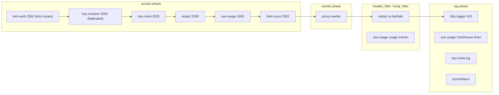

# Plugin Pipeline

**Date:** 2026-07-17

Plugins run in **priority order** (highest first) per Nginx phase. See
[`CUSTOM-PLUGINS.md`](CUSTOM-PLUGINS.md) and
[`BUILTIN-PLUGINS.md`](BUILTIN-PLUGINS.md) for implementation detail.

## Phase diagram (federated route)

## Priority table

| Plugin | Priority | Type | Phases |
|--------|----------|------|--------|
| `provider-sync` | 2570 | Custom | access (+ init warmup) |
| `kimi-auth` | 2560 | Custom | access |
| `key-resolver` | 2555 | Custom | access |
| `key-meta` | 2530 | Custom | access, log |
| `redact` | 2500 | Custom | access, header_filter, body_filter, log |
| `sse-usage` | 2400 | Custom | access, header_filter, body_filter, log |
| `limit-count` | 2002 | Built-in | access |
| `http-logger` | 410 | Built-in | log |
| `proxy-buffering` | 300 | Built-in | filter |
| `proxy-rewrite` | N/A | Built-in | rewrite |
| `prometheus` | N/A | Built-in | log |
| `request-id` | N/A | Built-in | rewrite/log |

## Per-route plugin matrix

Source: [`conf/apisix.yaml`](../../conf/apisix.yaml). Legend: y = enabled.

| Plugin | opencode | opencode-federated | kimi | kimi-v1 | kimi-federated | kimi-federated-v1 | kimi-key | kimi-key-v1 | llamafile | provider-sync |
|--------|:--:|:--:|:--:|:--:|:--:|:--:|:--:|:--:|:--:|:--:|
| `proxy-rewrite` | y | y | y | y | y | y | y | y | y | - |
| `key-resolver` | - | y | - | - | y | y | - | - | - | - |
| `kimi-auth` | - | - | y | y | - | - | - | - | - | - |
| `key-meta` | y | y | y | y | y | y | y | y | - | - |
| `provider-sync` | - | - | - | - | - | - | - | - | - | y |
| `redact` | y | y | y | y | y | y | y | y | y | - |
| `sse-usage` | y | y | y | y | y | y | y | y | y | - |
| `limit-count` | y | y | y | y | y | y | y | y | y | y |
| `request-id` | y | y | y | y | y | y | y | y | y | y |
| `http-logger` | y | y | y | y | y | y | y | y | y | - |
| `proxy-buffering` | y | y | y | y | y | y | y | y | y | - |
| `prometheus` | y | y | y | y | y | y | y | y | y | y |

`limit-count`: 100/60s keyed on `http_x_key_hash` for all keyed routes;
600/60s on `remote_addr` for llamafile; 60/60s on `remote_addr` for
provider-sync.

## Route-specific behavior

- **opencode routes:** no `key-resolver` on `relay-opencode` (direct key
  passthrough); `vgw-*` resolved via OpenBao on the federated route.
  Rewrite to `/zen/go/`.
- **kimi routes:** `kimi-auth` on `relay-kimi` / `relay-kimi-v1`;
  `key-resolver` on federated routes; `kimi-key*` routes pass keys through
  with `key-meta` only. All rewrite to `/coding/v1/`.
- **llamafile:** no auth plugins; per-IP rate limit; rewrite to `/`.
- **gateway-provider-sync:** served entirely by `provider-sync` in the
  access phase; no proxy-rewrite, logging, redaction, or usage tracking.
