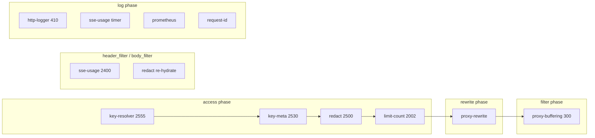

# Plugin Pipeline

Plugins run in **priority order** (highest first) per Nginx phase. See
[`CUSTOM-PLUGINS.md`](CUSTOM-PLUGINS.md) and [`BUILTIN-PLUGINS.md`](BUILTIN-PLUGINS.md)
for implementation detail.

## Phase diagram (federated route)

## Priority table

| Plugin | Priority | Type | Phases |
|--------|----------|------|--------|
| `key-resolver` | 2555 | Custom | access |
| `key-meta` | 2530 | Custom | access |
| `redact` | 2500 | Custom | access, header_filter, body_filter, log |
| `sse-usage` | 2400 | Custom | header_filter, body_filter, log |
| `limit-count` | 2002 | Built-in | access |
| `http-logger` | 410 | Built-in | log |
| `proxy-buffering` | 300 | Built-in | filter |
| `proxy-rewrite` | N/A | Built-in | rewrite |
| `prometheus` | N/A | Built-in | log |
| `request-id` | N/A | Built-in | varies |

## Per-route plugin matrix

| Plugin | `/opencode/*` | `/opencode_federated/*` | `/llamafile/*` |
|--------|:-------------:|:----------------------:|:--------------:|
| `proxy-rewrite` | yes | yes | yes |
| `key-resolver` | no | yes | no |
| `key-meta` | yes | yes | no |
| `redact` | yes | yes | yes |
| `limit-count` | yes (100/min per key hash) | yes (100/min per key hash) | yes (600/min per IP) |
| `sse-usage` | yes | yes | yes |
| `request-id` | yes | yes | yes |
| `http-logger` | yes | yes | yes |
| `proxy-buffering` | yes | yes | yes |
| `prometheus` | yes | yes | yes |

Source: [`conf/apisix.yaml`](../../conf/apisix.yaml).

**Note:** Federated route uses static `limit-count`, not OpenBao variable
rules. See [`OPEN-ISSUES.md`](OPEN-ISSUES.md).

## Route-specific behavior

- **`/opencode/*`:** no `key-resolver`; direct keys passed through
- **`/opencode_federated/*`:** `vgw-*` resolved via OpenBao
- **`/llamafile/*`:** no auth plugins; per-IP rate limit on `remote_addr`

Proxy-rewrite strips prefix: opencode routes -> `/zen/go/`, llamafile -> `/`.