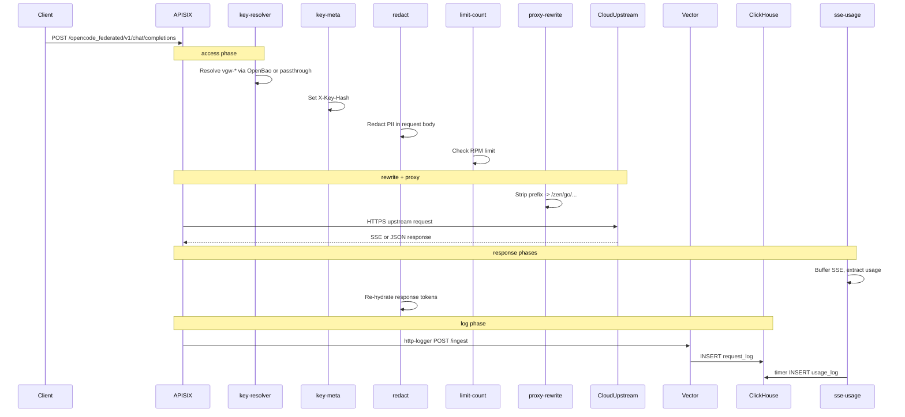

# Request Lifecycle

Sequence for one **federated** cloud request (`/opencode_federated/*`).
Passthrough and llamafile routes skip `key-resolver`; llamafile skips
`key-meta`.

## Phase summary

| Phase | Plugins | Action |
|-------|---------|--------|
| access | key-resolver, key-meta, redact, limit-count | Auth, hash, PII, RPM |
| rewrite | proxy-rewrite | Prefix strip |
| filter | proxy-buffering | SSE-friendly buffering off |
| header_filter / body_filter | sse-usage, redact | Track stream, re-hydrate |
| log | http-logger, sse-usage, prometheus, request-id | Vector ingest, usage INSERT, metrics |

## Error responses (key-resolver)

| Condition | Status |
|-----------|--------|
| Missing Authorization | 401 |
| Invalid / revoked key | 401 |
| OpenBao unreachable | 503 |
| Upstream key not configured | 500 |

Full table: [`CUSTOM-PLUGINS.md`](CUSTOM-PLUGINS.md#key-resolver).