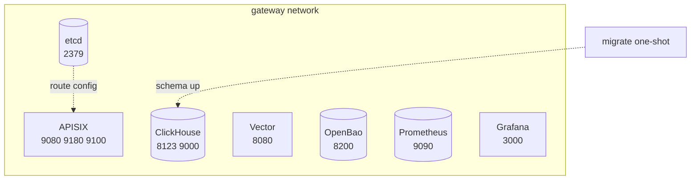

# Runtime Topology

Eight long-running services plus a one-shot `migrate` job on the **gateway**
bridge network. Flow diagrams: [`README.md`](../../README.md) (Architecture,
Plugins, Configuration).

## Runtime services

APISIX also joins external **dataops_default** for cross-project services.

## Service inventory

Source of truth: [`res/docker/docker-compose.yml`](../../res/docker/docker-compose.yml).

| Service | Image | Container ports | Host ports | Purpose |
|---------|-------|-----------------|------------|---------|
| APISIX | custom `Dockerfile.apisix` | 9080, 9180, 9443, 9100 | same | Data plane, Admin API, metrics export |
| etcd | `quay.io/coreos/etcd:v3.5.20` | 2379 | 2379 | Route/config store |
| ClickHouse | `clickhouse/clickhouse-server:24.8-alpine` | 8123, 9000 | 8123, 9000 | Telemetry and billing schema |
| migrate | `migrate/migrate:v4.19.1` | n/a | n/a | golang-migrate one-shot (`make ch-migrate`) |
| Vector | `timberio/vector:0.40.0-debian` | 8080 | 8080 | http-logger ingest |
| OpenBao | custom `Dockerfile.openbao` | 8200 | 8201 | Virtual key KV |
| Prometheus | `prom/prometheus:v3.13.1` | 9090 | 9092 | Scrapes `apisix:9100` |
| Grafana | `grafana/grafana-oss:13.0.2` | 3000 | 3030 | 3 dashboards, 16 panels |

## Networks

- **gateway** (bridge): internal DNS for `etcd`, `clickhouse`, `vector`,
  `openbao`, `prometheus`, `grafana`
- **dataops_default** (external): APISIX dual-homed for shared services

APISIX [`conf/config.yaml`](../../conf/config.yaml) sets `resolver` for Lua
cosocket hostname resolution inside the container network.

## Volumes

| Volume | Purpose |
|--------|---------|
| `clickhouse-data` | ClickHouse data |
| `etcd-data` | etcd route store |
| `openbao-data` | OpenBao file storage |
| `prometheus-data` | Prometheus TSDB |
| `grafana-data` | Grafana state |

Destroyed only by `make dev-clean`.

## Observability

| Concern | Doc |
|---------|-----|
| Telemetry + schema | [`TELEMETRY-AND-SCHEMA.md`](TELEMETRY-AND-SCHEMA.md) |
| Metrics + Grafana | [`README.md` Grafana](../../README.md#grafana-dashboards) |
| Dashboard panels | [`SPEC-DASHBOARD.md`](../specifications/SPEC-DASHBOARD.md) |