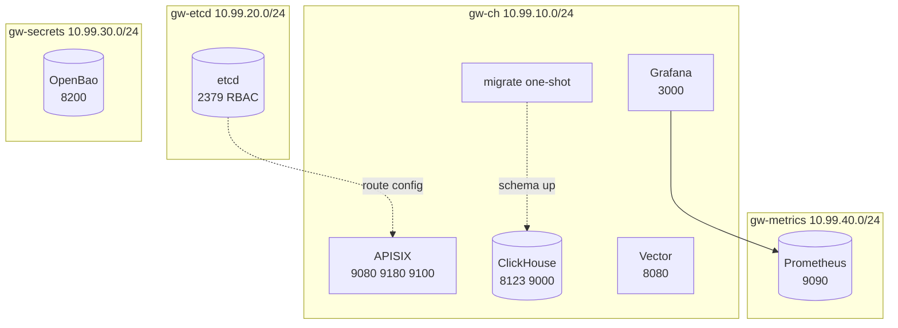

# Runtime Topology

Eight long-running services plus a one-shot `migrate` job on five
per-function bridge networks (REQ-SECURITY-HARDENING FR-6). Flow diagrams:
[`README.md`](../../README.md) (Architecture, Plugins, Configuration).

## Runtime services

```mermaid
flowchart TB
    subgraph gwch [gw-ch 10.99.10.0/24]
        APISIX["APISIX<br/>9080 9180 9100"]
        CH[(ClickHouse<br/>8123 9000)]
        VEC[Vector<br/>8080]
        GF[Grafana<br/>3000]
        MIG[migrate one-shot]
    end
    subgraph gwetcd [gw-etcd 10.99.20.0/24]
        ETCD[(etcd<br/>2379 RBAC)]
    end
    subgraph gwsecrets [gw-secrets 10.99.30.0/24]
        OB[(OpenBao<br/>8200)]
    end
    subgraph gwmetrics [gw-metrics 10.99.40.0/24]
        PROM[(Prometheus<br/>9090)]
    end
    ETCD -.->|route config| APISIX
    MIG -.->|schema up| CH
    GF --> PROM
```

APISIX also joins external **dataops_default** for cross-project services and
**gw-metrics** (Prometheus scrape + Grafana) and **gw-ingest** (Vector
http-logger target).

## Service inventory

Source of truth: [`res/docker/docker-compose.yml`](../../res/docker/docker-compose.yml).

| Service | Image | Container ports | Host ports | Networks | Purpose |
|---------|-------|-----------------|------------|----------|---------|
| APISIX | custom `Dockerfile.apisix` | 9080, 9180, 9443, 9100 | **9080, 9443 (public)** | gw-ch, gw-etcd, gw-secrets, gw-metrics, gw-ingest, dataops | Data plane, Admin API, metrics export |
| etcd | `quay.io/coreos/etcd:v3.5.20` | 2379 | *(none  -  podman exec)* | gw-etcd | Route/config store (RBAC) |
| ClickHouse | `clickhouse/clickhouse-server:24.8-alpine` | 8123, 9000 | **127.0.0.1:8123** | gw-ch | Telemetry and billing schema (per-service users) |
| migrate | `migrate/migrate:v4.19.1` | n/a | n/a | gw-ch | golang-migrate one-shot (`make ch-migrate`) |
| Vector | `timberio/vector:0.40.0-debian` | 8080 | *(none  -  podman exec)* | gw-ch, gw-ingest | http-logger ingest |
| OpenBao | custom `Dockerfile.openbao` | 8200 | *(none  -  podman exec)* | gw-secrets | Virtual key KV |
| Prometheus | `prom/prometheus:v3.13.1` | 9090 | *(none  -  podman exec)* | gw-metrics | Scrapes `apisix:9100` |
| Grafana | `grafana/grafana-oss:13.0.2` | 3000 | **127.0.0.1:3030** | gw-ch, gw-metrics | 5 dashboards, growth alerting |

Prod stack mirrors this with its own subnets and ports 9081/9444/8124
([`docker-compose.prod.yml`](../../res/docker/docker-compose.prod.yml));
it runs no Prometheus/Grafana.

## Port surface policy (REQ-SECURITY-HARDENING FR-6.2)

- **Public (0.0.0.0):** 9080/9443 (dev apisix), 9081/9444 (prod apisix)
- **Loopback only:** 8123 (dev ClickHouse HTTP, `ops_admin` auth),
  8124 (prod), 3030 (Grafana, edge-proxy auth)
- **Unpublished (podman exec only):** etcd, OpenBao, Vector, APISIX
  Admin/metrics, ClickHouse native protocol

## Networks

Static subnets (dev / prod):

- **gw-ch** (10.99.10.0/24 / 10.99.110.0/24): ClickHouse clients  - 
  apisix, vector, grafana, migrate
- **gw-etcd** (10.99.20.0/24 / 10.99.120.0/24): apisix, etcd
- **gw-secrets** (10.99.30.0/24 / 10.99.130.0/24): apisix, openbao
- **gw-metrics** (10.99.40.0/24 / 10.99.140.0/24): apisix, prometheus, grafana
- **gw-ingest** (10.99.50.0/24 / 10.99.150.0/24): apisix, vector
- **dataops_default** (external): APISIX dual-homed for shared services

ClickHouse user `HOST` restrictions are derived from these subnets
([clickhouse-provision.sh](../../res/docker/clickhouse-provision.sh)).

APISIX [`conf/config.yaml`](../../conf/config.yaml) sets `resolver` for Lua
cosocket hostname resolution inside the container network.

## Volumes

| Volume | Purpose |
|--------|---------|
| `clickhouse-data` | ClickHouse data (hot volume + `arch_store/` archive volume) |
| `etcd-data` | etcd route store |
| `openbao-data` | OpenBao file storage |
| `prometheus-data` | Prometheus TSDB |
| `grafana-data` | Grafana state |

Ordinary Gateway lifecycle commands preserve these persistent volumes.
Nightly backups land on `/mnt/ws-backup` (see
[RUNBOOK-SECRETS](../runbooks/RUNBOOK-SECRETS.md)).

## Observability

| Concern | Doc |
|---------|-----|
| Telemetry + schema | [`TELEMETRY-AND-SCHEMA.md`](TELEMETRY-AND-SCHEMA.md) |
| Metrics + Grafana | [`README.md` Grafana](../../README.md#grafana-dashboards) |
| Dashboard panels | [`SPEC-DASHBOARD.md`](../specifications/SPEC-DASHBOARD.md) |
| Security posture | [`SPEC-SECURITY-HARDENING.md`](../specifications/SPEC-SECURITY-HARDENING.md) |
