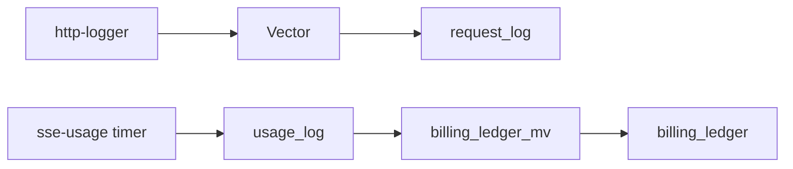

# Telemetry and ClickHouse Schema

Two write paths plus a materialized view. Diagram:
[`README.md` ClickHouse Tables](../../README.md#clickhouse-tables).

## Vector pipeline

**Source:** `http://0.0.0.0:8080/ingest`  
**Config:** [`conf/vector.toml`](../../conf/vector.toml)

VRL remap extracts:

- `request_id` from APISIX log (via `request-id` plugin)
- `model` canonicalized (lowercase suffix, same algorithm as Lua)
- Identity headers (`x-gateway-key-id`, tenant, user, session)
- Tokens from JSON body when parseable; SSE fallback via `parse_regex`
- `event_id` from route_id + integer-seconds start_time

Sink: batch insert to `request_log` with retry/backpressure
(`retry_attempts=5`, memory buffer).

## sse-usage path

Direct POST INSERT to `usage_log` from timer context. Authoritative token
counts for SSE streams.

## Tables

### request_log

Written by Vector. Full request/response metadata, bodies (truncated at
http-logger limits), identity columns. Join key: **`request_id`**.

Key columns: `event_id`, `request_id`, `model`, `status`, token fields
(often 0 for SSE in this table), `req_body`, `resp_body`, `timestamp`.

### usage_log

Written by sse-usage. 15 columns including `request_id`, `reasoning_tokens`,
`cost`, `cost_source` enum. Authoritative usage for billing.

### billing_ledger

Populated by **`billing_ledger_mv`** on every `usage_log` INSERT.
25-column schema in [`conf/clickhouse-init.sql`](../../conf/clickhouse-init.sql).
Some enrichment columns default empty until request_log join backfill (v2).

### billing_discrepancies

v2 reconciler target. Empty today.

## Migrations

**Framework:** golang-migrate (MIT), image `migrate/migrate:v4.19.1`  
**Files:** `conf/migrations/NNNNNN_*.up.sql` / `.down.sql`  
**Tracking:** `schema_migrations` table (MergeTree engine)  
**Orchestration:** compose `migrate` service after `init.sql` in Ansible;
`make ch-migrate`, `make ch-migrate-status`

Init SQL alone is insufficient across volume restarts; Ansible reapplies
`clickhouse-init.sql` and migrate runs pending versions.

## Reconciler

`res/scripts/reconciler.sh`: daily gateway-side totals from `request_log`.
Upstream API comparison deferred. See [`OPEN-ISSUES.md`](OPEN-ISSUES.md).

## Grafana

16 panels across 3 dashboards. Authoritative spec:
[`SPEC-DASHBOARD.md`](../specifications/SPEC-DASHBOARD.md). Joins use
`request_id` (not ASOF on key_id + timestamp).

## Prometheus

Scrape `apisix:9100/apisix/prometheus/metrics` every 15s. Grafana ops
panels use PromQL; cost panels query ClickHouse (read-only).