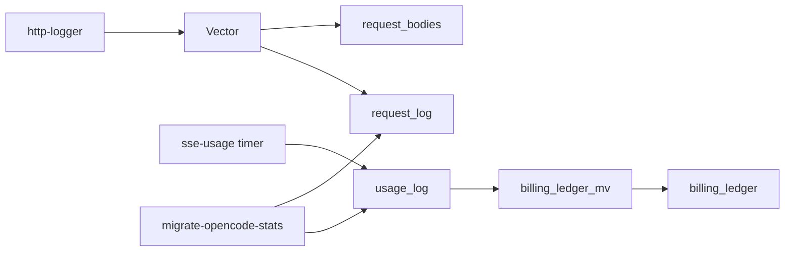

# Telemetry and ClickHouse Schema

Two write paths plus a materialized view, with conversation bodies isolated
in a dedicated table (REQ-SECURITY-HARDENING FR-3). Diagram:
[`README.md` ClickHouse Tables](../../README.md#clickhouse-tables).

```mermaid
graph LR
    HL[http-logger] --> V[Vector]
    V --> RL[request_log]
    V --> RB[request_bodies]
    SU[sse-usage timer] --> UL[usage_log]
    MIG[migrate-opencode-stats] --> UL
    MIG --> RL
    UL --> MV[billing_ledger_mv]
    MV --> BL[billing_ledger]
```

Backfill path: `res/scripts/migrate-opencode-stats.sh` writes historical
opencode SQLite stats into the tables with `ocm_`/`ocr_` event ids and
`client_type='migrated'`; ledger rows flow through the same MV. Details:
[SPEC-STATS-MIGRATION](../specifications/SPEC-STATS-MIGRATION.md).

## ClickHouse authentication

Every client authenticates (REQ-SECURITY-HARDENING FR-1/FR-2); there is no
passwordless network access. Users are provisioned by
[`res/docker/clickhouse-provision.sh`](../../res/docker/clickhouse-provision.sh)
(`make ch-provision` to re-run): `grafana_ro` (SELECT, readonly  -  **no
`request_bodies` grant**), `vector_rw` (INSERT request_log/request_bodies),
`apisix_rw` (INSERT usage_log), `migrator` (DDL), `ops_admin` (ALL, host
loopback / gw-ch gateway only). `default` is localhost-only with a strong
password.

## Vector pipeline

**Source:** `http://0.0.0.0:8080/ingest` (reachable only from apisix on
`gw-ingest`)
**Config:** [`conf/vector.toml`](../../conf/vector.toml)

VRL remap extracts:

- `request_id` from APISIX log (via `request-id` plugin)
- `model` canonicalized (lowercase suffix, same algorithm as Lua)
- Identity headers (`x-gateway-key-id`, tenant, user, session)
- Tokens from JSON body only; SSE streams record explicit zeros here (the
  sse-usage plugin writes their authoritative counts to `usage_log`)
- `event_id` from route_id + integer-seconds start_time

Sinks (both basic-auth as `vector_rw`, one remap  -  `skip_unknown_fields`
routes columns):

- batch insert to `request_log` (metadata; no body columns)
- batch insert to `request_bodies` (bodies + join keys only)

Retry/backpressure: `retry_attempts=5`, memory buffer.

## sse-usage path

Direct POST INSERT to `usage_log` from timer context, authenticated as
`apisix_rw` (`clickhouse_user` + `clickhouse_password_env` route config).
Authoritative token counts for SSE streams.

## Tables

### request_log

Written by Vector. Full request/response metadata and identity columns,
**no bodies** (split migration `000010`). Join key: **`request_id`**.

Key columns: `event_id`, `request_id`, `model`, `status`, token fields
(often 0 for SSE in this table), `timestamp`.

### request_bodies

Written by Vector. `event_id`, `request_id`, `req_body`, `resp_body`,
`timestamp`. Ungranted to `grafana_ro`; operator access via `ops_admin`
only. Bodies are truncated upstream at http-logger limits and PII-tokenized
in `req_body` by the `redact` plugin before logging.

### usage_log

Written by sse-usage. Columns include `request_id`, `reasoning_tokens`,
`cost`, `cost_source`, `provider_id`, `pricing_source`, and `pricing_snapshot`.
Authoritative usage for billing.

### billing_ledger

Populated by **`billing_ledger_mv`** on every `usage_log` INSERT.
25-column schema in [`conf/clickhouse-init.sql`](../../conf/clickhouse-init.sql).
Some enrichment columns default empty until request_log join backfill (v2).

### billing_discrepancies

v2 reconciler target. Empty today.

## Retention: tiered compression, no deletion

No table carries a delete TTL (migration `000011` removed the 13-month
retention; REQ-SECURITY-HARDENING FR-4). Tables use storage policy `tiered`
([`conf/clickhouse-storage-tiering.xml`](../../conf/clickhouse-storage-tiering.xml)):
parts move to the `archive` volume and recompress `CODEC ZSTD(3)` (bodies at
6 months, metadata at 12/18). Cost is controlled by compression and monitored
by the ops-health growth panel + alert, not by deletion. Nightly backups go
to `/mnt/ws-backup`.

## Migrations

**Framework:** golang-migrate (MIT), image `migrate/migrate:v4.19.1`
**Files:** `conf/migrations/NNNNNN_*.up.sql` / `.down.sql`
**Tracking:** `schema_migrations` table (MergeTree engine)
**Orchestration:** compose `migrate` service (authenticates as `migrator`)
after `init.sql` in Ansible; `make ch-migrate`, `make ch-migrate-status`

Init SQL alone is insufficient across volume restarts; Ansible reapplies
`clickhouse-init.sql` and migrate runs pending versions.

## Reconciler

`res/scripts/reconciler.sh`: daily gateway-side totals from `request_log`
(`ops_admin` auth) plus the storage-growth budget warning. Upstream API
comparison deferred. See [`OPEN-ISSUES.md`](OPEN-ISSUES.md).

## Grafana

31+ panels across 5 dashboards (incl. `gateway-model-experience` with the
Usefulness Score + friction telemetry and `gateway-model-performance` with
speed/reliability/waste, REQ-USEFULNESS-TELEMETRY). Authoritative spec:
[`SPEC-DASHBOARD.md`](../specifications/SPEC-DASHBOARD.md). Joins use
`request_id` (not ASOF on key_id + timestamp). The ClickHouse datasource
runs as `grafana_ro`  -  dashboards never reference body columns (test-enforced).

## Prometheus

Scrape `apisix:9100/apisix/prometheus/metrics` every 15s (gw-metrics
network). Grafana ops panels use PromQL; cost panels query ClickHouse
(read-only).
