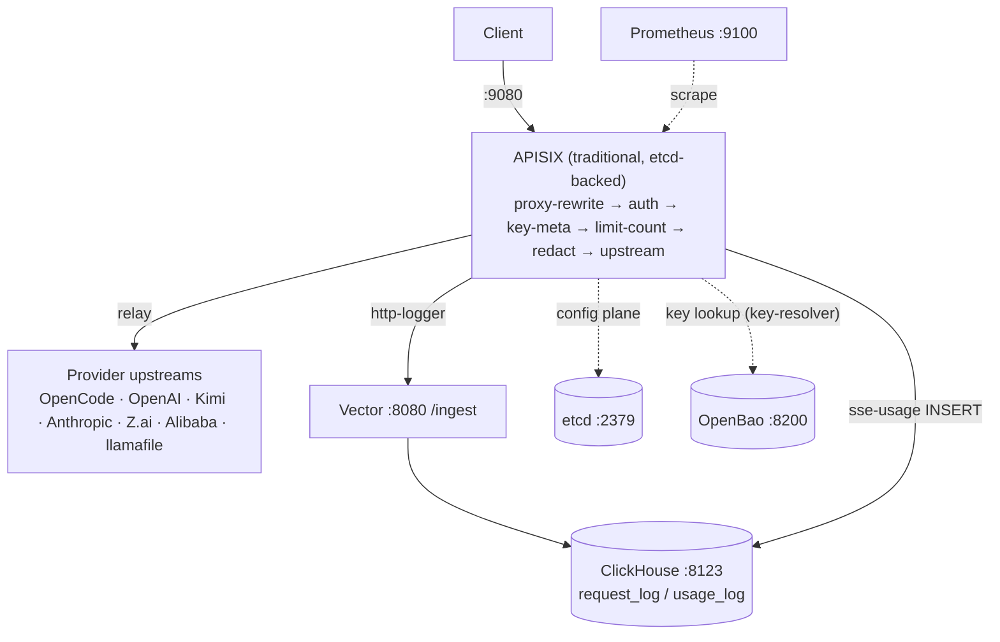

# SPEC-GATEWAY-CORE: APISIX Gateway Core Implementation

**Date:** 2026-07-17
**Status:** Active
**Type:** Specification
**Requirements:** [REQ-GATEWAY-CORE](../requirements/REQ-GATEWAY-CORE.md)

> Implements the gateway data plane on APISIX 3.18.0 in traditional/etcd mode. Key invariants: 18 routes in etcd (seeded from `conf/apisix.yaml`), pure-Lua request path (no sidecars), custom plugins registered in `conf/config.yaml`, per-route auth via `provider-oauth` (OAuth device flows) or `key-resolver` (OpenBao virtual keys).

---

**Cross-references:**
- [REQ-GATEWAY-CORE](../requirements/REQ-GATEWAY-CORE.md): requirements
- [`conf/apisix.yaml`](../../conf/apisix.yaml): route table (rendered from `conf/apisix.yaml.j2`)
- [`conf/config.yaml`](../../conf/config.yaml): deployment role, plugin list, shared dicts
- [`res/scripts/seed-routes.sh`](../../res/scripts/seed-routes.sh): seeds etcd on stack start
- [`docs/runbooks/RUNBOOK-DEPLOYMENT.md`](../runbooks/RUNBOOK-DEPLOYMENT.md): compose stack, image build

---

## 1. Overview

The gateway fronts the configured provider upstreams  -  OpenCode (`opencode.ai`), OpenAI (`chatgpt.com`), Moonshot Kimi (`api.kimi.com`), Anthropic (`api.anthropic.com`), Z.ai (`api.z.ai`), Alibaba Cloud Token Plan, and a local llamafile VM (`host.docker.internal:8765`)  -  plus an internal provider-sync endpoint. Routes live in etcd; `conf/apisix.yaml` is the seed document. All relay routes share a common plugin pipeline (rewrite → auth → key-meta → limit-count → redact → proxy) with telemetry plugins (`http-logger`, `prometheus`, `request-id`, `sse-usage`) attached.

## 2. Architectural Principles

### 2.1 etcd is the config plane
`deployment.role: traditional`, `config_provider: etcd` (`http://etcd:2379`, prefix `/apisix`). The J2 template is rendered at deploy, then seeded to etcd; Admin API/UI on port 9180 guarded by `${{ADMIN_KEY}}`.

### 2.2 No sidecars on the request path
Auth, redaction, usage accounting, and rate limiting run as Lua plugins inside the nginx worker. Only off-path services (Vector, ClickHouse, Prometheus, OpenBao) run as separate containers.

### 2.3 Streaming-first
`proxy-buffering.disable: true` on all relay routes so SSE token streams pass through unbuffered; `sse-usage` observes chunks in `body_filter`.

### 2.4 Per-key scoping via X-Key-Hash
`key-meta` sets `X-Key-Hash`; `limit-count` keys on `http_x_key_hash` and Prometheus adds a `key_hash` extra label to all http_* and llm_* metrics.

## 3. System Diagram

**Legend (all diagrams in this doc):** solid arrows = request/response data
path; dashed arrows = config, key lookup, or read-only observability.



## 4. Route Table

Verified against [`conf/apisix.yaml`](../../conf/apisix.yaml).

| Route id | URI | Rewrite | Upstream | Auth plugin | limit-count |
|----------|-----|---------|----------|-------------|-------------|
| relay-opencode | /opencode/* | ^/opencode/(.*) → /zen/go/$1 | https://opencode.ai:443 | none (passthrough) | 100/60s @ x_key_hash |
| relay-opencode-zen | /opencode_zen/* | ^/opencode_zen/(.*) → /zen/$1 | https://opencode.ai:443 | none (passthrough) | 100/60s @ x_key_hash |
| relay-opencode-federated | /opencode_federated/* | ^/opencode_federated/(.*) → /zen/go/$1 | https://opencode.ai:443 | key-resolver (OPENCODE_API_KEY) | 100/60s @ x_key_hash |
| relay-openai | /openai/* | ^/openai/(.*) → /backend-api/codex/responses | https://chatgpt.com:443 | provider-oauth (chatgpt_device) | 100/60s @ x_gateway_key_id |
| relay-kimi | /kimi/* | ^/kimi/(.*) → /coding/v1/$1 | https://api.kimi.com:443 | provider-oauth | 100/60s @ x_key_hash |
| relay-kimi-v1 | /kimi/v1/* | ^/kimi/v1/(.*) → /coding/v1/$1 | https://api.kimi.com:443 | provider-oauth | 100/60s @ x_key_hash |
| relay-kimi-federated | /kimi-federated/* | ^/kimi-federated/(.*) → /coding/v1/$1 | https://api.kimi.com:443 | key-resolver (KIMI_API_KEY) | 100/60s @ x_key_hash |
| relay-kimi-federated-v1 | /kimi-federated/v1/* | ^/kimi-federated/v1/(.*) → /coding/v1/$1 | https://api.kimi.com:443 | key-resolver (KIMI_API_KEY) | 100/60s @ x_key_hash |
| relay-kimi-key | /kimi-key/* | ^/kimi-key/(.*) → /coding/v1/$1 | https://api.kimi.com:443 | none | 100/60s @ x_key_hash |
| relay-kimi-key-v1 | /kimi-key/v1/* | ^/kimi-key/v1/(.*) → /coding/v1/$1 | https://api.kimi.com:443 | none | 100/60s @ x_key_hash |
| relay-zai-key | /zai-key/* | ^/zai-key/(.*) → /api/coding/paas/v4/$1 | https://api.z.ai:443 | none (passthrough) | 100/60s @ x_key_hash |
| relay-zai-key-v1 | /zai-key/v1/* | ^/zai-key/v1/(.*) → /api/coding/paas/v4/$1 | https://api.z.ai:443 | none (passthrough) | 100/60s @ x_key_hash |
| relay-anthropic | /anthropic/* | ^/anthropic/(.*) → /$1 | https://api.anthropic.com:443 | none (passthrough) | 100/60s @ x_key_hash |
| relay-anthropic-device | /anthropic-device/* | ^/anthropic-device/(.*) → /$1 | https://api.anthropic.com:443 | provider-oauth (device facade) | 100/60s @ x_gateway_key_id |
| relay-llamafile | /llamafile/* | ^/llamafile/(.*) → /$1 | http://host.docker.internal:8765 | none | 600/60s @ remote_addr |
| relay-alibaba-token-plan | /token-plan/* | ^/token-plan/(.*) → /$1 | https://token-plan.ap-southeast-1.maas.aliyuncs.com:443 | none (passthrough) | 100/60s @ x_key_hash |
| relay-alibaba-token-plan-cn | /token-plan-cn/* | ^/token-plan-cn/(.*) → /$1 | https://token-plan.cn-beijing.maas.aliyuncs.com:443 | none (passthrough) | 100/60s @ x_key_hash |
| gateway-provider-sync | /gateway/providers* | none | http://127.0.0.1:9080 (pass) | provider-sync plugin | 60/60s @ remote_addr |

All relay routes additionally attach: `key-meta` (except relay-llamafile and gateway-provider-sync), `prometheus` (prefer_name), `request-id` (X-Request-Id, include_in_response), `http-logger` (→ `http://vector:8080/ingest`, bodies included, batch_max_size 1), `proxy-buffering` (disable), `redact` (`/etc/apisix/redact-patterns.json`), `sse-usage` (`http://clickhouse:8123`). `gateway-provider-sync` attaches only `provider-sync`, `limit-count`, `prometheus`, `request-id`.

`key-resolver` config on federated routes: `openbao_addr: http://openbao:8200`, `openbao_token_env: OPENBAO_TOKEN`, `key_prefix: secret/data/gateway/keys/`, `cache_ttl: 5`, `virtual_key_prefix: vgw-`.

## 5. config.yaml Essentials

| Property | Value |
|----------|-------|
| deployment.role | traditional |
| config_provider | etcd (`http://etcd:2379`, prefix `/apisix`, timeout 30) |
| admin key | `${{ADMIN_KEY}}`, role admin, allow_admin 0.0.0.0/0, admin UI enabled |
| plugins | key-resolver, key-meta, provider-oauth, provider-sync, ai-rate-limiting, proxy-buffering, proxy-rewrite, http-logger, prometheus, request-id, redact, sse-usage, limit-count |
| prometheus export | 0.0.0.0:9100; `key_hash: $http_x_key_hash` extra label on http_status, http_latency, bandwidth, llm_latency, llm_prompt_tokens, llm_completion_tokens, llm_active_connections |
| nginx envs | OPENCODE_API_KEY, OPENBAO_TOKEN |
| shared dicts | redact_state 1m, key_cache 5m, gateway-cache 2m, quota_counters 5m |

Note: `ai-rate-limiting` is registered but not attached to any route. `cost_calc`, `model_registry`, `sse_usage_lib`, `redact_lib`, `provider_sync_catalog`, `provider_sync_pricing`, and the `kimi_*` modules are Lua libraries required by plugins, not registered APISIX plugins.

## 6. Edge Cases & Decisions

### 6.1 Production stack and staged rollout

`res/docker/docker-compose.prod.yml` defines a second, isolated instance of
the gateway (project name `workspace-gateway-prod`, ports offset from dev,
separate volumes; same image family, tag `localhost/workspace-gateway:<v>`).
Make targets mirror the sibling-project convention:

```
make gw-prod-build     # podman build from the projects root context
make gw-prod-start     # start prod stack
make gw-prod-stop      # stop prod stack
make gw-prod-redeploy  # restart + verify
make gw-prod-verify    # health report: containers, routes, provider sync
make gw-prod-status    # compose status
make gw-prod-logs      # tail logs
```

Rollout procedure: build the image, `gw-prod-start` (staging role), verify
with `gw-prod-verify` (routes seeded, provider-sync warm, relay sanity check), and
only then restart the dev stack onto the same code (`make gw-restart-service
SVC=apisix` after `make gw-update`). Dev is never restarted against an
untested image.

- No `cors` plugin is configured on any route; callers are server-side agents, not browsers.
- `relay-llamafile` and `gateway-provider-sync` rate-limit by `remote_addr` (no caller key).
- `pass_host: node` on relay routes preserves upstream Host; `gateway-provider-sync` uses `pass_host: pass`.
- Bodies are logged at up to 256 KiB (request) / 1 MiB (response); larger payloads are truncated by http-logger.

## 7. File Map

| File | Purpose | Key Changes |
|------|---------|-------------|
| [`conf/apisix.yaml`](../../conf/apisix.yaml) | Rendered route seed (18 routes) |  -  |
| [`conf/apisix.yaml.j2`](../../conf/apisix.yaml.j2) | Jinja2 template rendered by Ansible |  -  |
| [`conf/config.yaml`](../../conf/config.yaml) | Deployment mode, plugin registration, shared dicts |  -  |
| [`res/scripts/seed-routes.sh`](../../res/scripts/seed-routes.sh) | Seeds etcd from apisix.yaml |  -  |
| [`res/docker/docker-compose.yml`](../../res/docker/docker-compose.yml) | Stack definition |  -  |
| [`res/docker/docker-compose.prod.yml`](../../res/docker/docker-compose.prod.yml) | Isolated prod/staging stack |  -  |
| [`plugins/custom/`](../../plugins/custom) | Custom plugin sources |  -  |

## 8. Implementation Status

| Component | Status | Evidence |
|-----------|--------|----------|
| etcd/traditional deployment | Implemented | conf/config.yaml:5-21 |
| 18 routes | Implemented | conf/apisix.yaml |
| Plugin pipeline per route | Implemented | conf/apisix.yaml plugin blocks |
| Plugin registration | Implemented | conf/config.yaml:23-36 |
| Prometheus key_hash labels | Implemented | conf/config.yaml:37-63 |
