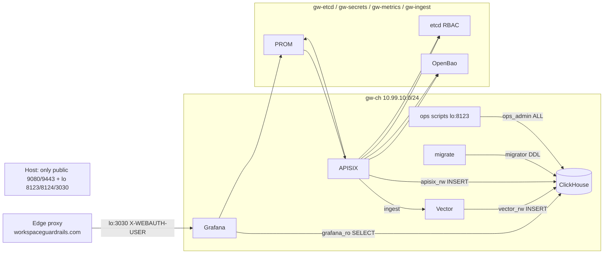

# SPEC-SECURITY-HARDENING: Exposure, AuthN/Z, and Retention Implementation

**Date:** 2026-09-20
**Status:** Active
**Type:** Specification
**Requirements:** [REQ-SECURITY-HARDENING](../requirements/REQ-SECURITY-HARDENING.md)

> Implementation of the 2026-09 hardening: ClickHouse provision script (five
> service users + locked `default`), `request_bodies` split + tiered storage
> migrations, Grafana env-secured datasource + auth-proxy allowlist, per-function
> compose networks with static subnets, host-port surface reduction, Vector/sse-usage/migrate
> authentication, etcd RBAC, edge contract runbook, secrets rotation runbook.

---

**Cross-references:**
- [REQ-SECURITY-HARDENING](../requirements/REQ-SECURITY-HARDENING.md): requirement contract
- [SPEC-BILLING-TELEMETRY](SPEC-BILLING-TELEMETRY.md): schema/vector contracts amended here
- [SPEC-DASHBOARD](SPEC-DASHBOARD.md): datasource/growth-panel amendments
- [RUNBOOK-EDGE-PROXY](../runbooks/RUNBOOK-EDGE-PROXY.md), [RUNBOOK-SECRETS](../runbooks/RUNBOOK-SECRETS.md)

---

## 1. Overview

Layered controls, each independently effective:

1. **Identity**  -  every ClickHouse/etcd client authenticates; no shared
   passwordless account exists anywhere on the stack networks.
2. **Grants**  -  Grafana's SQL surface physically cannot reach conversation
   bodies (ungranted table), cannot write or alter anything.
3. **Topology**  -  a compromised or Curious container only sees the networks
   its role requires; the host port surface is the two APISIX data planes,
   loopback ClickHouse HTTP, loopback Grafana.
4. **Trust boundary**  -  the only path into Grafana is the edge proxy, pinned
   by allowlist; spoofed trust headers are rejected.
5. **Retention**  -  data is never deleted; cost is controlled by tiered
   ZSTD compression and monitored by alerting, with nightly off-disk backups.

## 2. Architectural Principles

### 2.1 Privileges, not features
Explore stays enabled; anonymous stays off. What a Grafana identity can do is
bounded by `grafana_ro` grants, not by hiding UI affordances (C-3).

### 2.2 Order-safe rollout
Bootstrap order: provision users (default still open) → update+verify all
clients → run migrations → lock `default` → apply segmentation → verify. No
step bricks the telemetry path if halted mid-sequence.

### 2.3 Declarative and reversible
All controls are compose/XML/SQL/env; the only destructive statement is the
`request_log` body-column drop, gated by a parity check in the same migration.

## 3. System Diagram

## 4. ClickHouse Provisioning

**File:** [`res/docker/clickhouse-provision.sh`](../../res/docker/clickhouse-provision.sh)
(mounted as `/docker-entrypoint-initdb.d/00-provision.sh`; re-runnable via
`make ch-provision` → `podman exec`). Idempotent: `CREATE USER IF NOT EXISTS`
+ `ALTER USER ... IDENTIFIED BY` (password rotation) + `GRANT` re-assertion.

### 4.1 Users and grants

| User | Auth | Host restriction | Grants |
|------|------|------------------|--------|
| `grafana_ro` | `CH_GRAFANA_RO_PASSWORD` | gw-ch subnet | `readonly=1, allow_ddl=0`; `SELECT ON llm_gateway.*`; `SELECT ON system.parts, system.disks, system.tables`; **no `request_bodies` grant** |
| `vector_rw` | `CH_VECTOR_PASSWORD` | gw-ch subnet | `INSERT ON llm_gateway.request_log, llm_gateway.request_bodies` |
| `apisix_rw` | `CH_APISIX_PASSWORD` | gw-ch subnet | `INSERT ON llm_gateway.usage_log` |
| `migrator` | `CH_MIGRATOR_PASSWORD` | gw-ch subnet | `ALL ON llm_gateway.*` |
| `ops_admin` | `CH_OPS_PASSWORD` | static `conf/clickhouse-users.d/ops-admin.xml` user; gw-ch gateway + localhost (+ test-fixture gateway) | `ALL ON *.*` with `access_management`, `named_control_override` |
| `default` | `CLICKHOUSE_PASSWORD` (strong) | localhost only | none beyond bootstrap residue |

### 4.2 Compose changes (both files)
- `clickhouse`: drop `CLICKHOUSE_DEFAULT_ACCESS_MANAGEMENT`; mount provision
  script; mount `conf/clickhouse-users.d/ops-admin.xml` into
  `/etc/clickhouse-server/users.d/`; mount
  `conf/clickhouse-storage-tiering.xml` at
  `/etc/clickhouse-server/config.d/storage-tiering.xml`; healthcheck gains
  `--password $CLICKHOUSE_PASSWORD`.
- Static subnets (dev / prod): `gw-ch` 10.99.10.0/24 / 10.99.110.0/24,
  `gw-etcd` 10.99.20.0/24 / 10.99.120.0/24, `gw-secrets` 10.99.30.0/24 /
  10.99.130.0/24, `gw-metrics` 10.99.40.0/24 / 10.99.140.0/24,
  `gw-ingest` 10.99.50.0/24 / 10.99.150.0/24.

## 5. Schema Split and Tiering

**Migrations:** `conf/sql/migrations/000010_split_request_bodies.{up,down}.sql`,
`000011_tiered_retention.{up,down}.sql`. `conf/sql/clickhouse-init.sql` stays
UNCHANGED as the historical baseline: fresh volumes get init.sql at initdb,
then golang-migrate converges them (000001-000011) like existing volumes  - 
one schema lineage, no forked fresh-install path.

- `000010.up`: create `request_bodies` (event_id, request_id, req_body,
  resp_body, timestamp; MergeTree ORDER BY (event_id, request_id), partitioned
  monthly); `INSERT INTO request_bodies SELECT ... FROM request_log WHERE
  req_body != '' OR resp_body != ''`; parity check (`count() == countIf(...)`);
  `ALTER TABLE request_log DROP COLUMN req_body, resp_body` (guarded:
  migration aborts on parity mismatch). `000010.down`: re-add columns and
  copy back (no loss).
- `000011.up`: `REMOVE TTL` (delete-TTLs) on all tables; `MODIFY SETTING
  storage_policy = 'tiered'`; bodies `MODIFY TTL timestamp + INTERVAL 6 MONTH
  TO VOLUME 'archive', timestamp + INTERVAL 18 MONTH CODEC ZSTD(3)`; metadata
  tables at 12/18 months. `000011.down`: restore prior TTLs and policy
  `default`.
- **Storage policy:** `conf/clickhouse-storage-tiering.xml` defines disk
  `archive` at `/var/lib/clickhouse/arch_store/` (inside the existing data
  volume  -  same physical disk by design; ws-backup is backup-only, C-1) and
  policy `tiered` with volumes `hot` (default disk) and `archive`.

## 6. Vector

**File:** [`conf/vector.toml`](../../conf/vector.toml)

- Sink `clickhouse_request_log` (unchanged table) + new sink
  `clickhouse_request_bodies` → table `request_bodies`; both
  `inputs = ["parse_log"]`; `skip_unknown_fields = true` routes each sink's
  columns  -  no second transform.
- Both sinks: `[sinks.*.auth] strategy = "basic"`, `user = "${CH_VECTOR_USER}"`,
  `password = "${CH_VECTOR_PASSWORD}"` (Vector env interpolation; compose
  passes the env through).

## 7. sse-usage Authentication

**Files:** [`plugins/custom/sse-usage.lua`](../../plugins/custom/sse-usage.lua),
[`conf/apisix.yaml`](../../conf/apisix.yaml) (+ `.j2`), [`conf/config.yaml`](../../conf/config.yaml)

- Schema additions: `clickhouse_user` (default `apisix_rw`),
  `clickhouse_password_env` (default `CH_APISIX_PASSWORD`).
- INSERT gains `Authorization: Basic base64(user:password)` header; password
  resolved via `os.getenv` in worker context; `CH_APISIX_PASSWORD` added to
  `nginx_config.envs`.
- All 15 `sse-usage` route blocks carry the two new fields (rendered .j2 twin
  included).

## 8. Grafana

**Files:** compose env + [`conf/grafana/provisioning/datasources/datasources.yml`](../../conf/grafana/provisioning/datasources/datasources.yml)
+ `gateway-ops-health.json`

- Datasource `ClickHouse`: `username: grafana_ro`,
  `secureJsonData.password: ${CH_GRAFANA_RO_PASSWORD}` (provisioning env
  expansion), unchanged host/port/protocol.
- Env: `GF_AUTH_PROXY_WHITELIST` (gw-ch gateway + 127.0.0.1),
  `GF_SECURITY_COOKIE_SECURE=true`, `GF_SECURITY_STRICT_TRANSPORT_SECURITY`,
  `GF_ANALYTICS_REPORTING_ENABLED=false`, strong `GRAFANA_ADMIN_PASSWORD`;
  `GF_AUTH_ANONYMOUS_ENABLED=false` fixed (dev override removed from compose
  defaults and `tests/docker-compose.test.yml`).
- Ops-health dashboard: new "storage growth" panel (SQL over
  `system.parts`/`system.disks`) + unified alert rule (free space <20%,
  growth anomaly).

## 9. Network / Port Surface

| Network | Members | Subnet (dev/prod) |
|---------|---------|-------------------|
| `gw-ch` | clickhouse, apisix, vector, grafana, migrate | 10.99.10.0/24 · 10.99.110.0/24 |
| `gw-etcd` | apisix, etcd | 10.99.20.0/24 · 10.99.120.0/24 |
| `gw-secrets` | apisix, openbao | 10.99.30.0/24 · 10.99.130.0/24 |
| `gw-metrics` | apisix, prometheus, grafana | 10.99.40.0/24 · 10.99.140.0/24 |
| `gw-ingest` | apisix, vector | 10.99.50.0/24 · 10.99.150.0/24 |
| `dataops_default` (external) | apisix | unchanged |

Published: `9080/9443`, `9081/9444`, `127.0.0.1:8123`, `127.0.0.1:8124`,
`127.0.0.1:3030`. Removed: 2379/2380/8201/18080/9180/9181/9100/9101/9000/9001.
In-stack access to unpublished services via `podman exec` only.

## 10. etcd RBAC

- `make etcd-auth-init`: `etcdctl user add root`, `role add apisix`,
  `role grant-path --prefix /apisix`, `user add $ETCD_GW_USER`, bind, `auth enable`.
- `conf/config.yaml` `deployment.etcd` gains `username: ${ETCD_GW_USER}`,
  `password: ${ETCD_GW_PASSWORD}` (APISIX env expansion in config.yaml;
  verified live during rollout; if needed, render via `.j2` at deploy).
- etcd loses host port publication; `podman exec` + `etcdctl
  --user root:...` for ops.

## 11. Host Scripts

All ClickHouse clients read `CH_OPS_USER`/`CH_OPS_PASSWORD` (default
`ops_admin`/env) and send basic auth; no unauthenticated access:

`reconciler.sh` (+ growth-budget warning, FR-4.4), `crunch-usefulness.sh`,
`sync-model-registry.sh`, `backfill-reasoning-tokens.sh`,
`seed-clickhouse-dashboard-data.sh`, `dedupe-model-history.sh`,
`migrate-opencode-stats.sh`, `gateway-compose-up.sh` (ping needs no auth),
Makefile `ch-migrate`/`ch-migrate-status` (`migrator` DSN), Ansible
healthchecks (ping/health endpoints  -  unauthenticated by design).

## 12. Backups

`res/systemd/gateway-ch-backup.{service,timer}`: nightly `podman exec
clickhouse clickhouse-client --password ... BACKUP DATABASE llm_gateway TO
File('/backups/<date>')` writing to a staging dir, then sync to
`/mnt/ws-backup/workspace-gateway/` through the existing root write path
(A-3); falls back to staging-only with a logged warning if ws-backup is not
writable.

## 13. Edge Contract

RUNBOOK-EDGE-PROXY.md ships the nginx snippet (strip inbound
`X-WEBAUTH-USER`, set it only after authn, TLS 1.3+HSTS, rate limits,
allowlist) and the verification matrix executed from this host (V7).

## 14. File Map

| File | Change |
|------|--------|
| `res/docker/clickhouse-provision.sh` | new  -  user/grant provisioning |
| `conf/clickhouse-storage-tiering.xml` | new  -  tiered storage policy |
| `conf/sql/migrations/000010_*`, `000011_*` | new  -  body split, tiered retention |
| `conf/sql/clickhouse-init.sql` | unchanged historical baseline; fresh volumes converge via migrations 000010/000011 |
| `conf/vector.toml` | second sink + basic auth |
| `plugins/custom/sse-usage.lua` | auth fields + Authorization header |
| `conf/apisix.yaml` + `.j2` | sse-usage auth fields on 15 blocks |
| `conf/config.yaml` | etcd credentials, envs |
| `res/docker/docker-compose.yml`, `.prod.yml` | networks, ports, env, mounts, healthchecks |
| `conf/grafana/provisioning/datasources/datasources.yml` | grafana_ro + secureJsonData |
| `conf/grafana/dashboards/gateway-ops-health.json` | storage growth panel + alert |
| `res/scripts/*.sh`, `Makefile` | ops auth, `ch-provision`, `etcd-auth-init` |
| `res/systemd/gateway-ch-backup.*` | new  -  nightly backup |
| `.env.example` | full variable inventory, example values |
| `tests/docker-compose.test.yml`, `tests/**` | fixture + client updates, new V1-V8 |

## 15. Implementation Status
| Item | Status | Evidence |
|------|--------|----------|
| All sections | In progress (2026-09-20 hardening change) | this document + REQ verification matrix |
