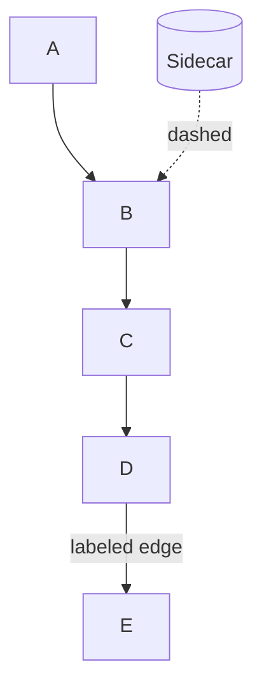
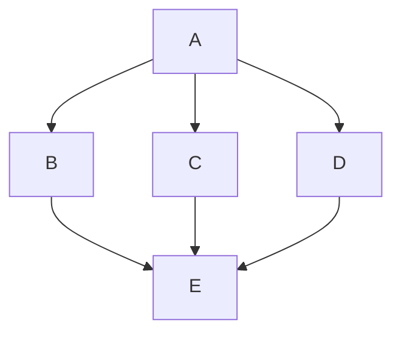

# Workflow: Creating Architecture Diagrams

Team workflow for creating and reviewing Mermaid architecture diagrams in this
repo (README, docs). Not a user-facing tutorial: a checklist for contributors
and agents.

## When to diagram

**One diagram = one message.** Stop when a second concern appears:

| Concern | Use |
|---------|-----|
| Who talks to whom at system scope | System context diagram |
| How one request flows through plugins | Request path diagram |
| Where usage/request logs land after upstream responds | Telemetry and logging diagram |
| Auth or key decision logic | Decision flow diagram |
| Which routes/upstreams ship in this repo | Sample deployments table |

If you need two messages, use two diagrams (or diagram + table). Do not merge
context, deployment, data flow, and observability on one canvas.

## Diagram types we use

Mapped to [C4](https://c4model.com/) and
[Azure WAF design diagrams](https://learn.microsoft.com/en-us/azure/well-architected/architect-role/design-diagrams).

### System context (C4 level 1)

- **Audience:** anyone opening the repo
- **Nodes:** clients, gateway box, external providers/storage
- **Exclude:** plugin names, etcd, Vector, Grafana, route prefixes
- **Budget:** ≤7 nodes

Example: README **Diagram 1: System context**.

### Request path

- **Audience:** implementers
- **Message:** single happy-path spine for **one** route prefix
- **Include:** plugin phases only when showing one federated/cloud path
- **Exclude:** telemetry sinks (ClickHouse, Vector), Grafana, etcd
- **Budget:** ≤7 nodes
- **Caption:** note how other prefixes differ (e.g. skip `key-resolver`)

Example: README **Diagram 2: Request path**.

### Telemetry and logging

- **Audience:** implementers tracing usage or request logs
- **Message:** response-phase plugins to storage (one path per sink)
- **Start from:** upstream response or telemetry plugin node, not the client
- **Budget:** ≤6 nodes
- **Keep separate** from the request-path diagram

Example: README **Diagram 3: Telemetry and logging**.

### Decision flow

- **Audience:** implementers debugging auth or policy
- **Layout:** top-to-bottom with converging branches (one outcome node)
- **Use edge labels** for route-specific behavior, not duplicate nodes

Example: README **Key Management** flowchart.

### Sample deployments

- **Format:** markdown table, not a diagram
- **Title:** `Sample deployments in this repo` (not "Current deployment")
- **Column:** `Sample upstream` (not "Upstream today")
- **Prose:** sample framing, e.g. "In this sample, ..." not "currently the only ..."

## Layout rules (Mermaid)

1. Prefer `flowchart TB` with a **single downward spine** (top → bottom reading).
2. **Avoid fan-out:** do not connect one node to 3+ siblings then merge (spider).
3. Group peers with `subgraph` + `direction LR` only at the same tier.
4. **Orphan nodes float**: attach sidecars with dashed edges or put them in a subgraph.
5. Do **not** rely on ELK/tidy-tree `%%{init}%%`; GitHub README renderer may ignore it.
6. Western reading order: declare nodes in the order you want the story told.

### Reliable spine pattern

Not:

## Arrow semantics

| Style | Meaning |
|-------|---------|
| Solid `-->` | Runtime request/response or data **write** path |
| Dashed `-.->` | Config, key lookup, control plane, **read-only** queries |

Rules:

- Label non-obvious edges (`usage_log`, `request_log`, `vgw-* keys`, `queries`).
- No bidirectional arrows.
- **Grafana → ClickHouse** is a read/query path: dashed, labeled `queries`, not a solid write.
- Prefer two one-way arrows over double-headed lines.

When mixing solid and dashed in one diagram, add a short **legend** in markdown
above or below the Mermaid block (see README Architecture section).

## Gateway-specific conventions

- Gateway is **provider-agnostic** in context diagrams. List OpenCode, xAI, etc.
  in sample deployment tables, not as the only upstream node in a context box.
- Plugin names belong in request-path diagrams or prose, not the context diagram.
- Routes `/opencode*`, `/llamafile/*` are **examples shipped in this repo**, not
  product identity. Additional providers = new relay route + upstream node.
- OpenCode is a valid **sample upstream** in tables; it must not headline the
  gateway as "the OpenCode gateway" in diagrams.

## Pre-merge checklist

- [ ] Diagram type matches audience (context vs path vs decision)
- [ ] Single spine; no spider fan-in/out
- [ ] Arrow direction matches real data flow (writes solid, reads/config dashed)
- [ ] Legend present if mixing solid and dashed
- [ ] Node count within budget (≤7 context, ≤7 request path, ≤6 telemetry)
- [ ] Rendered at [mermaid.live](https://mermaid.live) or GitHub preview
- [ ] Prose references diagram numbers instead of re-narrating every arrow
- [ ] `make check` / markdown link checks pass

## References

- [Azure WAF: Design diagrams](https://learn.microsoft.com/en-us/azure/well-architected/architect-role/design-diagrams)
- [C4 model](https://c4model.com/)
- [Mermaid flowchart syntax](https://mermaid.js.org/syntax/flowchart.html)
- In-repo: [`docs/DASHBOARD-REQUIREMENTS.md`](../docs/DASHBOARD-REQUIREMENTS.md) ,  Grafana panel specs (different concern; do not mix into gateway context diagrams)
- In-repo: [`docs/ARCHITECTURE.md`](../docs/ARCHITECTURE.md) ,  full technical reference

## Anti-patterns (from past README mistakes)

| Anti-pattern | Fix |
|--------------|-----|
| One canvas with routes + plugins + etcd + Vector + Grafana | Split into context + request path + telemetry (+ optional decision flow) |
| Request path diagram includes ClickHouse/Vector branches | Diagram 2 = gateway spine only; Diagram 3 = telemetry sinks |
| Naming one vendor as the headline upstream in a multi-provider gateway doc | Generic "Cloud LLM APIs" node; vendor in sample table |
| `### Current deployment (this repo)` | `### Sample deployments in this repo` |
| `Upstream today` column | `Sample upstream` |
| `Grafana --> ClickHouse` solid arrow | Dashed `-.->|queries|` or omit from context diagram |
| Three route nodes fanning from Clients | One route in request-path diagram; others in table |
| Floating etcd/OpenBao between subgraphs | Dashed edge from gateway or dedicated subgraph |